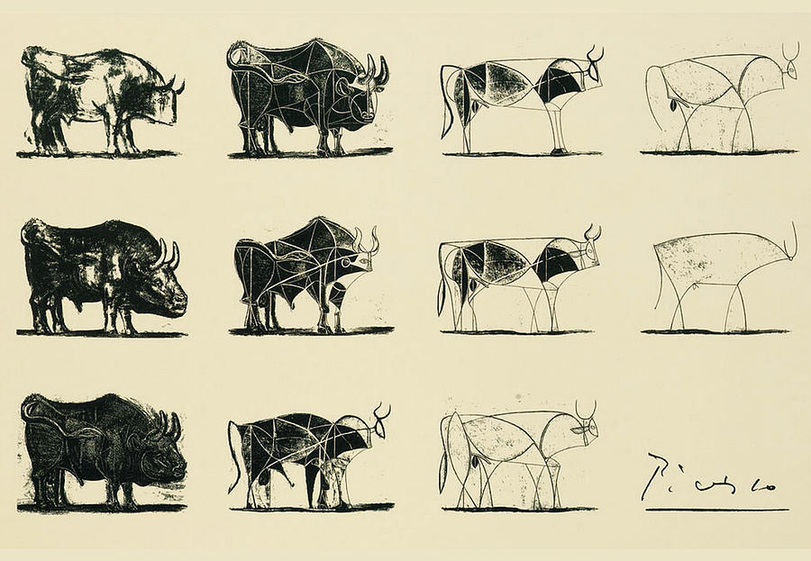

# Modelling {.unnumbered}

## What is a model?

> The Bull, by Pablo Picasso ([source](https://fineartamerica.com/featured/the-bull-picasso.html)).

A model is a simplified representation of a complex phenomenon [@vynnycky2010].

We all use models in our daily lives, often without realizing it. Imagine a colleague asks, "How long will it take to get to the restaurant?". There are different ways you might answer this question, each reflecting a different "model" in your head:

- Experience-based model: You might think, "Last week it took me 20 minutes to get to this restaurant". This model simplifies by assuming past experiences are a reliable predictor of future outcomes, ignoring daily variations like traffic or weather.

- Distance and speed model: You might think, "The restaurant is 15 kilometers away, and I drive at 45 km/h, so it should take about 20 minutes". This model uses the formula $\text{time} = \frac{\text{distance}}{\text{speed}}$. It simplifies by assuming a constant speed, and not accounting for real-world complexities like traffic lights or congestion.

Models help us navigate and make decisions about complex situations by focusing on the most relevant factors and ignoring the less critical details.

## There is no perfect model

> Despite the advances in modelling that will arise in the coming decades, models will **never** be able to accurately predict if, or when, a particular person, farm or community will become infected. This is for two reasons:
>
> - The transmission of infection is a stochastic process, such that no two epidemics are identical.
> - Models will always be an approximation, and rare or unforeseen behavioural events can have a significant impact on the disease dynamics
>
> Keeling M (2006) *State-of-science review: predictive and real-time epidemiological modelling*. London: Office of Science and Innovation [@keeling2006; @christley2013].

## The 3 purposes of modelling [@tredennick2021]

### Exploration

**Exploration** is to identify patterns in the data and generate hypotheses (then we use **inference** to test these hypotheses). While scientific methods emphasize hypothesis testing, it is often unclear where these hypotheses come from. They can come from theory, but more often, they from observed patterns in the data.

In **exploration**, we calculate descriptive statistics, check correlations or make visualisations to understand the data.

### Inference and Prediction

Consider a regression model,

$$\hat{y} = X \hat{\beta}$$

of which $\hat{y}$ is a vector of predicted response, $X$ is the data matrix, $\hat{\beta}$ is a vector of parameters.

**Inference** is about $\hat{\beta}$ (the parameters), to answer these questions:

- Which coefficients are non-zero, implying meaningful associations between covariates and the response?
- Which non-zero effects are positive, and which are negative?

We model using a small fraction sampling from the population, and try to draw some statements about the whole population. In **inference**, we either: (i) estimate parameters or (ii) conduct hypothesis testing.

**Prediction** concerns $\hat{y}$ (the predicted response). Prediction is further distinguished into two activities [@brouwer2026]:

1.  **Forecasting**: predicting future cases, hospitalisations, and deaths. The main focus is ***predictive performance*** (how accurate the forecasts are when compared with observed outcomes), and the aim is to support situational awareness. Statistical and machine learning tools are commonly used and, particularly at short horizons, can match or outperform mechanistic models.

2.  **Projection / scenario modelling**: projecting what these quantities would be under "what-if" scenarios. The main focus is comparing the ***status quo with alternative scenarios***. It can be thought of as an in-silico experiment to explore the impact of response strategies under various conditions. This mostly relies on mechanistic models.

Quantifying and communicating **uncertainty** is essential in both.

## Key modelling dichotomies

Before looking at specific model types, it helps to see the contrasting axes along which models are commonly described. The summary table below gives a quick overview [@bolker2008].

| Attribute | Option A | Option B |
|---|---|---|
| Aim | **Theoretical**: general insight into the working of processes; often mathematically difficult but ecologically oversimplified | **Applied**: describe and predict how a real system functions; often mathematically simpler but ecologically complex |
| Disciplinary framing | **Mathematical modelling**: typically deterministic and dynamic | **Statistical modelling**: typically stochastic and static |
| Approach\* | **Mechanistic**: focuses on the underlying processes; uses functions and distributions based on theoretical expectations | **Phenomenological**: focuses on observed patterns in the data; uses functions and distributions chosen because they are the right shape |
| Specification | **Explicit (direct)**: the model is written in a direct form, such as an equation that produces an output or a density defined in closed form | **Implicit (indirect)**: described through conditions, constraints, or a generating mechanism that produces samples without writing the density in closed form |
| Solution method | **Analytical**: equations solved with algebra and calculus (closed-form solution) | **Computational / numerical**: uses a computer programme to produce an approximate solution |
| Time dynamics | **Static**: the system does not change over time | **Dynamic**: state variables at time *t* feed back to affect the system in the future |
| Time representation | **Continuous**: events occur on a continuum | **Discrete**: events occur at fixed intervals |
| Randomness | **Deterministic**: the expected (average) behaviour with no random variation | **Stochastic**: incorporates noise and randomness |
| Behaviour representation | **Population-based (Eulerian)**: tracks aggregate compartments over time | **Individual-based (Lagrangian)**: follows each individual through the system |

\*The same function can be either mechanistic or phenomenological depending on why it was chosen. Mechanistic models are often more powerful when extrapolating beyond the observed conditions, because the underlying process drives the patterns.

A deterministic model is useful mainly for *qualitative* comparison with data, since each run gives the same output and the model can never match noisy data exactly. A stochastic model produces different results on every run, so it must be executed many times to characterise the full range of possible outcomes.

## Types of model

Models can be classified based on the following attributes [@kim2008]:

1.  **Time dynamics**: main features change over time (dynamic) or remain constant (static).
2.  **Randomness**: Any changes in the model occur randomly (stochastic or probabilistic) or follow pre-specified rules (deterministic).
3.  **Behavior representation**: the population's behaviour is simulated using aggregate variables (population averages) or individual behaviors (individual-based).
4.  **Time representation**: events occur at discrete intervals (discrete) or on a continuum (continuous).
5.  **Population entry**: allows individuals to enter or exit the model (open) or not (closed).
6.  **Equation structure**: the model is expressed in equations that are functions of linearly linked parameters (linear) or not (non-linear).

### Static vs dynamic

A **static** model is one where **time does not affect** its operation. Time may be present but does not influence the model's structure or function [@smith2023]. In infectious disease modelling, static model assumes that the force of infection is constant or changes only as a function of age and other individual characteristics (**not time**) [@handbook2023].

A **dynamic** model is one where **time is essential** to its operation. The model cannot function without representing time [@smith2023]. In infectious disease modelling, dynamic model assumes that the force of infection can vary throughout the course of **time** and as a function of population interactions, often in non-linear ways [@handbook2023].

### Dynamic continuous-change vs discrete-change

**Dynamic models** use **state variables** to describe the system's status at any point in time. If the state variables can change **continuously over continuous time**, then the model has continuous-change aspects.

### Deterministic vs stochastic

**Deterministic** means that if you know ***enough*** about the initial state of a system, you can predict exactly how this system will behave in the future [@denny2000]. In real life, truly deterministic systems are rare. A pendulum clock is a close example, where we can control all the conditions. In biology, systems are much less predictable, and deterministic behavior can be viewed at best as a polite fiction [@denny2000].

If a system is not deterministic, it is by definition **stochastic** [@denny2000]. Even if we know exactly the state of a stochastic system at one time, we can never predict exactly what its state will be in the future [@denny2000].

The line between deterministic and stochastic is often blurry and can depend on how much we understand or can measure. Many things we call stochastic might actually be deterministic if we knew all the details of how they work. In practice, we often treat complex systems as stochastic simply because it’s too hard to make precise predictions [@denny2000].

This boundary has become even less clear with the rise of **chaos** theory. Chaotic systems are technically deterministic, but they’re so sensitive to initial conditions that tiny, unmeasurable changes can lead to completely different outcomes. This extreme sensitivity makes them look random, even though they aren't [@denny2000].

A **deterministic** model assumes that there is **no randomness**, and the system can be fully described by a defined set of equations and parameters. **Each run** of the deterministic model **always** generates the **same result** [@handbook2023].

A **stochastic** model assumes events occur **randomly**, affecting single parameters or multiple components within the system. **Each run** of a stochastic model generates **different results**. Therefore, stochastic models must be run for hundreds or thousands of iterations to explore the full range of possible outcomes [@handbook2023].

### Population-based vs individual-based

In **population-based** (**aggregate** or population **average**) models, individuals are assigned to cohorts (or compartments) and move across different states based on parameter values at the aggregate level (averages of individuals belonging to a compartment or the entire population). The model records the number of individuals in each compartment over time [@kim2008].

Individual-based (or **microsimulation** - see @def-micsim) models keep track of each individual's behaviour. Individual-based models may or may not allow for interactions among individuals. If simulated individuals do not interact, the model is static. If they interact with others or the environment, it is dynamic [@kim2008].

Dynamic individual-based models have 3 subtypes [@kim2008]:

1.  **Individual-level Markov models**: extend static microsimulation model based with a Markov structure to allow interactions among individuals.
2.  **Discrete-event simulations (DES)**: sample the time to the next event and describes the life history of individuals progressing with various events over time, this type of model is originated from industrial engineering.
3.  **Agent-based models**: one of the most flexible modelling techniques, model each agent one by one and allow agents (e.g. individuals) to act and interact autonomously with their own behavioural rules [@handbook2023].

## Solving a model

Solving a model means finding a function that satisfies the given conditions. Consider the Malthusian growth model as an example:

$$\frac{dP}{dt} = rP$$

- $r$: the growth rate.
- $P$: the population size.

Solving this model means to write a function of $P$ that satisfies the derivative. This model can be solved analytically by:

$$\begin{align} \frac{dP}{dt} & = rP \\
\Leftrightarrow \frac{dP}{P} & = rdt \\
\Leftrightarrow \int \frac{dP}{P} & = \int rdt \\
\Leftrightarrow \log P & = rt + C \\
\Leftrightarrow P & = e^{rt + C} \end{align}$$

where $C$ is the constant of integration.
