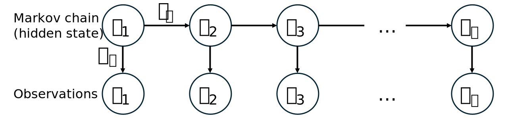

```{ojs}
import { createSlider, createButton, injectStyle, styleMathLabel } from "./_slider.js"
d3 = require("d3@7")
```

## Particle filter

Particle filters are used for sampling **latent states** in systems where we cannot observe all variables directly. This methodology is applied to solve **Hidden Markov Models** and nonlinear filtering problems. The primary goal of a particle filter is to estimate the **posterior density** of state variables based on **observation** variables.

### Key terminology

-   Particles: Samples representing the posterior distribution.

-   Weighting: Assigning likelihood weights to particles based on their agreement with observations.

-   Resampling: Selecting particles based on their weights. Particles with higher weights are sampled more frequently. This process is also referred to as Monte Carlo localisation.

### Example

A classic example is estimating the position of a robot vacuum on a 2D map of a room:

-   The robot moves on a 2D grid from $(-10, -10)$ to $(10, 10)$.
-   **Motion model**: the robot follows a noisy circular trajectory around the origin. The velocity vector is $v = (-y, x) \cdot V / \sqrt{x^2 + y^2}$, which produces **counter-clockwise** motion, with a small Gaussian process noise added at each step.
-   **Observation model**: a sensor reports only the robot's $x$-coordinate with Gaussian noise of standard deviation $\sigma$.

Given a stream of observations, we want the posterior over the robot's true position. The **bootstrap particle filter** iterates four ingredients:

1.  **Initialisation** ($t = 0$): sample $N$ particles from the prior $p(x_0)$. Each particle starts with weight $1/N$.
2.  For $t = 1, 2, \ldots$, repeat:
    a.  **Predict**: propagate each particle forward, $x_t^{(i)} \sim f(x_t \mid x_{t-1}^{(i)})$, including process noise so the cloud spreads out.
    b.  **Weight**: on receiving observation $y_t$, assign weights $w_t^{(i)} \propto g(y_t \mid x_t^{(i)})$ and normalise so they sum to 1.
    c.  **Resample**: draw $N$ new particles, with replacement, using probabilities equal to the weights. After resampling, all weights reset to $1/N$.

::: {.callout-note}
## A small correction to the original version

The verbal algorithm above (Predict → Weight → Resample → repeat) is exactly the bootstrap particle filter, so your high-level description is correct. A few small things worth flagging about the earlier implementation, though:

-   The R code weighted the particles *before* moving them and then resampled using those pre-movement weights. The rule is that **resampling should use the weights from the current time step**. Either "predict → weight → resample" or "weight → resample → predict" is a valid cycle, but mixing them (resampling with stale weights) breaks the filter.
-   The predict step didn't add any process noise. Without it, particles can only spread through resampling, which quickly leads to *particle depletion* — the posterior collapses to a handful of distinct values.
-   With $v = (-y, x) \cdot V / \sqrt{x^2 + y^2}$, the motion is counter-clockwise (not clockwise as the original text stated). At $(r, 0)$ for example, $v = (0, V)$, so the robot moves upward.
:::

Hit **▶ Play** to watch the vacuum trundle around the room. The **left panel** is the physical world: the dark robot follows a circular path, leaves a dashed trail, and at each time step the sensor reports its $x$-coordinate with noise (dashed red line, red pulse on the robot). The **right panel** is the filter's internal state: the four algorithm boxes at the top light up as the current phase changes, the middle strip shows every particle on the $x$-axis (with the observation likelihood curve overlaid during *Weight*), and the histogram at the bottom is the running posterior density $p(x_t\mid y_{1:t})$. Sliders let you change $N$, observation noise, process noise, and playback speed; the scrubber at the very bottom jumps to any frame.

```{ojs}
//| echo: false
pfDemo = {
  // ══════════════════════════════════════════════════════════════════════
  // Wrapper + styles
  // ══════════════════════════════════════════════════════════════════════
  const wrapper = document.createElement("div");
  wrapper.className = "pf-wrap";
  wrapper.style.cssText = "font-family:system-ui,-apple-system,sans-serif;max-width:940px;margin:0 auto;";
  wrapper.appendChild(injectStyle());

  // CSS transitions drive the animation. Particles animate cx/cy/r/fill,
  // the robot animates its transform, the step boxes fade on/off.
  const css = document.createElement("style");
  css.textContent = `
    .pf-wrap .particle { transition: cx .35s ease-out, cy .35s ease-out, r .25s ease-out, fill .25s, opacity .25s; }
    .pf-wrap .robot-g  { transition: transform .45s cubic-bezier(.4,0,.2,1); }
    .pf-wrap .step-box { transition: fill .22s, stroke-width .22s; }
    .pf-wrap .step-lbl { transition: fill .22s; }
    .pf-wrap .bar1d    { transition: y .3s ease-out, height .3s ease-out, fill .22s; }
    .pf-wrap .obs-el   { transition: opacity .2s; }
    .pf-wrap .obs-pulse{ transform-origin: center; transform-box: fill-box; }
    @keyframes pfPulse { from { transform: scale(.4); opacity:.9; } to { transform: scale(3.5); opacity:0; } }
    .pf-wrap .pulse-on { animation: pfPulse .9s ease-out both; }
  `;
  wrapper.appendChild(css);

  // ══════════════════════════════════════════════════════════════════════
  // Deterministic RNG (LCG) + helpers
  // ══════════════════════════════════════════════════════════════════════
  function makeRng(seed) {
    let s = seed >>> 0;
    const rng = () => { s = (s * 1664525 + 1013904223) >>> 0; return s / 4294967296; };
    const rnorm = (mu, sig) => {
      const u1 = Math.max(rng(), 1e-12), u2 = rng();
      return mu + sig * Math.sqrt(-2 * Math.log(u1)) * Math.cos(2 * Math.PI * u2);
    };
    return { rng, rnorm };
  }

  // ══════════════════════════════════════════════════════════════════════
  // Bootstrap particle filter — produces a list of sub-phase frames
  // ══════════════════════════════════════════════════════════════════════
  const MAX_N  = 500;
  const TSTEPS = 8;
  const V      = 5;
  const dt     = 0.3;

  function computeFrames({ N, obsSD, procSD, seed }) {
    const { rng, rnorm } = makeRng(seed);
    let particles = d3.range(N).map(() => ({ x: rnorm(0, 5), y: rnorm(0, 5), w: 1/N }));
    let robot = { x: 6, y: 0 };
    let trail = [{ x: robot.x, y: robot.y }];
    const frames = [];

    frames.push({
      phase: "initialize", t: 0, label: "",
      particles: particles.map(p => ({...p})),
      robot: {...robot}, trail: trail.slice(), obs: null, obsSD
    });

    for (let t = 1; t <= TSTEPS; t++) {
      // ── Predict ──
      const rn = Math.sqrt(robot.x**2 + robot.y**2) || 0.01;
      robot = { x: robot.x - dt*robot.y*V/rn, y: robot.y + dt*robot.x*V/rn };
      trail.push({ x: robot.x, y: robot.y });
      particles = particles.map(p => {
        const pn = Math.sqrt(p.x**2 + p.y**2) || 0.01;
        return {
          x: p.x - dt*p.y*V/pn + rnorm(0, procSD),
          y: p.y + dt*p.x*V/pn + rnorm(0, procSD),
          w: 1/N
        };
      });
      frames.push({
        phase: "predict", t,
        particles: particles.map(p => ({...p})),
        robot: {...robot}, trail: trail.slice(), obs: null, obsSD
      });

      // ── Weight ──
      const yObs = robot.x + rnorm(0, obsSD);
      particles = particles.map(p => ({
        x: p.x, y: p.y,
        w: Math.exp(-0.5 * ((p.x - yObs)/obsSD) ** 2)
      }));
      const sw = particles.reduce((a, p) => a + p.w, 0);
      if (sw > 0) particles.forEach(p => { p.w /= sw; });
      frames.push({
        phase: "weight", t,
        particles: particles.map(p => ({...p})),
        robot: {...robot}, trail: trail.slice(), obs: yObs, obsSD
      });

      // ── Resample (multinomial with current weights) ──
      const cum = []; let acc = 0;
      for (const p of particles) { acc += p.w; cum.push(acc); }
      const next = [];
      for (let i = 0; i < N; i++) {
        const u = rng();
        let j = 0;
        while (j < cum.length - 1 && cum[j] < u) j++;
        next.push({ x: particles[j].x, y: particles[j].y, w: 1/N });
      }
      particles = next;
      frames.push({
        phase: "resample", t,
        particles: particles.map(p => ({...p})),
        robot: {...robot}, trail: trail.slice(), obs: yObs, obsSD
      });
    }
    return frames;
  }

  // ══════════════════════════════════════════════════════════════════════
  // Layout
  // ══════════════════════════════════════════════════════════════════════
  const W = 920, H = 540;
  const LW = 430, RW = 460, GAP = 20;
  const M = { top: 14, bottom: 14, left: 16, right: 16 };
  const panelH = H - M.top - M.bottom;

  const svgSel = d3.create("svg")
    .attr("viewBox", `0 0 ${W} ${H}`)
    .style("width", "100%")
    .style("max-width", `${W}px`)
    .style("height", "auto")
    .style("display", "block");
  const svg = svgSel.node();

  const defs = svgSel.append("defs");

  // Floor grid pattern
  const pat = defs.append("pattern")
    .attr("id", "pf-floor").attr("width", 26).attr("height", 26)
    .attr("patternUnits", "userSpaceOnUse");
  pat.append("rect").attr("width", 26).attr("height", 26).attr("fill", "#f8fafc");
  pat.append("path").attr("d", "M 26 0 L 0 0 0 26")
    .attr("fill", "none").attr("stroke", "#e2e8f0").attr("stroke-width", 0.6);

  // Soft drop shadow for the robot
  const shadow = defs.append("filter").attr("id", "pf-shadow")
    .attr("x", "-50%").attr("y", "-50%").attr("width", "200%").attr("height", "200%");
  shadow.append("feGaussianBlur").attr("in", "SourceAlpha").attr("stdDeviation", 1.4);
  shadow.append("feOffset").attr("dx", 0).attr("dy", 1.5).attr("result", "off");
  const m = shadow.append("feMerge");
  m.append("feMergeNode").attr("in", "off");
  m.append("feMergeNode").attr("in", "SourceGraphic");

  // Radial gradient for robot body
  const grad = defs.append("radialGradient").attr("id", "pf-robot").attr("cx", "35%").attr("cy", "30%");
  grad.append("stop").attr("offset", "0%").attr("stop-color", "#475569");
  grad.append("stop").attr("offset", "100%").attr("stop-color", "#0f172a");

  // ══════════════════════════════════════════════════════════════════════
  // LEFT PANEL — The Room
  // ══════════════════════════════════════════════════════════════════════
  const LG = svgSel.append("g").attr("transform", `translate(${M.left}, ${M.top})`);

  LG.append("rect")
    .attr("width", LW).attr("height", panelH)
    .attr("fill", "url(#pf-floor)")
    .attr("stroke", "#94a3b8").attr("stroke-width", 1.2).attr("rx", 8);

  LG.append("text").attr("x", 14).attr("y", 22)
    .style("font-size", "13px").style("font-weight", 700).style("fill", "#0f172a")
    .text("The Room");
  LG.append("text").attr("x", 14).attr("y", 38)
    .style("font-size", "11px").style("fill", "#64748b")
    .text("Vacuum robot on a circular path  ·  sensor reports x with noise");

  const roomPad = { top: 54, right: 22, bottom: 30, left: 34 };
  const xL = d3.scaleLinear().domain([-10, 10]).range([roomPad.left, LW - roomPad.right]);
  const yL = d3.scaleLinear().domain([-10, 10]).range([panelH - roomPad.bottom, roomPad.top]);

  // True trajectory hint (faint ring)
  LG.append("circle")
    .attr("cx", xL(0)).attr("cy", yL(0))
    .attr("r", Math.abs(xL(6) - xL(0)))
    .attr("fill", "none").attr("stroke", "#cbd5e1")
    .attr("stroke-width", 1).attr("stroke-dasharray", "1,4").attr("opacity", 0.6);

  // Axes
  LG.append("g").attr("transform", `translate(0, ${panelH - roomPad.bottom})`)
    .style("font-size", "9.5px").style("color", "#94a3b8")
    .call(d3.axisBottom(xL).tickValues([-10, -5, 0, 5, 10]));
  LG.append("g").attr("transform", `translate(${roomPad.left}, 0)`)
    .style("font-size", "9.5px").style("color", "#94a3b8")
    .call(d3.axisLeft(yL).tickValues([-10, -5, 0, 5, 10]));

  // Trail
  const trailPath = LG.append("path")
    .attr("fill", "none").attr("stroke", "#475569")
    .attr("stroke-width", 1.8).attr("stroke-dasharray", "2,4")
    .attr("opacity", 0.55).attr("stroke-linecap", "round");

  // Observation markers inside the room
  const obsLine = LG.append("line").attr("class", "obs-el")
    .attr("stroke", "#dc2626").attr("stroke-width", 1.5)
    .attr("stroke-dasharray", "3,3").attr("opacity", 0);
  const obsLabel = LG.append("text").attr("class", "obs-el")
    .style("font-size", "11px").style("font-weight", 700)
    .style("fill", "#dc2626").attr("text-anchor", "middle").attr("opacity", 0);
  const obsPulse = LG.append("circle").attr("class", "obs-pulse")
    .attr("fill", "none").attr("stroke", "#dc2626").attr("stroke-width", 2.2)
    .attr("r", 14).attr("opacity", 0);

  // Particle pool (2D)
  const particlesG = LG.append("g");
  const roomC = [];
  for (let i = 0; i < MAX_N; i++) {
    roomC.push(particlesG.append("circle").attr("class", "particle")
      .attr("fill", "#3b82f6").attr("opacity", 0.36).attr("r", 0).node());
  }

  // Vacuum robot
  const robotG = LG.append("g").attr("class", "robot-g").attr("filter", "url(#pf-shadow)");
  robotG.append("circle").attr("r", 12).attr("fill", "url(#pf-robot)");
  robotG.append("circle").attr("r", 12).attr("fill", "none").attr("stroke", "#0f172a").attr("stroke-width", 0.8);
  // direction wedge
  robotG.append("path")
    .attr("d", "M 0 -12 L 4 -8 L -4 -8 Z")
    .attr("fill", "#22d3ee");
  // LED centre
  robotG.append("circle").attr("r", 2.6).attr("fill", "#22d3ee");
  robotG.append("circle").attr("r", 2.6).attr("fill", "none").attr("stroke", "#67e8f9").attr("stroke-width", 0.8);

  // ══════════════════════════════════════════════════════════════════════
  // RIGHT PANEL — Algorithm
  // ══════════════════════════════════════════════════════════════════════
  const RG = svgSel.append("g").attr("transform", `translate(${M.left + LW + GAP}, ${M.top})`);

  RG.append("rect")
    .attr("width", RW).attr("height", panelH)
    .attr("fill", "#ffffff")
    .attr("stroke", "#e2e8f0").attr("stroke-width", 1).attr("rx", 8);

  RG.append("text").attr("x", 14).attr("y", 22)
    .style("font-size", "13px").style("font-weight", 700).style("fill", "#0f172a")
    .text("Bootstrap particle filter");
  RG.append("text").attr("x", 14).attr("y", 38)
    .style("font-size", "11px").style("fill", "#64748b")
    .text("Posterior p(xₜ | y₁:ₜ) represented by N weighted particles");

  // ── Step flow ──
  const steps = [
    { key: "initialize", label: "① Initialise", color: "#475569" },
    { key: "predict",    label: "② Predict",    color: "#7c3aed" },
    { key: "weight",     label: "③ Weight",     color: "#dc2626" },
    { key: "resample",   label: "④ Resample",   color: "#16a34a" }
  ];
  const flowY = 52, flowH = 38, flowPad = 12;
  const boxW = (RW - flowPad * 2 - 3 * 6) / 4;
  const flowG = RG.append("g").attr("transform", `translate(0, ${flowY})`);
  const stepNodes = [];
  steps.forEach((s, i) => {
    const g = flowG.append("g").attr("transform", `translate(${flowPad + i * (boxW + 6)}, 0)`);
    const box = g.append("rect").attr("class", "step-box")
      .attr("width", boxW).attr("height", flowH).attr("rx", 6)
      .attr("fill", "#f8fafc").attr("stroke", s.color).attr("stroke-width", 1);
    const lbl = g.append("text").attr("class", "step-lbl")
      .attr("x", boxW / 2).attr("y", flowH / 2 + 4.5)
      .attr("text-anchor", "middle")
      .style("font-size", "12px").style("font-weight", 700)
      .style("fill", s.color).text(s.label);
    if (i < steps.length - 1) {
      g.append("path")
        .attr("d", `M${boxW + 1},${flowH/2} L${boxW + 4.5},${flowH/2} M${boxW + 3},${flowH/2 - 2} L${boxW + 5.5},${flowH/2} L${boxW + 3},${flowH/2 + 2}`)
        .attr("fill", "none").attr("stroke", "#94a3b8").attr("stroke-width", 1);
    }
    stepNodes.push({ box, lbl, key: s.key, color: s.color });
  });

  // Loop arrow (Resample → Predict)
  const xPred = flowPad + 1 * (boxW + 6) + boxW / 2;
  const xRes  = flowPad + 3 * (boxW + 6) + boxW / 2;
  flowG.append("path")
    .attr("d", `M${xRes},${flowH + 2} C${xRes},${flowH + 16} ${xPred},${flowH + 16} ${xPred},${flowH + 2}`)
    .attr("fill", "none").attr("stroke", "#94a3b8").attr("stroke-dasharray", "3,2");
  flowG.append("path")
    .attr("d", `M${xPred - 3},${flowH + 3} L${xPred},${flowH - 1} L${xPred + 3},${flowH + 3} Z`)
    .attr("fill", "#94a3b8");
  flowG.append("text").attr("x", (xPred + xRes) / 2).attr("y", flowH + 24)
    .attr("text-anchor", "middle").style("font-size", "9.5px").style("fill", "#94a3b8")
    .text("repeat for t = 1, 2, …");

  // ── Phase description panel ──
  const descG = RG.append("g").attr("transform", `translate(${flowPad}, ${flowY + flowH + 32})`);
  descG.append("rect")
    .attr("width", RW - flowPad * 2).attr("height", 36)
    .attr("fill", "#f8fafc").attr("stroke", "#e2e8f0").attr("rx", 4);
  const descTitle = descG.append("text").attr("x", 10).attr("y", 15)
    .style("font-size", "11.5px").style("font-weight", 700).style("fill", "#0f172a");
  const descBody = descG.append("text").attr("x", 10).attr("y", 29)
    .style("font-size", "10.5px").style("fill", "#475569");

  // ── 1D particle strip ──
  const stripTitleY = flowY + flowH + 92;
  RG.append("text").attr("x", flowPad).attr("y", stripTitleY)
    .style("font-size", "11px").style("font-weight", 700).style("fill", "#334155")
    .text("Particles along x  (size ∝ weight)");

  const stripY = stripTitleY + 8;
  const stripH = 104;
  const xR = d3.scaleLinear().domain([-10, 10]).range([flowPad + 22, RW - flowPad - 4]);
  const jBase = stripY + stripH / 2 + 26;
  const jSpread = 22;

  // Likelihood bell curve (only visible during Weight)
  const likeArea  = RG.append("path").attr("class", "obs-el").attr("fill", "#fecaca").attr("opacity", 0);
  const likeCurve = RG.append("path").attr("class", "obs-el").attr("fill", "none")
    .attr("stroke", "#dc2626").attr("stroke-width", 1.6).attr("opacity", 0);

  // Strip particle pool (1D)
  const stripG = RG.append("g");
  const stripC = [];
  for (let i = 0; i < MAX_N; i++) {
    stripC.push(stripG.append("circle").attr("class", "particle")
      .attr("fill", "#3b82f6").attr("opacity", 0.55).attr("r", 0).node());
  }

  // Deterministic per-particle jitter so re-layout doesn't twitch vertically
  const jTable = new Float64Array(MAX_N);
  { let s = 1337;
    for (let i = 0; i < MAX_N; i++) {
      s = (s * 1103515245 + 12345) >>> 0;
      jTable[i] = s / 4294967296 - 0.5;
    }
  }

  const stripObsLine  = RG.append("line").attr("class", "obs-el")
    .attr("stroke", "#dc2626").attr("stroke-width", 1.5).attr("stroke-dasharray", "3,3").attr("opacity", 0);
  const stripObsLabel = RG.append("text").attr("class", "obs-el")
    .style("font-size", "11px").style("font-weight", 700).style("fill", "#dc2626")
    .attr("text-anchor", "middle").attr("opacity", 0);
  const trueXMark = RG.append("polygon")
    .attr("fill", "#0f172a").attr("stroke", "#fff").attr("stroke-width", 1.2);

  // ── Posterior histogram ──
  const histTitleY = stripY + stripH + 34;
  RG.append("text").attr("x", flowPad).attr("y", histTitleY)
    .style("font-size", "11px").style("font-weight", 700).style("fill", "#334155")
    .text("Posterior density of x");
  const histY = histTitleY + 8;
  const histH = 84;

  const NB = 30;
  const edges = d3.range(NB + 1).map(i => -10 + 20 * i / NB);
  const histG = RG.append("g");
  const histBars = [];
  for (let i = 0; i < NB; i++) {
    histBars.push(histG.append("rect").attr("class", "bar1d")
      .attr("x", xR(edges[i]) + 0.5)
      .attr("width", Math.max(0, xR(edges[i + 1]) - xR(edges[i]) - 1))
      .attr("y", histY + histH).attr("height", 0)
      .attr("fill", "#3b82f6").attr("opacity", 0.7).node());
  }
  RG.append("g").attr("transform", `translate(0, ${histY + histH})`)
    .style("font-size", "9.5px").style("color", "#94a3b8")
    .call(d3.axisBottom(xR).tickValues([-10, -5, 0, 5, 10]));
  RG.append("text").attr("x", (xR(-10) + xR(10)) / 2).attr("y", histY + histH + 24)
    .attr("text-anchor", "middle").style("font-size", "10px").style("fill", "#64748b")
    .text("x coordinate");

  const histObs = RG.append("line").attr("class", "obs-el")
    .attr("stroke", "#dc2626").attr("stroke-width", 1.5).attr("stroke-dasharray", "3,3").attr("opacity", 0);
  const histTrue = RG.append("line")
    .attr("stroke", "#0f172a").attr("stroke-width", 1.5).attr("opacity", 0.8);

  const postText = RG.append("text").attr("x", flowPad).attr("y", histY + histH + 40)
    .style("font-size", "11.5px").style("font-weight", 700).style("fill", "#0f172a");

  // ══════════════════════════════════════════════════════════════════════
  // Controls
  // ══════════════════════════════════════════════════════════════════════
  const controls = document.createElement("div");
  controls.style.cssText = "display:flex;gap:16px;margin:10px 0;flex-wrap:wrap;align-items:flex-end;";
  const SL = {
    N:      createSlider("N particles", 50,  500, 10,   200, "#3b82f6", "blue"),
    obsSD:  createSlider("obs σ",       0.3, 3,   0.1,  1,   "#dc2626", "red"),
    procSD: createSlider("process σ",   0,   1,   0.05, 0.3, "#7c3aed", "purple"),
    speed:  createSlider("speed",       0.3, 3,   0.1,  1,   "#16a34a", "green")
  };
  styleMathLabel(SL.obsSD, SL.procSD);
  for (const s of Object.values(SL)) controls.appendChild(s.el);

  const btnRow = document.createElement("div");
  btnRow.style.cssText = "display:flex;gap:8px;margin:0 0 10px;max-width:440px;";
  const btnPlay  = createButton("▶  Play",  "go");
  const btnStep  = createButton("Step ▸",   "step");
  const btnReset = createButton("↻  Reset", "reset");
  btnRow.appendChild(btnPlay.el);
  btnRow.appendChild(btnStep.el);
  btnRow.appendChild(btnReset.el);

  const scrubWrap = document.createElement("div");
  scrubWrap.style.cssText = "margin-top:4px;";
  const scrub = createSlider("frame", 0, 24, 1, 0, "#0891b2", "teal");
  scrubWrap.appendChild(scrub.el);

  // ══════════════════════════════════════════════════════════════════════
  // State
  // ══════════════════════════════════════════════════════════════════════
  let frames = computeFrames({ N: SL.N.val(), obsSD: SL.obsSD.val(), procSD: SL.procSD.val(), seed: 42 });
  scrub.update(0, 0, frames.length - 1);
  let fIdx = 0;
  let playing = false;
  let rafId = null;

  // ══════════════════════════════════════════════════════════════════════
  // Draw  (hot path — attribute writes only, CSS handles motion)
  // ══════════════════════════════════════════════════════════════════════
  function draw() {
    const f = frames[fIdx];

    // ─ Robot (rotate so the wedge points along its tangent) ─
    const dirAngle = Math.atan2(-f.robot.x, -f.robot.y) * 180 / Math.PI;
    robotG.attr("transform", `translate(${xL(f.robot.x)}, ${yL(f.robot.y)}) rotate(${dirAngle})`);

    // ─ Trail ─
    const line = d3.line().x(p => xL(p.x)).y(p => yL(p.y)).curve(d3.curveCatmullRom.alpha(0.4));
    trailPath.attr("d", f.trail.length > 1 ? line(f.trail) : "");

    // ─ Particles ─
    const N = f.particles.length;
    const weights = f.particles.map(p => p.w);
    const wMax = d3.max(weights);
    const wMin = d3.min(weights);
    const rRoom = (wMax > wMin * 1.01)
      ? d3.scaleSqrt().domain([wMin, wMax]).range([1.2, 5.5]).clamp(true)
      : () => 2.3;
    const rStrip = (wMax > wMin * 1.01)
      ? d3.scaleSqrt().domain([wMin, wMax]).range([1.8, 7]).clamp(true)
      : () => 3;

    const isWeight = f.phase === "weight";
    const fillC = isWeight ? "#dc2626" : "#3b82f6";

    for (let i = 0; i < MAX_N; i++) {
      const cr = roomC[i], cs = stripC[i];
      if (i < N) {
        const p = f.particles[i];
        cr.setAttribute("cx", xL(p.x));
        cr.setAttribute("cy", yL(p.y));
        cr.setAttribute("r", rRoom(p.w));
        cr.setAttribute("fill", fillC);
        cr.setAttribute("opacity", 0.38);

        cs.setAttribute("cx", xR(p.x));
        cs.setAttribute("cy", jBase + jTable[i] * jSpread);
        cs.setAttribute("r", rStrip(p.w));
        cs.setAttribute("fill", fillC);
        cs.setAttribute("opacity", 0.6);
      } else {
        cr.setAttribute("r", 0);
        cs.setAttribute("r", 0);
      }
    }

    // ─ Observation elements (room) ─
    if (f.obs != null) {
      const ox = xL(f.obs);
      obsLine.attr("x1", ox).attr("x2", ox)
        .attr("y1", yL(-10)).attr("y2", yL(10))
        .attr("opacity", 0.85);
      obsLabel.attr("x", ox).attr("y", yL(10) - 4)
        .text(`yₜ = ${f.obs.toFixed(2)}`).attr("opacity", 1);
      obsPulse.attr("cx", xL(f.obs)).attr("cy", yL(f.robot.y)).attr("opacity", isWeight ? 1 : 0);
      obsPulse.classed("pulse-on", false);
      if (isWeight) requestAnimationFrame(() => obsPulse.classed("pulse-on", true));
    } else {
      obsLine.attr("opacity", 0);
      obsLabel.attr("opacity", 0);
      obsPulse.attr("opacity", 0).classed("pulse-on", false);
    }

    // ─ Observation elements (right panel) ─
    if (f.obs != null) {
      const oxR = xR(f.obs);
      stripObsLine.attr("x1", oxR).attr("x2", oxR)
        .attr("y1", stripY).attr("y2", stripY + stripH)
        .attr("opacity", 0.85);
      stripObsLabel.attr("x", oxR).attr("y", stripY - 2)
        .text(`yₜ = ${f.obs.toFixed(2)}`).attr("opacity", 1);
      histObs.attr("x1", oxR).attr("x2", oxR)
        .attr("y1", histY).attr("y2", histY + histH)
        .attr("opacity", 0.85);
    } else {
      stripObsLine.attr("opacity", 0);
      stripObsLabel.attr("opacity", 0);
      histObs.attr("opacity", 0);
    }

    // True x (triangle pointer above the strip)
    const tx = xR(f.robot.x);
    trueXMark.attr("points", `${tx - 5},${stripY - 3} ${tx + 5},${stripY - 3} ${tx},${stripY + 5}`);
    histTrue.attr("x1", tx).attr("x2", tx).attr("y1", histY).attr("y2", histY + histH);

    // ─ Likelihood bell curve ─
    if (isWeight && f.obs != null) {
      const steps2 = 100;
      const pts = d3.range(steps2 + 1).map(k => {
        const xv = -10 + 20 * k / steps2;
        return [xv, Math.exp(-0.5 * ((xv - f.obs) / f.obsSD) ** 2)];
      });
      const topH = 74;
      const yCurve = d => stripY + 4 + (1 - d[1]) * topH;
      likeArea.attr("d",
        d3.area().x(d => xR(d[0])).y0(stripY + 4 + topH).y1(yCurve)(pts))
        .attr("opacity", 0.35);
      likeCurve.attr("d",
        d3.line().x(d => xR(d[0])).y(yCurve)(pts))
        .attr("opacity", 1);
    } else {
      likeArea.attr("opacity", 0);
      likeCurve.attr("opacity", 0);
    }

    // ─ Posterior histogram ─
    const binW = new Array(NB).fill(0);
    for (const p of f.particles) {
      let k = Math.floor((p.x + 10) / 20 * NB);
      if (k < 0) k = 0; else if (k >= NB) k = NB - 1;
      binW[k] += p.w;
    }
    let wTop = 0;
    for (const v of binW) if (v > wTop) wTop = v;
    if (wTop <= 0) wTop = 1;
    for (let i = 0; i < NB; i++) {
      const h = (binW[i] / wTop) * histH;
      histBars[i].setAttribute("y", histY + histH - h);
      histBars[i].setAttribute("height", h);
      histBars[i].setAttribute("fill", fillC);
    }

    const mx = f.particles.reduce((a, p) => a + p.x * p.w, 0);
    const vx = f.particles.reduce((a, p) => a + (p.x - mx) * (p.x - mx) * p.w, 0);
    const sx = Math.sqrt(Math.max(0, vx));
    postText.text(`x̂ = ${mx.toFixed(2)} ± ${sx.toFixed(2)}   ·   true x = ${f.robot.x.toFixed(2)}   ·   |x̂ − x| = ${Math.abs(mx - f.robot.x).toFixed(2)}`);

    // ─ Step flow highlight ─
    stepNodes.forEach(s => {
      const active = s.key === f.phase;
      s.box.attr("fill", active ? s.color : "#f8fafc").attr("stroke-width", active ? 2 : 1);
      s.lbl.style("fill", active ? "#ffffff" : s.color);
    });

    // ─ Description ─
    const tag = f.phase === "initialize" ? "" : `   ·   t = ${f.t}`;
    const titles = {
      initialize: "① Initialise" + tag,
      predict:    "② Predict"    + tag,
      weight:     "③ Weight"     + tag,
      resample:   "④ Resample"   + tag
    };
    const bodies = {
      initialize: `Sample ${f.particles.length} particles from the prior p(x₀); each has weight 1/N.`,
      predict:    `Propagate every particle via f(xₜ|xₜ₋₁) = circular motion + N(0, σ²) process noise.`,
      weight:     `Observation y = ${f.obs != null ? f.obs.toFixed(2) : "?"} arrived. Re-weight by wᵢ ∝ g(y|xᵢ) = N(y; xᵢ, σ²).`,
      resample:   `Draw N particles with probability ∝ wᵢ. High-weight particles reproduce; weights reset to 1/N.`
    };
    descTitle.text(titles[f.phase]);
    descBody.text(bodies[f.phase]);

    if (+scrub.input.value !== fIdx) {
      scrub.input.value = fIdx;
      scrub.sync();
    }
  }

  // ══════════════════════════════════════════════════════════════════════
  // Animation loop
  // ══════════════════════════════════════════════════════════════════════
  let lastTick = 0;
  function loop(now) {
    if (!playing) { rafId = null; return; }
    const step = 900 / SL.speed.val();
    if (now - lastTick >= step) {
      lastTick = now;
      fIdx = (fIdx + 1) % frames.length;
      draw();
    }
    rafId = requestAnimationFrame(loop);
  }

  // ══════════════════════════════════════════════════════════════════════
  // Events
  // ══════════════════════════════════════════════════════════════════════
  function recompute() {
    frames = computeFrames({
      N: SL.N.val(), obsSD: SL.obsSD.val(),
      procSD: SL.procSD.val(), seed: 42
    });
    if (fIdx >= frames.length) fIdx = frames.length - 1;
    scrub.update(fIdx, 0, frames.length - 1);
    draw();
  }

  SL.N.input.addEventListener("input",      () => { SL.N.sync();      recompute(); });
  SL.obsSD.input.addEventListener("input",  () => { SL.obsSD.sync();  recompute(); });
  SL.procSD.input.addEventListener("input", () => { SL.procSD.sync(); recompute(); });
  SL.speed.input.addEventListener("input",  () => { SL.speed.sync(); });
  scrub.input.addEventListener("input", () => {
    scrub.sync();
    fIdx = +scrub.input.value;
    draw();
  });

  function setPlaying(on) {
    playing = on;
    btnPlay.setText(on ? "⏸  Pause" : "▶  Play");
    btnPlay.el.className = `sl-btn sl-btn-${on ? "pause" : "go"}`;
    if (on && rafId == null) { lastTick = 0; rafId = requestAnimationFrame(loop); }
  }
  btnPlay.el.addEventListener("click",  () => setPlaying(!playing));
  btnStep.el.addEventListener("click",  () => {
    setPlaying(false);
    fIdx = (fIdx + 1) % frames.length;
    draw();
  });
  btnReset.el.addEventListener("click", () => {
    setPlaying(false);
    fIdx = 0;
    draw();
  });

  // ══════════════════════════════════════════════════════════════════════
  // Assemble
  // ══════════════════════════════════════════════════════════════════════
  wrapper.appendChild(controls);
  wrapper.appendChild(btnRow);
  wrapper.appendChild(svg);
  wrapper.appendChild(scrubWrap);

  draw();
  return wrapper;
}
```

## POMP

maximum likelihood via iterated filtering

https://kingaa.github.io/short-course/mif/mif.html

## PMCMC

PMCMC stands for Particle Markov Chain Monte Carlo. It's a full Bayesian approach and basically a way to combine:

-   Particle filtering (to sampling hidden states of a system), and
-   MCMC (Markov Chain Monte Carlo) (to sampling unknown parameters).



The main components of HMP are:

1.  Hidden state $x_t$: This represents the true number of infectious individuals. In an SIR model, the state is "hidden" because:
    - Only the I compartment can be observed, while the others are hidden
    - There is an observation noise that hide the true value of I
2.  Time evolution process $f(x_{t + 1}|x_t)$: The state variable at the next time step $x_{t + 1}$ is a function of the current state: $\mathbb{P}(x_{t + 1}) = f(x_{t + 1}|x_t)$, since this is a Markov process.
3.  Observations $y_t$: The reported case counts at each time $t$.
4.  Observation process $g(y_t|x_t)$: The probabilistic distribution of observing $y_t$ is a function of $x_t$. Typically this is underreporting represented by a binomial process with reporting probability $\epsilon$: $\mathbb{P}(y_t) = g(y_t|x_t) = Bin(n = x_t, p = \epsilon)$.

We are interested in the time evolution process $f(x_{t + 1}|x_t)$, modelled with a set of parameters $\theta$. The posterior distribution of $\theta$, when we have the case counts $y_t$: $\mathbb{P}(\theta|y_t)$, is:

$$\mathbb{P}(\theta|y_t) \propto \mathbb{P}(y_t|\theta) \cdot \mathbb{P}(\theta)$$

We need to compute the likelihood of the data $\mathbb{P}(y_t|\theta)$. This likelihood is often referred to as the marginal likelihood, as it is a marginal distribution of $\mathbb{P}(x_t, y_t|\theta)$ on $y_t$. For example, if we only have 2 time steps $t = 1, 2$, we know the initial state $x_1$.

$$\mathbb{P}(y_2|\theta) = \underbrace{\int \underbrace{\mathbb{P}(y_2|x_2, \theta)}_{y_2 \text{ is what we see from } x_2} \cdot \underbrace{\mathbb{P}(x_2|x_1, \theta)}_{x_2 \text{ depends on } x_1} dx_2}_{\substack{\text{We can't observe } x_2 \text{, it has many possible values,} \\ \text{so must integrate for all possible values of } x_2}}$$

If we have 3 time steps:

$$\mathbb{P}(y_3|\theta) = \int \mathbb{P}(y_3|x_3, \theta) \cdot \mathbb{P}(x_3|x_2, \theta) \cdot \mathbb{P}(x_2|x_1, \theta) \ dx_3 \ dx_2$$

The more time steps we have, the more complicated this computation will be. The generalised form of this is:

$$\mathbb{P}(y_{1:T}|\theta) = \int \mathbb{P}(y_{1:T}|x_{1:T}, \theta) \cdot \mathbb{P}(x_{1:T}| \theta) \ dx_{1:T}$$

Particle filter is a sub-algorithm to approximate the marginal likelihood.

The Markov property allows for the use of particle filtering [@endo2019]. The algorithm:

-   For $t = 1, 2, .. ., T$, sample the current state $x_t$ using the samples of the previous state $x_{t−1}$ and the current observation $y_t$:

$$\begin{align}
\mathbb{P}(x_t|y_t) & \propto \mathbb{P}(y_t|x_t) \cdot \mathbb{P}(x_t) \\
\underbrace{\mathbb{P}(x_t| y_t, x_{t - 1}, \theta)}_{\substack{\text{add } x_{t - 1} \text{, } \theta \text{ to the condition}}} &\propto \underbrace{\mathbb{P}(y_t|x_t, x_{t - 1}, \theta)}_{\substack{= \mathbb{P}(y_t|x_t, \theta) \text{ because } y_t \\ \text{ does not depends on } x_{t - 1}}} \cdot \mathbb{P}(x_t|x_{t - 1}, \theta) \\
&= \mathbb{P}(y_t|x_t, \theta) \cdot \mathbb{P}(x_t|x_{t - 1}, \theta) \\
&= g_{\theta}(y_t|x_t) \cdot f_{\theta}(x_t|x_{t - 1})
\end{align}$$

-   So having $g_{\theta}(y_t|x_t)$ and $f_{\theta}(x_t|x_{t - 1})$ we can get the current state $x_t$:

    -   Generate particles of $x_t$ given $x_{t−1}$ on the previous time step based on $f_{\theta}(x_t|x_{t - 1})$.

    -   Filter those particles so that only those consistent with the observation $y_t$ are selected based on $g_{\theta}(y_t|x_t)$.

-   Using the produced $x_{1:T}$ to approximate the marginal likelihood $\mathbb{P}(y_{1:T}|\theta)$. First, apply the chain rule of probabilities on $\mathbb{P}(y_{1:T}|\theta)$:

::: {.callout-tip collapse="true"}
# Chain rule of probabilities

$$\begin{align}
\mathbb{P}(A_1, A_2, A_3) &= \mathbb{P}(A_3|A_2, A_1) \cdot \mathbb{P}(A_2, A_1) \\
&= \mathbb{P}(A_3|A_2, A_1) \cdot \mathbb{P}(A_2|A_1) \cdot \mathbb{P}(A_1) \\
&= \mathbb{P}(A_1) \cdot \mathbb{P}(A_2|A_1) \cdot \mathbb{P}(A_3|A_2, A_1)
\end{align}$$
:::

$$\begin{align}
\mathbb{P}(y_{1:T}|\theta) &= \mathbb{P}(y_1|\theta) \cdot \mathbb{P}(y_2|y_1, \theta) \cdot \mathbb{P}(y_3|y_2, y_1, \theta) \cdots \mathbb{P}(y_T|y_{1:T-1}, \theta) \\
&= \mathbb{P}(y_1|\theta) \cdot \prod^{T}_{t = 2} \mathbb{P}(y_t|y_{1:t - 1},\theta)
\end{align}$$

In which:

$$\mathbb{P}(y_1|\theta) = \int \mathbb{P}(y_1|x_t, \theta) \cdot \underbrace{\mathbb{P}(x_t, \theta) dx_t}_{\substack{\text{because we add } x_t \\ \text{ to the condition}}}$$

$$\prod^{T}_{t = 2} \mathbb{P}(y_t|y_{1:t - 1},\theta) = \prod^{T}_{t = 2} \int \mathbb{P}(y_t|x_t, y_{1:t - 1}, \theta) \cdot \mathbb{P}(x_t|y_{1:t - 1}, \theta) \ dx_t$$

## PMCMC algorithm

1.  Arbitrarily choose an initial parameter value $\theta^{(0)}$ (step $n = 0$). Run particle filtering to generate samples $X_{1:T}$ and the approximated marginal likelihood $\mathbb{P}(y_{1:T}|\theta^{(0)})$. Randomly choose **one trajectory** $x^{(0)}_{1:T}$ from $X_{1:T}$.
2.  For step $n \geq 1$, use the previous parameter value $\theta^{(n - 1)}$ to propose a new value $\theta^{*(n)}$ by sampling from the proposal distribution $q(\theta^{*(n)}; \theta^{(n - 1)})$.
3.  Run particle filtering to generate samples $X^{*}_{1:T}$ and the approximated marginal likelihood $\mathbb{P}(y_{1:T}|\theta^{*(n)})$. Randomly choose **one trajectory** $x^{*(n)}_{1:T}$ from $X^{*}_{1:T}$.
4.  Compare the marginal likelihood with that in the previous step, with probability:

$$min \Big[ 1, \frac{\mathbb{P}(y_{1:T}|\theta^{*(n)})}{\mathbb{P}(y_{1:T}|\theta^{(n - 1)})} \cdot \frac{q(\theta^{(n - 1)}; \theta^{(*n)})}{q(\theta^{*(n)}; \theta^{(n - 1)})} \Big]$$
  update $\theta^{(n)} = \theta^{*(n)}$ and $X^{(n)}_{1:T} = X^{*(n)}_{1:T}$. Otherwise, keep the values from the previous step: $\theta^{(n)} = \theta^{(n - 1)}$ and $X^{(n)}_{1:T} = X^{(n - 1)}_{1:T}$

5. Repeat 2-4 until the Markov-chain converges.

### Visual walk-through

The hardest part of PMCMC is keeping the **two nested loops** straight: the *outer* Metropolis–Hastings chain walks around in parameter space $\theta$, and for **every single proposal** it fires off a *whole* particle filter to get a (noisy) estimate of $\mathbb{P}(y_{1:T}\mid\theta)$.

The demo below uses a tiny linear state-space model — $x_t = x_{t-1} + \theta + \mathcal{N}(0,\sigma_p^2)$, $y_t = x_t + \mathcal{N}(0,\sigma_o^2)$ — so that the reference log-likelihood profile $\log L(\theta)$ (top of the left panel, indigo curve) can be pre-computed on a grid for orientation. Hit **▶ Play** to watch the algorithm.

- **Top bar**: the four algorithm steps light up in turn — ① *initialise* → ② *propose* $\theta^*$ → ③ *run particle filter* → ④ *accept/reject* → loop back to ②.
- **Left panel** — *outer MCMC*: the top shows $\log L(\theta)$ as a reference. The bottom is the chain trace: each horizontal row is one iteration $n$, going downward. The black dot is $\theta^{(n-1)}$ (current state), the purple dot is the proposal $\theta^{*(n)}$, and the arrow shows the jump drawn from $q(\cdot\mid\theta^{(n-1)})$. Green dots are *accepted* states; the green step-line is the chain trajectory (flat segments = rejections, where $\theta$ stays put).
- **Right panel** — *inner particle filter*: the red dots are the fixed observations $y_{1:T}$. During step ③ a cloud of blue trajectories sweeps across — these are the particles propagated under $\theta^*$. Trajectories that pass close to the red dots get high weights, and their average weight at each step gives $\log \hat{\mathbb{P}}(y_{1:T}\mid\theta^*)$. The two bars underneath compare the *current* and *proposed* log-likelihoods.
- **Bottom strip**: the Metropolis–Hastings decision — the acceptance ratio $\alpha$, the uniform draw $u$, and a green **ACCEPT** or red **REJECT** badge.

The sliders let you change the chain length, the proposal width $\sigma_q$, the number of particles in the inner filter, and the playback speed.

```{ojs}
//| echo: false
pmcmcDemo = {
  // ══════════════════════════════════════════════════════════════════════
  // Wrapper + styles
  // ══════════════════════════════════════════════════════════════════════
  const wrapper = document.createElement("div");
  wrapper.className = "pm-wrap";
  wrapper.style.cssText = "font-family:system-ui,-apple-system,sans-serif;max-width:940px;margin:0 auto;";
  wrapper.appendChild(injectStyle());

  const css = document.createElement("style");
  css.textContent = `
    .pm-wrap .step-box  { transition: fill .22s, stroke-width .22s; }
    .pm-wrap .step-lbl  { transition: fill .22s; }
    .pm-wrap .theta-dot { transition: cx .45s cubic-bezier(.4,0,.2,1), cy .45s cubic-bezier(.4,0,.2,1), r .22s, fill .25s, opacity .22s; }
    .pm-wrap .trajectory{ transition: opacity .28s, stroke .28s; }
    .pm-wrap .propose-el{ transition: opacity .22s; }
    .pm-wrap .accept-el { transition: opacity .22s, fill .22s; }
    .pm-wrap .meter-bar { transition: width .35s ease-out, fill .22s; }
    .pm-wrap .chain-line{ transition: opacity .25s; }
  `;
  wrapper.appendChild(css);

  // ══════════════════════════════════════════════════════════════════════
  // Deterministic RNG (LCG) + Box–Muller
  // ══════════════════════════════════════════════════════════════════════
  function makeRng(seed) {
    let s = seed >>> 0;
    const rng = () => { s = (s * 1664525 + 1013904223) >>> 0; return s / 4294967296; };
    const rnorm = (mu, sig) => {
      const u1 = Math.max(rng(), 1e-12), u2 = rng();
      return mu + sig * Math.sqrt(-2 * Math.log(u1)) * Math.cos(2 * Math.PI * u2);
    };
    return { rng, rnorm };
  }

  // ══════════════════════════════════════════════════════════════════════
  // Toy state-space model
  //   xₜ = xₜ₋₁ + θ + 𝒩(0, σ_p²)      latent drift
  //   yₜ = xₜ + 𝒩(0, σ_o²)             noisy obs
  // ══════════════════════════════════════════════════════════════════════
  const T = 20, X0 = 0, THETA_TRUE = 0.5;
  const SIG_P = 0.7, SIG_O = 1.2;

  function generateObs() {
    const { rnorm } = makeRng(11);
    const xs = [X0], ys = [];
    for (let t = 1; t <= T; t++) {
      const x = xs[t - 1] + THETA_TRUE + rnorm(0, SIG_P);
      xs.push(x);
      ys.push(x + rnorm(0, SIG_O));
    }
    return { xs: xs.slice(1), ys };
  }
  const { xs: xsTrue, ys: yObs } = generateObs();

  // Bootstrap particle filter → log-marginal-likelihood estimate + trajectories
  function particleFilter(theta, N, seed) {
    const { rng, rnorm } = makeRng(seed);
    let parts = d3.range(N).map(() => ({ x: X0, path: [X0] }));
    let logL = 0;
    for (let t = 0; t < T; t++) {
      // Predict
      parts.forEach(p => { p.x += theta + rnorm(0, SIG_P); p.path.push(p.x); });
      // Weight
      const ws = parts.map(p => Math.exp(-0.5 * ((p.x - yObs[t]) / SIG_O) ** 2));
      const sumW = ws.reduce((a, b) => a + b, 0);
      logL += Math.log(Math.max(sumW / N, 1e-300));
      // Resample (multinomial)
      const cum = []; let acc = 0;
      for (const w of ws) { acc += w / sumW; cum.push(acc); }
      const next = [];
      for (let i = 0; i < N; i++) {
        const u = rng();
        let j = 0;
        while (j < N - 1 && cum[j] < u) j++;
        next.push({ x: parts[j].x, path: parts[j].path.slice() });
      }
      parts = next;
    }
    return { logL, parts };
  }

  // Reference log-likelihood profile on a θ grid (used as background orientation)
  const THETA_MIN = -0.25, THETA_MAX = 1.25;
  const GRID_N = 40;
  const thetaGrid = d3.range(GRID_N + 1).map(i => THETA_MIN + (THETA_MAX - THETA_MIN) * i / GRID_N);
  const logLref = thetaGrid.map(th => particleFilter(th, 150, 999).logL);
  const llMax = d3.max(logLref), llMin = d3.min(logLref);

  // ══════════════════════════════════════════════════════════════════════
  // PMCMC → list of (sub-phase) frames
  // ══════════════════════════════════════════════════════════════════════
  function buildFrames({ nSteps, propSD, pfN, seed }) {
    const { rng, rnorm } = makeRng(seed);
    const frames = [];
    let theta = -0.05;                                  // deliberately off-peak
    const pf0 = particleFilter(theta, pfN, seed + 3);
    let logL = pf0.logL;
    const chain = [{ theta, logL, accepted: true }];

    frames.push({
      phase: "init", step: 0, theta, thetaProp: null,
      logL, logLprop: null, accepted: null,
      trajs: pf0.parts.slice(0, 18).map(p => p.path),
      chain: chain.slice()
    });

    for (let n = 1; n <= nSteps; n++) {
      const thetaProp = theta + rnorm(0, propSD);

      frames.push({
        phase: "propose", step: n, theta, thetaProp,
        logL, logLprop: null, accepted: null,
        trajs: [], chain: chain.slice()
      });

      const pf = particleFilter(thetaProp, pfN, seed + n * 17 + 101);
      const logLprop = pf.logL;
      frames.push({
        phase: "pfilter", step: n, theta, thetaProp,
        logL, logLprop, accepted: null,
        trajs: pf.parts.slice(0, 18).map(p => p.path),
        chain: chain.slice()
      });

      const logA = Math.min(0, logLprop - logL);       // symmetric q → cancels
      const alpha = Math.exp(logA);
      const u = rng();
      const accept = u < alpha;
      if (accept) { theta = thetaProp; logL = logLprop; }
      chain.push({ theta, thetaProp, logL, accepted: accept });
      frames.push({
        phase: "decide", step: n, theta, thetaProp,
        logL, logLprop, accepted: accept, alpha, u,
        trajs: pf.parts.slice(0, 18).map(p => p.path),
        chain: chain.slice()
      });
    }
    return frames;
  }

  // ══════════════════════════════════════════════════════════════════════
  // Layout
  // ══════════════════════════════════════════════════════════════════════
  const W = 920, H = 620;
  const M = { top: 12, bottom: 12, left: 16, right: 16 };
  const FLOW_H = 48, DEC_H = 78;
  const panelY0 = M.top + FLOW_H + 12;
  const panelH = H - M.bottom - DEC_H - panelY0;
  const LW = 430, RW = 440, GAP = 20;

  const svgSel = d3.create("svg")
    .attr("viewBox", `0 0 ${W} ${H}`)
    .style("width", "100%").style("max-width", `${W}px`)
    .style("height", "auto").style("display", "block");
  const svg = svgSel.node();

  const defs = svgSel.append("defs");
  const arrow = defs.append("marker").attr("id", "pm-arrow")
    .attr("viewBox", "0 -5 10 10").attr("refX", 9).attr("refY", 0)
    .attr("markerWidth", 5).attr("markerHeight", 5).attr("orient", "auto");
  arrow.append("path").attr("d", "M0,-4L9,0L0,4").attr("fill", "#7c3aed");

  // ── Step-flow bar (top) ──
  const steps = [
    { key: "init",    label: "① Initialise",              color: "#475569" },
    { key: "propose", label: "② Propose θ*",              color: "#7c3aed" },
    { key: "pfilter", label: "③ Run particle filter",     color: "#3b82f6" },
    { key: "decide",  label: "④ Accept / reject",         color: "#16a34a" }
  ];
  const flowG = svgSel.append("g").attr("transform", `translate(${M.left}, ${M.top})`);
  const flowW = W - M.left - M.right;
  const bw = (flowW - 6 * 3) / 4;
  const stepNodes = [];
  steps.forEach((s, i) => {
    const g = flowG.append("g").attr("transform", `translate(${i * (bw + 6)}, 0)`);
    const box = g.append("rect").attr("class", "step-box")
      .attr("width", bw).attr("height", FLOW_H).attr("rx", 8)
      .attr("fill", "#f8fafc").attr("stroke", s.color).attr("stroke-width", 1.2);
    const lbl = g.append("text").attr("class", "step-lbl")
      .attr("x", bw / 2).attr("y", FLOW_H / 2 + 5)
      .attr("text-anchor", "middle")
      .style("font-size", "13px").style("font-weight", 700).style("fill", s.color)
      .text(s.label);
    if (i < steps.length - 1) {
      g.append("path")
        .attr("d", `M${bw + 1},${FLOW_H/2} L${bw + 4.5},${FLOW_H/2} M${bw + 3},${FLOW_H/2 - 2} L${bw + 5.5},${FLOW_H/2} L${bw + 3},${FLOW_H/2 + 2}`)
        .attr("fill", "none").attr("stroke", "#94a3b8").attr("stroke-width", 1);
    }
    stepNodes.push({ box, lbl, key: s.key, color: s.color });
  });
  // Loop arrow ④ → ②
  const xPropBox = 1 * (bw + 6) + bw / 2;
  const xDecBox  = 3 * (bw + 6) + bw / 2;
  flowG.append("path")
    .attr("d", `M${xDecBox},${FLOW_H + 2} C${xDecBox},${FLOW_H + 14} ${xPropBox},${FLOW_H + 14} ${xPropBox},${FLOW_H + 2}`)
    .attr("fill", "none").attr("stroke", "#94a3b8").attr("stroke-dasharray", "3,2");
  flowG.append("path")
    .attr("d", `M${xPropBox - 3},${FLOW_H + 3} L${xPropBox},${FLOW_H - 1} L${xPropBox + 3},${FLOW_H + 3} Z`)
    .attr("fill", "#94a3b8");

  // ══════════════════════════════════════════════════════════════════════
  // LEFT PANEL  — outer MCMC (parameter space θ)
  // ══════════════════════════════════════════════════════════════════════
  const LG = svgSel.append("g").attr("transform", `translate(${M.left}, ${panelY0})`);
  LG.append("rect").attr("width", LW).attr("height", panelH)
    .attr("fill", "#fcfcfd").attr("stroke", "#e2e8f0").attr("stroke-width", 1).attr("rx", 8);
  LG.append("text").attr("x", 14).attr("y", 20)
    .style("font-size", "13px").style("font-weight", 700).style("fill", "#0f172a")
    .text("Outer MCMC  —  parameter space θ");

  const padL = { t: 34, r: 18, b: 16, l: 42 };
  const xT = d3.scaleLinear().domain([THETA_MIN, THETA_MAX]).range([padL.l, LW - padL.r]);

  // Top half: log-likelihood reference profile
  const llH = 104;
  const yLL = d3.scaleLinear().domain([llMin, llMax])
    .range([padL.t + llH, padL.t + 8]);
  LG.append("path")
    .attr("d", d3.area().x((_, i) => xT(thetaGrid[i])).y0(padL.t + llH).y1(d => yLL(d))(logLref))
    .attr("fill", "#e0e7ff").attr("opacity", 0.75);
  LG.append("path")
    .attr("d", d3.line().x((_, i) => xT(thetaGrid[i])).y(d => yLL(d))(logLref))
    .attr("fill", "none").attr("stroke", "#6366f1").attr("stroke-width", 1.5);
  LG.append("text").attr("x", padL.l + 4).attr("y", padL.t + 14)
    .style("font-size", "10.5px").style("fill", "#6366f1").style("font-weight", 700)
    .text("log L(θ)   — reference (grid eval)");

  // θ_true marker (spans top profile and trace)
  LG.append("line").attr("x1", xT(THETA_TRUE)).attr("x2", xT(THETA_TRUE))
    .attr("y1", padL.t + 2).attr("y2", panelH - padL.b)
    .attr("stroke", "#0f172a").attr("stroke-width", 1).attr("stroke-dasharray", "2,3").attr("opacity", 0.45);
  LG.append("text").attr("x", xT(THETA_TRUE) + 4).attr("y", panelH - padL.b - 4)
    .style("font-size", "10px").style("fill", "#0f172a").style("font-weight", 700)
    .text(`θ = ${THETA_TRUE}`);

  // θ axis between profile and trace
  LG.append("g").attr("transform", `translate(0, ${padL.t + llH})`)
    .style("font-size", "9.5px").style("color", "#94a3b8")
    .call(d3.axisBottom(xT).ticks(6));

  // Trace plot (n increases downward)
  const traceY0 = padL.t + llH + 34;
  const traceY1 = panelH - padL.b - 8;
  LG.append("text").attr("x", 14).attr("y", traceY0 - 8)
    .style("font-size", "11px").style("font-weight", 700).style("fill", "#334155")
    .text("Chain trace   — iteration n runs downward");
  LG.append("rect")
    .attr("x", padL.l).attr("y", traceY0)
    .attr("width", LW - padL.r - padL.l).attr("height", traceY1 - traceY0)
    .attr("fill", "#ffffff").attr("stroke", "#e2e8f0");

  const yN = d3.scaleLinear();
  const chainLine = LG.append("path").attr("class", "chain-line")
    .attr("fill", "none").attr("stroke", "#16a34a").attr("stroke-width", 1.6)
    .attr("opacity", 0.8);
  const chainG = LG.append("g");

  // Proposal fan (faint Gaussian bump centred at current θ)
  const propFan = LG.append("path").attr("class", "propose-el")
    .attr("fill", "#7c3aed").attr("opacity", 0);

  // Proposal arrow + dots
  const propArrow = LG.append("line").attr("class", "propose-el")
    .attr("stroke", "#7c3aed").attr("stroke-width", 1.8)
    .attr("marker-end", "url(#pm-arrow)").attr("opacity", 0);
  const currDot = LG.append("circle").attr("class", "theta-dot")
    .attr("r", 7).attr("fill", "#0f172a").attr("stroke", "#fff").attr("stroke-width", 2);
  const propDot = LG.append("circle").attr("class", "theta-dot propose-el")
    .attr("r", 7).attr("fill", "#7c3aed").attr("stroke", "#fff").attr("stroke-width", 2).attr("opacity", 0);

  // ══════════════════════════════════════════════════════════════════════
  // RIGHT PANEL  — inner particle filter
  // ══════════════════════════════════════════════════════════════════════
  const RG = svgSel.append("g").attr("transform", `translate(${M.left + LW + GAP}, ${panelY0})`);
  RG.append("rect").attr("width", RW).attr("height", panelH)
    .attr("fill", "#fcfcfd").attr("stroke", "#e2e8f0").attr("stroke-width", 1).attr("rx", 8);
  RG.append("text").attr("x", 14).attr("y", 20)
    .style("font-size", "13px").style("font-weight", 700).style("fill", "#0f172a")
    .text("Inner particle filter  —  simulate x₁:T, score against y₁:T");

  const padR = { t: 34, r: 18, b: 92, l: 42 };
  const xTime = d3.scaleLinear().domain([0, T]).range([padR.l, RW - padR.r]);
  const allY = xsTrue.concat(yObs, [X0]);
  const yMinN = d3.min(allY) - 2, yMaxN = d3.max(allY) + 3;
  const yState = d3.scaleLinear().domain([yMinN, yMaxN])
    .range([panelH - padR.b, padR.t + 10]);

  RG.append("g").attr("transform", `translate(0, ${panelH - padR.b})`)
    .style("font-size", "9.5px").style("color", "#94a3b8")
    .call(d3.axisBottom(xTime).ticks(8));
  RG.append("g").attr("transform", `translate(${padR.l}, 0)`)
    .style("font-size", "9.5px").style("color", "#94a3b8")
    .call(d3.axisLeft(yState).ticks(6));
  RG.append("text").attr("x", (padR.l + RW - padR.r) / 2).attr("y", panelH - padR.b + 28)
    .attr("text-anchor", "middle").style("font-size", "10.5px").style("fill", "#64748b")
    .text("time t");

  // Trajectory pool (pre-allocated)
  const MAX_TRAJ = 18;
  const trajG = RG.append("g");
  const trajPaths = [];
  for (let i = 0; i < MAX_TRAJ; i++) {
    trajPaths.push(trajG.append("path").attr("class", "trajectory")
      .attr("fill", "none").attr("stroke", "#3b82f6").attr("stroke-width", 1.2)
      .attr("opacity", 0).node());
  }

  // Observations (red dots) — always visible
  const obsG = RG.append("g");
  yObs.forEach((y, i) => {
    obsG.append("circle")
      .attr("cx", xTime(i + 1)).attr("cy", yState(y)).attr("r", 3.3)
      .attr("fill", "#dc2626").attr("stroke", "#fff").attr("stroke-width", 0.8);
  });

  // Legend
  RG.append("circle").attr("cx", RW - padR.r - 94).attr("cy", padR.t + 12)
    .attr("r", 3.3).attr("fill", "#dc2626");
  RG.append("text").attr("x", RW - padR.r - 87).attr("y", padR.t + 15)
    .style("font-size", "10px").style("fill", "#334155").text("obs yₜ");
  RG.append("line").attr("x1", RW - padR.r - 42).attr("x2", RW - padR.r - 28)
    .attr("y1", padR.t + 12).attr("y2", padR.t + 12)
    .attr("stroke", "#3b82f6").attr("stroke-width", 1.5);
  RG.append("text").attr("x", RW - padR.r - 22).attr("y", padR.t + 15)
    .style("font-size", "10px").style("fill", "#334155").text("particles");

  // Log-likelihood meters
  const metersY = panelH - padR.b + 44;
  RG.append("text").attr("x", padR.l).attr("y", metersY - 4)
    .style("font-size", "10px").style("font-weight", 700).style("fill", "#334155")
    .text("log p̂(y₁:T | θ)   — noisy likelihood estimate from the PF");
  const barMaxW = RW - padR.l - padR.r - 100;

  const meterCurr = RG.append("g").attr("transform", `translate(${padR.l + 70}, ${metersY + 2})`);
  meterCurr.append("rect").attr("width", barMaxW).attr("height", 9)
    .attr("fill", "#eef2f7").attr("rx", 2);
  const meterCurrBar = meterCurr.append("rect").attr("class", "meter-bar")
    .attr("height", 9).attr("fill", "#475569").attr("rx", 2);
  RG.append("text").attr("x", padR.l).attr("y", metersY + 10)
    .style("font-size", "10px").style("fill", "#475569").style("font-weight", 700)
    .text("current θ");
  const meterCurrVal = RG.append("text").attr("x", padR.l + 70 + barMaxW + 4).attr("y", metersY + 10)
    .style("font-size", "10px").style("fill", "#475569").style("font-weight", 700)
    .style("font-variant-numeric", "tabular-nums");

  const meterProp = RG.append("g").attr("transform", `translate(${padR.l + 70}, ${metersY + 18})`);
  meterProp.append("rect").attr("width", barMaxW).attr("height", 9)
    .attr("fill", "#eef2f7").attr("rx", 2);
  const meterPropBar = meterProp.append("rect").attr("class", "meter-bar")
    .attr("height", 9).attr("fill", "#7c3aed").attr("rx", 2);
  RG.append("text").attr("x", padR.l).attr("y", metersY + 26)
    .style("font-size", "10px").style("fill", "#7c3aed").style("font-weight", 700)
    .text("proposed θ*");
  const meterPropVal = RG.append("text").attr("x", padR.l + 70 + barMaxW + 4).attr("y", metersY + 26)
    .style("font-size", "10px").style("fill", "#7c3aed").style("font-weight", 700)
    .style("font-variant-numeric", "tabular-nums");

  // ══════════════════════════════════════════════════════════════════════
  // Decision strip (bottom)
  // ══════════════════════════════════════════════════════════════════════
  const DG = svgSel.append("g").attr("transform", `translate(${M.left}, ${H - DEC_H + 4})`);
  const decW = W - M.left - M.right;
  DG.append("rect").attr("width", decW).attr("height", DEC_H - M.bottom - 4)
    .attr("fill", "#f8fafc").attr("stroke", "#e2e8f0").attr("rx", 8);
  const decTitle = DG.append("text").attr("x", 14).attr("y", 18)
    .style("font-size", "12px").style("font-weight", 700).style("fill", "#334155")
    .text("Metropolis–Hastings decision");
  const decFormula = DG.append("text").attr("x", 14).attr("y", 36)
    .style("font-size", "11px").style("fill", "#475569")
    .style("font-family", '"Latin Modern Math","STIX Two Math","Cambria Math",serif');
  const decAlpha = DG.append("text").attr("x", 14).attr("y", 52)
    .style("font-size", "11px").style("fill", "#334155")
    .style("font-family", '"Latin Modern Math","STIX Two Math","Cambria Math",serif');

  const badgeW = 120;
  const decBadge = DG.append("g").attr("transform", `translate(${decW - badgeW - 12}, 12)`);
  const decBadgeRect = decBadge.append("rect").attr("class", "accept-el")
    .attr("width", badgeW).attr("height", 36).attr("rx", 6)
    .attr("fill", "#e2e8f0").attr("opacity", 0);
  const decBadgeText = decBadge.append("text").attr("class", "accept-el")
    .attr("x", badgeW / 2).attr("y", 23).attr("text-anchor", "middle")
    .style("font-size", "15px").style("font-weight", 800).style("fill", "#fff").attr("opacity", 0);

  // ══════════════════════════════════════════════════════════════════════
  // Controls
  // ══════════════════════════════════════════════════════════════════════
  const controls = document.createElement("div");
  controls.style.cssText = "display:flex;gap:16px;margin:10px 0;flex-wrap:wrap;align-items:flex-end;";
  const SL = {
    nSteps:  createSlider("chain length", 10,  120, 10,   50,  "#16a34a", "green"),
    propSD:  createSlider("proposal σ",   0.02, 0.5, 0.01, 0.15,"#7c3aed", "purple"),
    pfN:     createSlider("PF particles", 20,  200, 10,   60,  "#3b82f6", "blue"),
    speed:   createSlider("speed",        0.3, 4,   0.1,  1.2, "#d97706", "amber")
  };
  styleMathLabel(SL.propSD);
  for (const s of Object.values(SL)) controls.appendChild(s.el);

  const btnRow = document.createElement("div");
  btnRow.style.cssText = "display:flex;gap:8px;margin:0 0 10px;max-width:440px;";
  const btnPlay  = createButton("▶  Play",  "go");
  const btnStep  = createButton("Step ▸",   "step");
  const btnReset = createButton("↻  Reset", "reset");
  btnRow.appendChild(btnPlay.el);
  btnRow.appendChild(btnStep.el);
  btnRow.appendChild(btnReset.el);

  const scrubWrap = document.createElement("div");
  scrubWrap.style.cssText = "margin-top:4px;";
  const scrub = createSlider("frame", 0, 200, 1, 0, "#0891b2", "teal");
  scrubWrap.appendChild(scrub.el);

  // ══════════════════════════════════════════════════════════════════════
  // State
  // ══════════════════════════════════════════════════════════════════════
  let frames = buildFrames({
    nSteps: SL.nSteps.val(), propSD: SL.propSD.val(),
    pfN: SL.pfN.val(), seed: 42
  });
  let fIdx = 0;
  let playing = false;
  let rafId = null;
  scrub.update(0, 0, frames.length - 1);

  // ══════════════════════════════════════════════════════════════════════
  // Draw
  // ══════════════════════════════════════════════════════════════════════
  const llScale = d3.scaleLinear()
    .domain([llMin - 2, llMax + 1]).range([2, barMaxW]).clamp(true);

  function draw() {
    const f = frames[fIdx];
    const nChain = SL.nSteps.val();
    yN.domain([0, nChain]).range([traceY0 + 6, traceY1 - 6]);

    // ── Proposal fan (Gaussian bump around current θ, only in propose phase) ──
    if (f.phase === "propose") {
      const sd = SL.propSD.val();
      const pts = d3.range(49).map(i => {
        const x = f.theta - 3 * sd + 6 * sd * i / 48;
        return [x, Math.exp(-0.5 * ((x - f.theta) / sd) ** 2)];
      });
      const yCurr = yN(f.chain.length - 1);
      const fanH = 20;
      propFan.attr("d",
        d3.area().x(d => xT(d[0])).y0(yCurr).y1(d => yCurr - d[1] * fanH)(pts))
        .attr("opacity", 0.28);
    } else {
      propFan.attr("opacity", 0);
    }

    // ── Current / proposal dots ──
    const yCurr = yN(f.chain.length - 1);
    currDot.attr("cx", xT(f.theta)).attr("cy", yCurr).attr("opacity", 1);

    if (f.thetaProp != null && (f.phase === "propose" || f.phase === "pfilter")) {
      const yProp = yN(f.step);
      propDot.attr("cx", xT(f.thetaProp)).attr("cy", yProp).attr("opacity", 1);
      propArrow
        .attr("x1", xT(f.theta)).attr("y1", yCurr)
        .attr("x2", xT(f.thetaProp)).attr("y2", yProp)
        .attr("opacity", 0.9);
    } else {
      propDot.attr("opacity", 0);
      propArrow.attr("opacity", 0);
    }

    // ── Chain markers: accepted = green dot at θ; rejected = gray × at θ* ──
    chainG.selectAll("*").remove();
    f.chain.forEach((c, i) => {
      if (i === 0 || c.accepted) {
        chainG.append("circle")
          .attr("cx", xT(c.theta)).attr("cy", yN(i))
          .attr("r", 3).attr("fill", "#16a34a").attr("opacity", 0.9);
      } else if (c.thetaProp != null) {
        // gray × at the rejected proposal location
        const cx = xT(c.thetaProp), cy = yN(i), r = 3;
        chainG.append("line")
          .attr("x1", cx - r).attr("y1", cy - r)
          .attr("x2", cx + r).attr("y2", cy + r)
          .attr("stroke", "#94a3b8").attr("stroke-width", 1.3).attr("opacity", 0.75);
        chainG.append("line")
          .attr("x1", cx - r).attr("y1", cy + r)
          .attr("x2", cx + r).attr("y2", cy - r)
          .attr("stroke", "#94a3b8").attr("stroke-width", 1.3).attr("opacity", 0.75);
      }
    });
    // step-after line = chain trajectory (flat segments encode rejections)
    chainLine.attr("d",
      d3.line().x(d => xT(d.theta)).y((_, i) => yN(i)).curve(d3.curveStepAfter)(f.chain));

    // ── Particle trajectories ──
    const lineT = d3.line().x((_, i) => xTime(i)).y(d => yState(d));
    for (let i = 0; i < MAX_TRAJ; i++) {
      const showPhase = f.phase === "pfilter" || f.phase === "decide" || f.phase === "init";
      if (i < f.trajs.length && showPhase) {
        trajPaths[i].setAttribute("d", lineT(f.trajs[i]));
        trajPaths[i].setAttribute("opacity",
          f.phase === "init"    ? 0.40 :
          f.phase === "pfilter" ? 0.55 :
          f.accepted            ? 0.55 : 0.20
        );
        trajPaths[i].setAttribute("stroke",
          f.phase === "init"    ? "#94a3b8" :
          f.phase === "decide" && !f.accepted ? "#cbd5e1" :
          f.phase === "decide" &&  f.accepted ? "#16a34a" :
                                               "#3b82f6"
        );
      } else {
        trajPaths[i].setAttribute("opacity", 0);
      }
    }

    // ── Log-likelihood meters ──
    meterCurrBar.attr("width", llScale(f.logL));
    meterCurrVal.text(f.logL.toFixed(2));
    if (f.logLprop != null) {
      meterPropBar.attr("width", llScale(f.logLprop)).attr("opacity", 1);
      meterPropVal.text(f.logLprop.toFixed(2)).attr("opacity", 1);
    } else {
      meterPropBar.attr("width", 0);
      meterPropVal.text("");
    }

    // ── Step-flow highlight ──
    stepNodes.forEach(s => {
      const active = s.key === f.phase;
      s.box.attr("fill", active ? s.color : "#f8fafc").attr("stroke-width", active ? 2 : 1.2);
      s.lbl.style("fill", active ? "#ffffff" : s.color);
    });

    // ── Decision strip ──
    if (f.phase === "init") {
      decFormula.text(`Seeding chain: θ⁽⁰⁾ = ${f.theta.toFixed(3)}, log p̂(y|θ⁽⁰⁾) = ${f.logL.toFixed(2)}.`);
      decAlpha.text(`A full particle filter is run once here so the first link of the chain has a likelihood to compare against.`);
      decBadgeRect.attr("opacity", 0);
      decBadgeText.attr("opacity", 0);
    } else if (f.phase === "propose") {
      decFormula.text(`② θ*⁽${f.step}⁾ ~ q(·|θ⁽${f.step-1}⁾ = ${f.theta.toFixed(3)}).  Drew θ* = ${f.thetaProp.toFixed(3)}   (q is 𝒩 with σ_q = ${SL.propSD.val().toFixed(2)}).`);
      decAlpha.text("Symmetric proposal → the q ratio in the MH acceptance cancels.");
      decBadgeRect.attr("opacity", 0);
      decBadgeText.attr("opacity", 0);
    } else if (f.phase === "pfilter") {
      decFormula.text(`③ Running particle filter at θ* = ${f.thetaProp.toFixed(3)}  with ${SL.pfN.val()} particles over T = ${T} time steps.`);
      decAlpha.text(`→ log p̂(y|θ*) = ${f.logLprop.toFixed(2)}      (this estimate is noisy — that noise is fine! PMCMC still targets the exact posterior.)`);
      decBadgeRect.attr("opacity", 0);
      decBadgeText.attr("opacity", 0);
    } else { // decide
      const ratio = Math.exp(f.logLprop - f.logL);
      const alphaShown = Math.min(1, ratio);
      const ratStr = ratio > 1e4 ? ratio.toExponential(2) : ratio.toFixed(3);
      decFormula.text(`④ α = min(1,  p̂(y|θ*) / p̂(y|θ) )  =  min(1, exp(${f.logLprop.toFixed(2)} − ${f.logL.toFixed(2)}) )  =  min(1, ${ratStr}) = ${alphaShown.toFixed(3)}`);
      decAlpha.text(`drew u ~ U(0,1) = ${f.u.toFixed(3)}   ⇒   ${f.accepted ? `u < α: move to θ* = ${f.thetaProp.toFixed(3)}` : `u ≥ α: stay at θ = ${f.theta.toFixed(3)}`}`);
      decBadgeRect.attr("opacity", 1).attr("fill", f.accepted ? "#16a34a" : "#dc2626");
      decBadgeText.attr("opacity", 1).text(f.accepted ? "ACCEPT ✓" : "REJECT ✗");
    }

    if (+scrub.input.value !== fIdx) {
      scrub.input.value = fIdx;
      scrub.sync();
    }
  }

  // ══════════════════════════════════════════════════════════════════════
  // Animation loop + events
  // ══════════════════════════════════════════════════════════════════════
  let lastTick = 0;
  function loop(now) {
    if (!playing) { rafId = null; return; }
    const step = 700 / SL.speed.val();
    if (now - lastTick >= step) {
      lastTick = now;
      fIdx = (fIdx + 1) % frames.length;
      draw();
    }
    rafId = requestAnimationFrame(loop);
  }

  function recompute() {
    frames = buildFrames({
      nSteps: SL.nSteps.val(), propSD: SL.propSD.val(),
      pfN: SL.pfN.val(), seed: 42
    });
    if (fIdx >= frames.length) fIdx = frames.length - 1;
    scrub.update(fIdx, 0, frames.length - 1);
    draw();
  }

  SL.nSteps.input.addEventListener("input", () => { SL.nSteps.sync(); recompute(); });
  SL.propSD.input.addEventListener("input", () => { SL.propSD.sync(); recompute(); });
  SL.pfN.input.addEventListener("input",    () => { SL.pfN.sync();    recompute(); });
  SL.speed.input.addEventListener("input",  () => { SL.speed.sync(); });
  scrub.input.addEventListener("input", () => {
    scrub.sync();
    fIdx = +scrub.input.value;
    draw();
  });

  function setPlaying(on) {
    playing = on;
    btnPlay.setText(on ? "⏸  Pause" : "▶  Play");
    btnPlay.el.className = `sl-btn sl-btn-${on ? "pause" : "go"}`;
    if (on && rafId == null) { lastTick = 0; rafId = requestAnimationFrame(loop); }
  }
  btnPlay.el.addEventListener("click",  () => setPlaying(!playing));
  btnStep.el.addEventListener("click",  () => { setPlaying(false); fIdx = (fIdx + 1) % frames.length; draw(); });
  btnReset.el.addEventListener("click", () => { setPlaying(false); fIdx = 0; draw(); });

  // ══════════════════════════════════════════════════════════════════════
  // Assemble
  // ══════════════════════════════════════════════════════════════════════
  wrapper.appendChild(controls);
  wrapper.appendChild(btnRow);
  wrapper.appendChild(svg);
  wrapper.appendChild(scrubWrap);

  draw();
  return wrapper;
}
```

