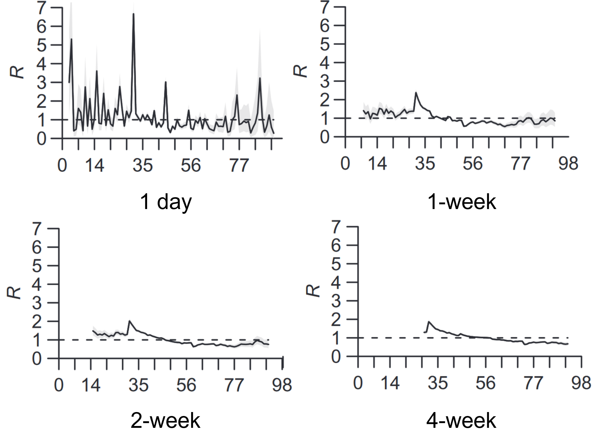
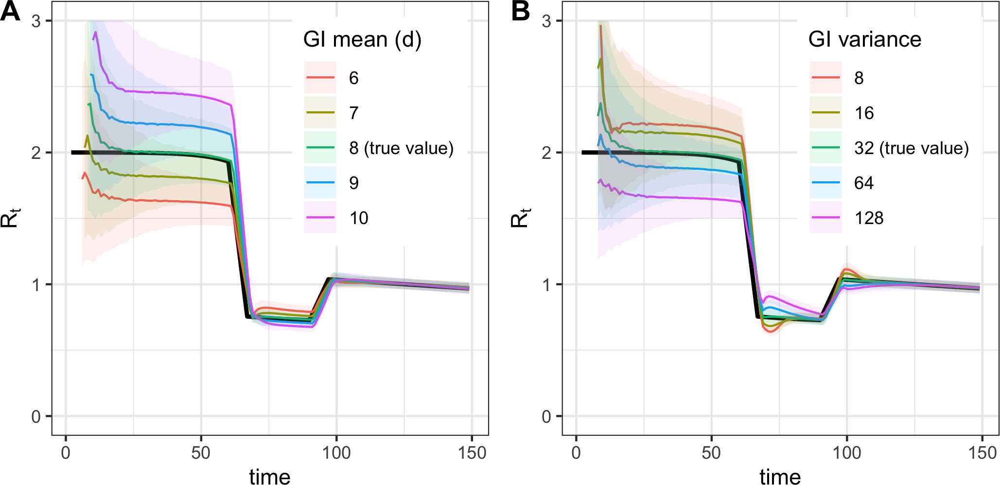
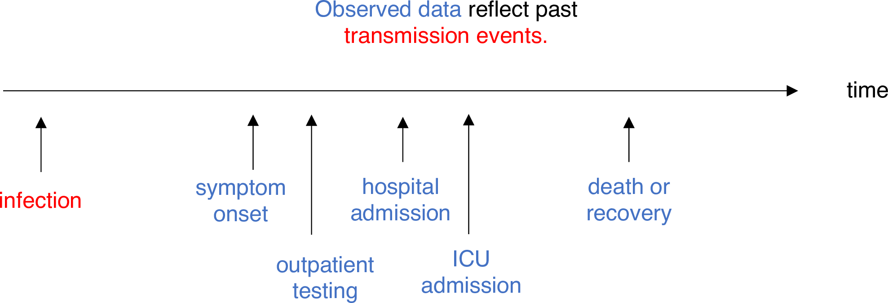

```{r}
#| include: false
source("_common.R")
```

# Estimating $R_t$

```{ojs}
import { createSlider, createButton, injectStyle } from "../assets/js/_slider.js"
d3 = require("d3@7")
```

$R_t$ can be defined in 2 ways: as the **instantaneous reproduction number** (see @sec-rt-inst) or as the **case reproduction number** (see @sec-rt-case).

## Instantaneous reproduction number $R_t^i$

::: {#def-rt-inst}
The instantaneous reproduction number is the expected number of secondary infections occurring at time $t$, divided by the number of infected individuals, each scaled by their relative infectiousness at time $t$ (an individual's relative infectiousness is based on the generation interval and time since infection) [@gostic2020].
:::

### Exact calculation

For a compartmental model (SIR or SEIR), $R_t^i$ can be calculated exactly as [@gostic2020]:

$$R_t^i = \beta(t) S(t) D$$

-   $\beta(t)$: the time-varying transmission rate.
-   $S(t)$: the fraction of the population that is susceptible.
-   $D$: the mean duration of infectiousness.

### Cori method {#sec-cori}

$$R_t^i = \frac{I_t}{\sum_{s = 1}^{t} I_{t - s} w_s}$$

-   $I_t$: the number of infection on day $t$.
-   $I_{t - s}$: the number of individuals who became infected $s$ days in the past.
-   $w_s$: the infectivity profile, describes how infectious an individual is $s$ days since infection, $w_s$ dependent on time since infection $s$ but independent of calendar time $t$, and often be approximated by the generation interval [@cori2013].
-   $I_{t - s} w_s$: we scale the number of individuals who became infected $s$ days in the past by how infectiousness are they still on day $t$ (which is $s$ days after the date they got infected, $w_s$).

Looking back at @def-rt-inst, $R_t^i$ is the expected number of secondary infections occurring at time $t$ ($I_t$), divided by the number of infected individuals ($\sum_{s = 1}^{t} I_{t - s}$), each scaled by their relative infectiousness at time $t$ ($w_s$).

The only parametric assumption required by this method is **the form of the generation interval**. The standard assumption is that $w_s$ follows a **discretized gamma distribution**, but any parametric or empirical discrete distribution also work [@gostic2020].

#### Interactive intuition {#sec-cori-intuition}

The three stacked panels map one-to-one onto the formula:

-   **Top**: incidence $I_t$. Gray bars are past $I_{t-s}$, red is today $I_t$ (numerator), and amber overlays are each past day's contribution $I_{t-s} \cdot w_s$. Summing the amber bars gives the denominator.
-   **Middle**: generation interval $w_s$, placed at day $t-s$ so each purple bar sits directly under the amber bar it produces. Visually: **gray $\times$ purple $=$ amber**.
-   **Bottom**: $R_t$ across the whole series, with $R_t = 1$ dashed and a red dot at the day you picked.

To run on your own data, upload a `date,count` CSV (or one number per line, 5–365 days). [📄 Download an example CSV](cori_example.csv).

This is the textbook Cori with a discrete-gamma generation interval and no smoothing, useful for intuition, not a replacement for [EpiEstim](https://github.com/mrc-ide/EpiEstim) or [EpiNow2](https://epiforecasts.io/EpiNow2/) (see @sec-code).

```{ojs}
//| echo: false
coriUserData = {
  // ─────────────────────────────────────────────────────────────────────────
  // "Bring your own data" Cori widget. Same three-panel layout as the
  // teaching widget, but `incidence` is mutable: a textarea + file picker +
  // examples dropdown feed it. The widget rebuilds bars when the series
  // length changes and otherwise behaves identically (rAF-coalesced draws,
  // CSS-driven dim/highlight, tap-to-toggle on phone).
  // ─────────────────────────────────────────────────────────────────────────
  const wrapper = document.createElement("div");
  wrapper.className = "cori-wrap";
  wrapper.style.cssText = "font-family:system-ui,-apple-system,sans-serif;max-width:900px;margin:0 auto;";
  wrapper.appendChild(injectStyle());

  // ───────── Built-in examples ─────────
  const EXAMPLES = {
    "Synthetic bell (30 days)":
      [2, 3, 5, 8, 12, 18, 27, 39, 53, 68, 82, 93, 100, 103, 101, 95, 86, 75, 63, 51, 40, 30, 22, 16, 11, 7, 5, 3, 2, 1],
    "Slow start, long tail (45 days)":
      [1, 1, 2, 2, 3, 4, 6, 8, 11, 15, 20, 26, 32, 38, 44, 49, 52, 53, 52, 49, 45, 41, 37, 33, 30, 27, 24, 22, 19, 17, 15, 13, 11, 10, 8, 7, 6, 5, 4, 3, 3, 2, 2, 1, 1],
    "Two waves (50 days)":
      [2, 4, 7, 12, 18, 25, 31, 36, 38, 36, 31, 25, 19, 14, 10, 7, 5, 4, 3, 4, 6, 9, 13, 19, 26, 34, 42, 48, 52, 53, 51, 47, 41, 34, 27, 21, 16, 12, 9, 7, 5, 4, 3, 2, 2, 1, 1, 1, 1, 1]
  };
  const DEFAULT_KEY = "Synthetic bell (30 days)";
  const MAX_T = 365;

  // ───────── State ─────────
  let incidence = EXAMPLES[DEFAULT_KEY].slice();
  let T = incidence.length;
  let t = Math.min(14, T - 1);

  // Pre-allocated scratch buffers (sized for MAX_T)
  const weights  = new Float64Array(MAX_T + 1);
  const contrib  = new Float64Array(MAX_T);
  const wValues  = new Float64Array(MAX_T);
  const rtRaw    = new Float64Array(MAX_T);
  const rtValid  = new Uint8Array(MAX_T);
  const rtPoints = new Array(MAX_T);
  for (let i = 0; i < MAX_T; i++) rtPoints[i] = { t: 0, rt: 0 };
  const rtLineData = [];

  function updateWeights(meanGI, sdGI) {
    const shape = (meanGI * meanGI) / (sdGI * sdGI);
    const scale = (sdGI * sdGI) / meanGI;
    let total = 0;
    weights[0] = 0;
    for (let s = 1; s <= MAX_T; s++) {
      const v = Math.pow(s, shape - 1) * Math.exp(-s / scale);
      weights[s] = v;
      total += v;
    }
    if (total > 0) for (let s = 1; s <= MAX_T; s++) weights[s] /= total;
  }

  // ───────── Parser ─────────
  function parseInput(text) {
    if (!text || !text.trim()) throw new Error("No data to parse.");
    const lines = text.trim().split(/\r?\n/).map(l => l.trim())
      .filter(l => l && !l.startsWith("#"));
    if (lines.length === 0) throw new Error("Empty input (only blank or # lines).");

    // Header detection: first line contains a non-numeric token?
    let startIdx = 0;
    const headerProbe = lines[0].split(/[,;\t\s]+/).filter(s => s);
    if (headerProbe.some(tok => !/^-?[\d.]+$/.test(tok.replace(/,/g, "")) && !/^\d{4}-\d{2}-\d{2}$/.test(tok))) {
      // Looks like a header
      startIdx = 1;
    }

    const result = [];
    for (let i = startIdx; i < lines.length; i++) {
      const parts = lines[i].split(/[,;\t\s]+/).filter(s => s);
      if (parts.length === 0) continue;
      // Use last column as the count (handles "date, count" and bare counts)
      const last = parts[parts.length - 1].replace(/,/g, "");
      const n = Number(last);
      if (!isFinite(n) || n < 0) {
        throw new Error(`Line ${i + 1}: "${lines[i]}" is not a non-negative number.`);
      }
      result.push(n);
    }

    if (result.length < 5) throw new Error(`Need at least 5 days of data; got ${result.length}.`);
    if (result.length > MAX_T) throw new Error(`Too many days (max ${MAX_T}); got ${result.length}.`);
    return result;
  }

  // ───────── Layout (matches the teaching widget) ─────────
  const W = 860;
  const M = { top: 18, right: 20, bottom: 44, left: 55 };
  const H_INC = 180, H_W = 90, H_RT = 130;
  const GAP = 10, GAP_RT = 24;
  const H = M.top + H_INC + GAP + H_W + GAP_RT + H_RT + M.bottom;
  const innerW = W - M.left - M.right;

  // ───────── Input controls ─────────
  const controlsBox = document.createElement("div");
  controlsBox.style.cssText = "display:flex;flex-wrap:wrap;gap:10px;align-items:center;margin:0 0 8px;padding:12px 16px;background:#f8fafc;border:1px solid #e3edf9;border-radius:6px;";

  const exSelect = document.createElement("select");
  exSelect.style.cssText = "flex:1 1 240px;padding:7px 8px;border:1px solid #cfe0f2;border-radius:4px;font-size:13px;background:#fff;";
  for (const k of Object.keys(EXAMPLES)) {
    const opt = document.createElement("option");
    opt.value = k; opt.textContent = k;
    exSelect.appendChild(opt);
  }
  exSelect.value = DEFAULT_KEY;

  const fileInput = document.createElement("input");
  fileInput.type = "file";
  fileInput.accept = ".csv,.tsv,.txt";
  fileInput.style.display = "none";

  const mkBtn = (text, fill, fg, border) => {
    const b = document.createElement("button");
    b.textContent = text;
    b.style.cssText = `padding:7px 14px;background:${fill};color:${fg};border:1px solid ${border};border-radius:4px;cursor:pointer;font-weight:600;font-size:13px;`;
    return b;
  };
  const btnFile  = mkBtn("Upload CSV", "#0E9AAB", "#fff",    "#0E9AAB");
  const btnReset = mkBtn("Reset",      "#fff",    "#42566b", "#cfe0f2");

  controlsBox.appendChild(exSelect);
  controlsBox.appendChild(btnFile);
  controlsBox.appendChild(btnReset);
  controlsBox.appendChild(fileInput);

  // Status / error line
  const statusEl = document.createElement("div");
  statusEl.style.cssText = "font-size:13px;color:#16A06B;margin:0 4px 12px;font-weight:600;";

  // ───────── GI sliders ─────────
  const sliders = document.createElement("div");
  sliders.style.cssText = "display:flex;gap:20px;margin:0 0 10px;align-items:flex-end;flex-wrap:wrap;";
  const SL = {};
  SL.meanGI = createSlider("Mean GI (days)", 1, 10, 0.5, 4, "#7E5AD6", "purple");
  SL.sdGI   = createSlider("SD GI (days)",   0.5, 5, 0.1, 2, "#7E5AD6", "purple");
  sliders.appendChild(SL.meanGI.el);
  sliders.appendChild(SL.sdGI.el);

  // ───────── Formula (re-uses .cori-formula CSS injected by the teaching
  //          widget; if this widget is loaded standalone the same rules are
  //          re-emitted below; duplicates are harmless). ─────────
  const fStyle = document.createElement("style");
  fStyle.textContent = `
    .cori-formula { display:flex; align-items:center; gap:14px; flex-wrap:wrap;
      font-family:'SF Mono',Menlo,Consolas,monospace; font-size:17px; color:#14263b;
      justify-content:center; }
    .cori-formula .op { font-weight:600; color:#647587; }
    .cori-formula .frac { display:inline-flex; flex-direction:column;
      text-align:center; line-height:1.15; }
    .cori-formula .hl-num { color:#C1343F; font-weight:700; }
    .cori-formula .hl-den { color:#B45309; font-weight:700; }
    .cori-formula [data-hl] { cursor:pointer; user-select:none;
      -webkit-tap-highlight-color:transparent; touch-action:manipulation;
      background-color:rgba(148,163,184,0.10);
      transition:background-color 0.15s, box-shadow 0.15s; }
    /* Each part sits on a soft tint of its own colour so they are easy to
       tell apart even where the text colours are close. */
    .cori-formula [data-hl="num"] { background-color:rgba(224,87,78,0.16); }
    .cori-formula [data-hl="den"] { background-color:rgba(234,179,8,0.24); }
    .cori-formula [data-hl="rt"]  { background-color:rgba(14,154,171,0.15); }
    .cori-formula .frac .num { padding:4px 10px 5px; border-bottom:1.5px solid #647587; border-radius:6px 6px 0 0; }
    .cori-formula .frac .den { padding:5px 10px 4px; border-radius:0 0 6px 6px; }
    .cori-formula .rtv { font-size:24px; font-weight:800; padding:4px 10px; border-radius:6px; }
    .cori-formula [data-hl]:hover,
    .cori-wrap[data-hover="num"] .cori-formula [data-hl="num"],
    .cori-wrap[data-hover="den"] .cori-formula [data-hl="den"],
    .cori-wrap[data-hover="rt"]  .cori-formula [data-hl="rt"] {
      background-color:#fef3c7; box-shadow:0 0 0 2px #facc15; }
    .cori-wrap .dimmable { transition: opacity 0.18s ease; }
    .cori-wrap[data-hover] .dimmable { opacity: 0.08; }
    .cori-wrap[data-hover="num"] .dimmable.keep-num,
    .cori-wrap[data-hover="den"] .dimmable.keep-den,
    .cori-wrap[data-hover="rt"]  .dimmable.keep-rt { opacity: 1; }
  `;
  const formula = document.createElement("div");
  formula.style.cssText = "margin:0 0 6px;padding:14px 18px;background:#f8fafc;border-radius:6px;border:1px solid #e3edf9;color:#14263b;";
  const fMain = document.createElement("div");
  fMain.className = "cori-formula";
  formula.appendChild(fStyle); formula.appendChild(fMain);

  // ───────── SVG (panels rebuilt on every data change) ─────────
  const svgSel = d3.create("svg")
    .attr("viewBox", `0 0 ${W} ${H}`)
    .style("width", "100%")
    .style("max-width", `${W}px`)
    .style("height", "auto")
    .style("cursor", "ew-resize")
    .style("touch-action", "none")
    .style("user-select", "none")
    .style("-webkit-user-select", "none")
    .style("outline", "none");
  const svg = svgSel.node();
  svg.setAttribute("tabindex", "0");

  const gInc = svgSel.append("g").attr("transform", `translate(${M.left}, ${M.top})`);
  const gW   = svgSel.append("g").attr("transform", `translate(${M.left}, ${M.top + H_INC + GAP})`);
  const gRt  = svgSel.append("g").attr("transform", `translate(${M.left}, ${M.top + H_INC + GAP + H_W + GAP_RT})`);

  // State that gets reset/rebuilt when incidence length changes
  let xScale, xBW, xStep, barX, barCx;
  let yScale, yScaleW, rtY;
  let baseBars, weightBars, tBar, labelIt, labelDenom;
  let wBars, wRule;
  let wyAxisG, wyAxis, rtYAxisG, rtYAxis;
  let rOneLine, rOneLabel, rtPath, rtDots, rtHighlight, rtRule;
  let rtLine;

  function rebuildPanels() {
    // Clear three panel containers
    gInc.selectAll("*").remove();
    gW.selectAll("*").remove();
    gRt.selectAll("*").remove();

    // Day-axis tick interval: show ~15 labels regardless of T
    const tickStep = Math.max(1, Math.ceil(T / 15));

    // x scale
    xScale = d3.scaleBand().domain(d3.range(T)).range([0, innerW]).padding(0.18);
    xBW = xScale.bandwidth();
    xStep = xScale.step();
    barX  = new Float64Array(T);
    barCx = new Float64Array(T);
    for (let i = 0; i < T; i++) { barX[i] = xScale(i); barCx[i] = barX[i] + xBW / 2; }

    // ───────── Panel 1: Incidence ─────────
    const yMaxInc = Math.max(1, d3.max(incidence)) * 1.2;
    yScale = d3.scaleLinear().domain([0, yMaxInc]).range([H_INC, 0]);

    gInc.append("g")
      .attr("transform", `translate(0, ${H_INC})`)
      .call(d3.axisBottom(xScale).tickFormat("").tickValues(d3.range(0, T, tickStep)));
    gInc.append("g").style("font-size", "12px")
      .call(d3.axisLeft(yScale).ticks(4).tickFormat(d3.format("d")));
    gInc.append("text")
      .attr("x", 2).attr("y", 13)
      .style("font-size", "15px").style("font-weight", "700").style("fill", "#14263b")
      .text("Incidence Iₜ");

    const gIncBase    = gInc.append("g").attr("class", "dimmable");
    const gIncContrib = gInc.append("g").attr("class", "dimmable keep-den");
    const gIncToday   = gInc.append("g").attr("class", "dimmable keep-num");

    baseBars   = new Array(T);
    weightBars = new Array(T);
    for (let i = 0; i < T; i++) {
      baseBars[i] = gIncBase.append("rect")
        .attr("x", barX[i]).attr("width", xBW)
        .attr("y", yScale(incidence[i]))
        .attr("height", H_INC - yScale(incidence[i]))
        .node();
      weightBars[i] = gIncContrib.append("rect")
        .attr("x", barX[i]).attr("width", xBW)
        .attr("fill", "#EAB308").attr("opacity", 0)
        .node();
    }
    tBar = gIncToday.append("rect")
      .attr("width", xBW).attr("fill", "#E0574E").node();
    labelIt = gIncToday.append("text")
      .style("font-size", "15px").style("font-weight", "700")
      .style("fill", "#E0574E").attr("text-anchor", "middle").node();
    labelDenom = gIncContrib.append("text")
      .style("font-size", "14px").style("font-weight", "700")
      .style("fill", "#b45309").attr("text-anchor", "middle").node();

    // ───────── Panel 2: Generation interval ─────────
    yScaleW = d3.scaleLinear().domain([0, 0.3]).range([H_W, 0]);

    gW.append("g")
      .attr("transform", `translate(0, ${H_W})`)
      .call(d3.axisBottom(xScale).tickFormat("").tickValues(d3.range(0, T, tickStep)));
    wyAxisG = gW.append("g").style("font-size", "12px");
    wyAxis  = d3.axisLeft(yScaleW).ticks(3).tickFormat(d3.format(".2f"));
    wyAxisG.call(wyAxis);
    gW.append("text")
      .attr("x", 2).attr("y", 13)
      .style("font-size", "15px").style("font-weight", "700").style("fill", "#6742BE")
      .text("Generation interval wₛ");

    const gWContent = gW.append("g").attr("class", "dimmable");
    wBars = new Array(T);
    for (let i = 0; i < T; i++) {
      wBars[i] = gWContent.append("rect")
        .attr("x", barX[i]).attr("width", xBW)
        .attr("fill", "#7E5AD6").attr("opacity", 0)
        .node();
    }
    wRule = gWContent.append("line")
      .attr("stroke", "#E0574E").attr("stroke-dasharray", "2,2")
      .attr("stroke-width", 1).attr("y1", 0).attr("y2", H_W).node();

    // ───────── Panel 3: R_t over time ─────────
    rtY = d3.scaleLinear().domain([0, 3]).range([H_RT, 0]);

    gRt.append("g").style("font-size", "13px")
      .attr("transform", `translate(0, ${H_RT})`)
      .call(d3.axisBottom(xScale).tickFormat(d => d + 1).tickValues(d3.range(0, T, tickStep)));
    rtYAxisG = gRt.append("g").style("font-size", "12px");
    rtYAxis  = d3.axisLeft(rtY).ticks(5);
    rtYAxisG.call(rtYAxis);
    gRt.append("text")
      .attr("x", 2).attr("y", 13)
      .style("font-size", "15px").style("font-weight", "700").style("fill", "#0E9AAB")
      .text("Rₜ over time");
    gRt.append("text")
      .attr("x", innerW / 2).attr("y", H_RT + 36)
      .style("font-size", "13px").style("fill", "#42566b")
      .attr("text-anchor", "middle")
      .text("Day  (click or drag the figure to pick t · ← → arrow keys also work)");

    const gRtCurve  = gRt.append("g").attr("class", "dimmable");
    const gRtMarker = gRt.append("g").attr("class", "dimmable keep-rt");

    rOneLine = gRtCurve.append("line")
      .attr("x1", 0).attr("x2", innerW)
      .attr("stroke", "#647587").attr("stroke-dasharray", "3,3").node();
    rOneLabel = gRtCurve.append("text")
      .attr("x", innerW - 4).style("font-size", "12px").style("fill", "#647587")
      .attr("text-anchor", "end").text("R = 1").node();

    rtPath = gRtCurve.append("path")
      .attr("fill", "none").attr("stroke", "#0E9AAB").attr("stroke-width", 2.5).node();
    rtDots = new Array(T);
    for (let i = 0; i < T; i++) {
      rtDots[i] = gRtCurve.append("circle")
        .attr("r", 2.8).attr("fill", "#0E9AAB").attr("opacity", 0).node();
    }
    rtHighlight = gRtMarker.append("circle")
      .attr("r", 5.5).attr("fill", "#E0574E")
      .attr("stroke", "#fff").attr("stroke-width", 2).node();
    rtRule = gRtMarker.append("line")
      .attr("stroke", "#E0574E").attr("stroke-dasharray", "2,2")
      .attr("stroke-width", 1).attr("y1", 0).attr("y2", H_RT).node();

    rtLine = d3.line().x(d => barCx[d.t]).y(d => rtY(d.rt));
  }

  // ───────── Apply parsed data ─────────
  function applyData(arr, sourceLabel) {
    incidence = arr.slice();
    T = incidence.length;
    // Clamp / nudge t into a useful default position
    if (t < 2 || t > T - 1) {
      t = Math.min(T - 1, Math.max(2, Math.ceil(SL.meanGI.val())));
    }
    rebuildPanels();
    requestDraw();
    const total = arr.reduce((a, b) => a + b, 0);
    statusEl.style.color = "#16A06B";
    statusEl.textContent = `Loaded ${T} days, total ${total.toLocaleString()} cases · ${sourceLabel}`;
  }

  function tryApply(text, sourceLabel) {
    try {
      const arr = parseInput(text);
      applyData(arr, sourceLabel);
    } catch (err) {
      statusEl.style.color = "#E0574E";
      statusEl.textContent = "Error: " + err.message;
    }
  }

  // ───────── Draw (hot path) ─────────
  let rafPending = false;
  function requestDraw() {
    if (rafPending) return;
    rafPending = true;
    requestAnimationFrame(() => { rafPending = false; draw(); });
  }

  function draw() {
    const meanGI = SL.meanGI.val();
    const sdGI   = SL.sdGI.val();
    updateWeights(meanGI, sdGI);

    // Panel 1: contributions
    let denom = 0, maxContrib = 0, maxContribIdx = -1;
    for (let i = 0; i < T; i++) contrib[i] = 0;
    for (let s = 1; s <= t; s++) {
      const c = incidence[t - s] * weights[s];
      contrib[t - s] = c;
      denom += c;
      if (c > maxContrib) { maxContrib = c; maxContribIdx = t - s; }
    }
    const numerator = incidence[t];
    const Rt = denom > 0 ? numerator / denom : NaN;

    for (let i = 0; i < T; i++) {
      baseBars[i].setAttribute("fill",
        i < t ? "#e3edf9" : i === t ? "#E0574E" : "#f1f5f9");
      const c = contrib[i];
      const wb = weightBars[i];
      if (c > 0 && i < t) {
        const y = yScale(c);
        wb.setAttribute("y", y);
        wb.setAttribute("height", H_INC - y);
        wb.setAttribute("opacity", "0.92");
      } else {
        wb.setAttribute("opacity", "0");
      }
    }
    const tY = yScale(incidence[t]);
    tBar.setAttribute("x", barX[t]);
    tBar.setAttribute("y", tY);
    tBar.setAttribute("height", H_INC - tY);

    labelIt.setAttribute("x", barCx[t]);
    labelIt.setAttribute("y", Math.max(22, tY - 6));
    labelIt.textContent = "Iₜ";
    if (maxContribIdx >= 0) {
      labelDenom.setAttribute("x", barCx[maxContribIdx]);
      labelDenom.setAttribute("y", Math.max(22, yScale(maxContrib) - 5));
      labelDenom.textContent = "Iₜ₋ₛ · wₛ";
    } else {
      labelDenom.textContent = "";
    }

    // Panel 2
    let wMax = 0;
    for (let s = 1; s <= T; s++) if (weights[s] > wMax) wMax = weights[s];
    for (let i = 0; i < T; i++) wValues[i] = 0;
    for (let s = 1; s <= t; s++) wValues[t - s] = weights[s];
    yScaleW.domain([0, Math.max(0.3, wMax * 1.2)]).nice();
    wyAxisG.call(wyAxis);

    for (let i = 0; i < T; i++) {
      const w = wValues[i];
      const wb = wBars[i];
      if (w > 0.0005) {
        const y = yScaleW(w);
        wb.setAttribute("y", y);
        wb.setAttribute("height", H_W - y);
        wb.setAttribute("opacity", "0.9");
      } else {
        wb.setAttribute("opacity", "0");
      }
    }
    const cx = barCx[t];
    wRule.setAttribute("x1", cx);
    wRule.setAttribute("x2", cx);

    // Panel 3
    let rtMax = 0;
    const startT = Math.max(3, Math.ceil(meanGI));
    for (let tt = 0; tt < T; tt++) {
      rtValid[tt] = 0;
      if (tt >= startT) {
        let d = 0;
        for (let s = 1; s <= tt; s++) d += incidence[tt - s] * weights[s];
        if (d > 0.5) {
          const r = incidence[tt] / d;
          rtRaw[tt] = r;
          rtValid[tt] = 1;
          if (r > rtMax) rtMax = r;
        }
      }
    }
    rtY.domain([0, Math.max(3, rtMax * 1.1)]).nice();
    rtYAxisG.call(rtYAxis);
    const rOneY = rtY(1);
    rOneLine.setAttribute("y1", rOneY);
    rOneLine.setAttribute("y2", rOneY);
    rOneLabel.setAttribute("y", rOneY - 4);

    rtLineData.length = 0;
    for (let i = 0; i < T; i++) {
      if (rtValid[i]) {
        rtPoints[i].t = i;
        rtPoints[i].rt = rtRaw[i];
        rtLineData.push(rtPoints[i]);
      }
    }
    rtPath.setAttribute("d", rtLine(rtLineData) || "");

    for (let i = 0; i < T; i++) {
      const dot = rtDots[i];
      if (rtValid[i]) {
        dot.setAttribute("cx", barCx[i]);
        dot.setAttribute("cy", rtY(rtRaw[i]));
        dot.setAttribute("opacity", "0.75");
      } else {
        dot.setAttribute("opacity", "0");
      }
    }

    if (rtValid[t]) {
      rtHighlight.setAttribute("cx", cx);
      rtHighlight.setAttribute("cy", rtY(rtRaw[t]));
      rtHighlight.style.display = "";
    } else {
      rtHighlight.style.display = "none";
    }
    rtRule.setAttribute("x1", cx);
    rtRule.setAttribute("x2", cx);

    // Formula readout
    const rtColor = isNaN(Rt) ? "#647587" : "#0E9AAB";
    fMain.innerHTML =
      `<span style="color:${rtColor};font-weight:700;">R<sub>t</sub></span>` +
      `<span class="op">=</span>` +
      `<span class="frac">` +
        `<span class="num hl-num" data-hl="num">I<sub>t</sub></span>` +
        `<span class="den hl-den" data-hl="den">Σ<sub>s</sub> I<sub>t−s</sub>·w<sub>s</sub></span>` +
      `</span>` +
      `<span class="op">=</span>` +
      `<span class="frac">` +
        `<span class="num hl-num" data-hl="num">${numerator}</span>` +
        `<span class="den hl-den" data-hl="den">${denom.toFixed(2)}</span>` +
      `</span>` +
      `<span class="op">=</span>` +
      `<span class="rtv" data-hl="rt" style="color:${rtColor};">${isNaN(Rt) ? "-" : Rt.toFixed(2)}</span>`;
  }

  // ───────── Hover + tap-to-toggle ─────────
  let hoverPart = null, stickyPart = null;
  function applyHover() {
    const a = hoverPart || stickyPart;
    if (a) wrapper.setAttribute("data-hover", a);
    else wrapper.removeAttribute("data-hover");
  }
  fMain.addEventListener("pointerover", (e) => {
    const el = e.target.closest("[data-hl]");
    if (el) { hoverPart = el.dataset.hl; applyHover(); }
  });
  fMain.addEventListener("pointerout", (e) => {
    const el = e.target.closest("[data-hl]");
    if (!el) return;
    const rel = e.relatedTarget && e.relatedTarget.closest && e.relatedTarget.closest("[data-hl]");
    if (rel && rel.dataset.hl === el.dataset.hl) return;
    hoverPart = null; applyHover();
  });
  wrapper.addEventListener("click", (e) => {
    const el = e.target.closest("[data-hl]");
    if (el) stickyPart = (stickyPart === el.dataset.hl) ? null : el.dataset.hl;
    else stickyPart = null;
    applyHover();
  });

  // ───────── Drag / keyboard ─────────
  function eventToT(event) {
    const rect = svg.getBoundingClientRect();
    const k = W / rect.width;
    const localX = (event.clientX - rect.left) * k - M.left;
    const idx = Math.round(localX / xStep);
    return idx < 2 ? 2 : idx > T - 1 ? T - 1 : idx;
  }
  let dragging = false;
  svg.addEventListener("pointerdown", (e) => {
    dragging = true;
    try { svg.setPointerCapture(e.pointerId); } catch (_) {}
    const nt = eventToT(e);
    if (nt !== t) { t = nt; requestDraw(); }
    svg.focus(); e.preventDefault();
  });
  svg.addEventListener("pointermove", (e) => {
    if (!dragging) return;
    const nt = eventToT(e);
    if (nt !== t) { t = nt; requestDraw(); }
  });
  const endDrag = (e) => {
    dragging = false;
    try { svg.releasePointerCapture(e.pointerId); } catch (_) {}
  };
  svg.addEventListener("pointerup", endDrag);
  svg.addEventListener("pointercancel", endDrag);
  svg.addEventListener("keydown", (e) => {
    if (e.key === "ArrowLeft"  && t > 2)     { t--; requestDraw(); e.preventDefault(); }
    if (e.key === "ArrowRight" && t < T - 1) { t++; requestDraw(); e.preventDefault(); }
  });

  SL.meanGI.input.addEventListener("input", () => { SL.meanGI.sync(); requestDraw(); });
  SL.sdGI.input.addEventListener("input",   () => { SL.sdGI.sync();   requestDraw(); });

  // ───────── Input wiring ─────────
  btnFile.addEventListener("click", () => fileInput.click());
  fileInput.addEventListener("change", (e) => {
    const file = e.target.files[0];
    if (!file) return;
    const reader = new FileReader();
    reader.onload  = () => tryApply(reader.result, `file: ${file.name}`);
    reader.onerror = () => {
      statusEl.style.color = "#E0574E";
      statusEl.textContent = "Error: could not read file.";
    };
    reader.readAsText(file);
    // Allow re-uploading the same file by resetting the input value
    e.target.value = "";
  });
  exSelect.addEventListener("change", (e) => {
    applyData(EXAMPLES[e.target.value], `example: ${e.target.value}`);
  });
  btnReset.addEventListener("click", () => {
    exSelect.value = DEFAULT_KEY;
    applyData(EXAMPLES[DEFAULT_KEY], `example: ${DEFAULT_KEY}`);
  });

  // ───────── Privacy note ─────────
  const privacyNote = document.createElement("div");
  privacyNote.style.cssText = "font-size:12px;color:#647587;margin-top:14px;padding:8px 12px;background:#f1f5f9;border-left:3px solid #647587;border-radius:3px;";
  privacyNote.textContent = "Your data stays in your browser. Nothing is uploaded to a server.";

  // ───────── Assemble + first draw ─────────
  wrapper.appendChild(controlsBox);
  wrapper.appendChild(statusEl);
  wrapper.appendChild(sliders);
  wrapper.appendChild(formula);
  wrapper.appendChild(svg);
  wrapper.appendChild(privacyNote);

  applyData(EXAMPLES[DEFAULT_KEY], `example: ${DEFAULT_KEY}`);
  return wrapper;
}
```

::: {.callout-tip collapse="true"}

## Proofs

The renewal equation (also called the Euler-Lotka equation [@wallinga2006]) is a cornerstone of demographic theory and backbone of the $R_t$ estimators.

$$b(t) = \int_{a = 0}^{\infty} b(t - a) n(a) da$$

-   $b(t)$: the number of female offspring at time $t$.
-   $b(t - a)$: the number of mothers of age $a$ at time $t$, which is equal to the number of female offspring at time $t - a$.
-   $n(a)$: the birth ability of mothers of age $a$, scaled by the probability of surviving to age $a$.
-   $\int_{a = 0}^{\infty}$: summing these female offspring over all possible mothers' ages, we obtain the total number of female offspring at time $t$ which is $b(t)$.

This equation assume that the population displays exponential growth at a fixed growth rate and that the age distribution of the population does not change over time [@wallinga2006].

To describe epidemic dynamics, the renewal equation is expressed in terms of $I(t)$.

$$I(t) = R_0 S(t) \int_{s = 0}^{\infty} I(t - s) w_s ds$$

-   $R_0 S(t) = R_t$: see @def-rt.
-   $I(t - s)$: the number of individuals who became infected $s$ time points ago in the past.
-   $w_s$: the infectivity profile, or the probability of how infectiousness are they still at time $t$ (which is $s$ time points after the date they got infected).
-   $I(t - s) w_s$: we scale the number of individuals who in the past by how infectiousness are they still at time $t$.

Now we transform the equation a bit, and we got something very similar to the Cori method (see @sec-cori).

$$R_t = \frac{I(t)}{\int_{s = 0}^{\infty} I(t - s) w_s ds}$$

:::

### When can we start estimating $R_t^i$?

Cori et al. suggest starting estimating $R_t^i$ once those three criteria are fulfilled [@cori2013]:

-   At least after the sliding window size.
-   At least after one mean serial interval.
-   At least 12 cases (the initial case + 11) have been observed since the beginning of the epidemic (in a time window): to get a posterior credible interval of 0.3, the time window must comprise at least 11 incident cases.

### Key considerations

Source: Dr. Anne Cori's [webinar](https://www.youtube.com/watch?v=wv3BecZD5DU).

-   Temporal resolution: we can't apply the $R_t^i$ method when the time step of observation is too large (\> mean generation interval).
-   Spatial resolution: ideally use a spatial scale that you can distinguish locally infected cases from imported cases.
-   $R_t^i$ is very sensitive to the size of the sliding window: small windows can lead to highly variable estimates with wide credible intervals, whereas longer windows lead to smoothed estimates with narrower credible intervals. Perhaps also consider at least 11 incident cases in a sliding window to get a posterior credible interval of 0.3 [@cori2013].



## Case reproduction number $R_t^c$

::: {#def-rt-case}
The case or cohort reproduction number is the expected number of secondary infections that an individual who becomes infected at time $t$ will eventually cause as they progress through their infection [@gostic2020].
:::

### Exact calculation {#sec-rt-case-exact}

$$R_t^c = \int_{u = t}^{\infty} R_u^i w_{u-t} du$$

-   $R_u^i$: the instantaneous reproduction number of current infected cases at time $u$, starting from $t$ to the end of their infectious period $\infty$.
-   $w_{u-t}$: the infectiousness of them at that time.

### Wallinga and Teunis method

There are 3 steps [@gostic2020]:

**Step 1**. Estimate the likelihood that case $j$ (infected at time $t_j$) infected case $i$ (at time $t_i$).

$$p_{ij} = \frac{w_{t_i - t_j}}{\sum_{i \neq k} w_{t_i - t_k}}$$

-   $\sum_{i \neq k} w_{t_i - t_k}$: sum of the infectiousness of all cases (other than $i$) infects case $i$.

**Step 2**. Compute the individual reproduction number of case $j$.

$$R_j = \sum_i p_{ij}$$

**Step 3**. Compute the case reproduction number at time $t$, it is the expected value of $R_j$ for all individuals infected at time $t$.

$$R_t^c = \mathbb{E}(R_j)$$

#### Interactive demonstration {#sec-wt-demo .unnumbered}

Every circle is one infected case. The outbreak is **1–2–3–2–1**, nine cases over five days, with three cases on the peak day. Same-day cases are stacked vertically in each day-column. Click commits a selection, hover explores.

-   **Step 1** (blue): **click** any case to set $i$ (clicking again swaps to a new $i$). **Hover** an earlier case to preview it as $j$: that node, its arc, and the matching $w_s$ bar all flash red, the $p_{ij}$ symbol in the header formula lights up red, and the readout at the bottom is wrapped in a red pill matching the formula highlight. Leaving the hover restores the "all past arcs with $w$" view.
-   **Step 2** (green): **click** any case to set $j$; arcs to every later $i$ are drawn and labelled with their $p_{ij}$, their sum $R_j$ printed next to the node. **Hover** a later case to isolate a single $p_{ij}$ contribution; the hovered arc thickens and darkens while the others fade.
-   **Step 3** (amber): every case prints its own $R_j$ (top-slot labels go above, bottom-slot below, middle-slot to the right). Day 3 holds **three** $R_j$ labels and $R_t^c$ below the column is their mean. At day-level the three $R_j$'s are equal, so the mean equals each; the averaging is what formally defines $R_t^c$.

```{ojs}
//| echo: false
wtSteps = {
  // ═══════════════════════════════════════════════════════════════════════
  // Hover stroke is now proportional (w * 42 or p * 44, with small floors)
  // so a hovered arc's thickness still reflects its magnitude, just bigger
  // than its non-hovered scale (w * 28, p * 30). SVG text sizes and chip /
  // bubble dimensions have been bumped so everything reads at a glance.
  // ═══════════════════════════════════════════════════════════════════════

  // ── Outbreak: 1-2-3-2-1 (9 cases) ──
  const perDay = [1, 2, 3, 2, 1];
  const cases = [];
  let nxt = 1;
  for (let d = 0; d < perDay.length; d++)
    for (let k = 0; k < perDay[d]; k++)
      cases.push({ id: nxt++, day: d + 1, slot: k, total: perDay[d] });
  const N = cases.length, T = perDay.length;
  const SMAX = Math.max(T + 3, 8);

  // ── Discretised gamma weights ──
  const weights = new Float64Array(SMAX + 1);
  function updW(m, sd) {
    const shape = (m * m) / (sd * sd);
    const scale = (sd * sd) / m;
    let tot = 0;
    weights[0] = 0;
    for (let s = 1; s <= SMAX; s++) {
      weights[s] = Math.pow(s, shape - 1) * Math.exp(-s / scale);
      tot += weights[s];
    }
    if (tot > 0) for (let s = 1; s <= SMAX; s++) weights[s] /= tot;
  }

  const computeDenom = i => {
    const di = cases[i].day;
    let D = 0;
    for (let k = 0; k < N; k++) {
      if (k === i) continue;
      const g = di - cases[k].day;
      if (g > 0 && g <= SMAX) D += weights[g];
    }
    return D;
  };
  const computePij = (i, j) => {
    const g = cases[i].day - cases[j].day;
    if (g <= 0 || g > SMAX) return 0;
    const D = computeDenom(i);
    return D > 0 ? weights[g] / D : 0;
  };
  const computeRj = j => {
    let r = 0;
    for (let i = 0; i < N; i++)
      if (cases[i].day > cases[j].day) r += computePij(i, j);
    return r;
  };

  // ── State ──
  // Click-committed state (works on desktop + mobile via tap)
  let selI    = 4;     // Panel 1 i
  let selJ1   = null;  // Panel 1 j, set by tap on an earlier case (toggle)
  let selJ2   = 1;     // Panel 2 j
  let stickI2 = null;  // Panel 2 isolated i, set by tap on a later case (toggle)
  // Hover-only transients (desktop only; ignored on touch devices)
  let hoverJ  = null;
  let hoverI2 = null;

  // ── Layout ──
  const W = 900;
  const NODE_R = 22;
  const netM = { top: 62, right: 54, bottom: 54, left: 54 };
  const netPlotW = W - netM.left - netM.right;
  const xSp = netPlotW / (T - 1);

  const slotOffsets = {
    1: [0],
    2: [-30, 30],
    3: [-58, 0, 58]
  };
  const slotOff = c => slotOffsets[c.total][c.slot];

  const nodePos = (c, H) => ({
    x: netM.left + (c.day - 1) * xSp,
    y: netM.top + (H - netM.top - netM.bottom) / 2 + slotOff(c)
  });

  function arcGeom(pi, pj, gap) {
    const lift = Math.min(230, 150 + gap * 28);
    const mx = (pi.x + pj.x) / 2;
    const cy = (pi.y + pj.y) / 2 - lift;
    const py = (pi.y + pj.y) / 2 - lift / 2;
    return { d: `M ${pj.x} ${pj.y} Q ${mx} ${cy} ${pi.x} ${pi.y}`, px: mx, py };
  }

  const pairs = [];
  for (let i = 0; i < N; i++)
    for (let j = 0; j < N; j++)
      if (cases[j].day < cases[i].day) pairs.push({ i, j });

  const subD = n => String(n).split("").map(d => "₀₁₂₃₄₅₆₇₈₉"[+d]).join("");
  const SUM_SYM = "Σₖ≠ᵢ wₜᵢ₋ₜₖ";

  // ── Wrapper & styles ──
  const wrapper = document.createElement("div");
  wrapper.className = "wtsteps-wrap";
  wrapper.style.cssText = "font-family:system-ui,-apple-system,sans-serif;max-width:960px;margin:0 auto;";
  wrapper.appendChild(injectStyle());

  const style = document.createElement("style");
  style.textContent = `
    .wtsteps-wrap { color:#14263b; }
    .wtsteps-wrap .panel { border:1px solid #e3edf9; border-radius:12px;
      margin-bottom:14px; overflow:hidden; background:#fff;
      box-shadow:0 1px 3px rgba(15,23,42,0.05); }
    .wtsteps-wrap .panel-head { display:flex; align-items:center; gap:12px;
      padding:12px 20px; border-bottom:1px solid #e3edf9;
      background:var(--bg); flex-wrap:wrap; }
    .wtsteps-wrap .badge { background:var(--c); color:#fff; padding:4px 12px;
      border-radius:14px; font-weight:700; font-size:12px;
      letter-spacing:0.5px; text-transform:uppercase; white-space:nowrap; }
    .wtsteps-wrap .pname { font-weight:700; font-size:15px; color:#14263b;
      white-space:nowrap; }
    .wtsteps-wrap .pformula { font-family:'SF Mono',Menlo,Consolas,monospace;
      color:#42566b; font-size:14px; margin-left:auto; }
    .wtsteps-wrap .panel.step1 { --c:#2A5CD6; --bg:#eff6ff; }
    .wtsteps-wrap .panel.step2 { --c:#16A06B; --bg:#ecfdf5; }
    .wtsteps-wrap .panel.step3 { --c:#E5A800; --bg:#fffbeb; }
    .wtsteps-wrap svg { display:block; width:100%; height:auto; }
    .wtsteps-wrap .node-grp { cursor:pointer; }
    .wtsteps-wrap .node-grp circle { transition: stroke-width 0.12s; }
    .wtsteps-wrap .node-grp:hover circle { stroke-width: 3.4; }
    .wtsteps-wrap .hint { font-size:14px; color:#42566b; margin:0 0 12px;
      padding:12px 16px; background:#f8fafc; border-radius:8px;
      border:1px solid #e3edf9; line-height:1.6; }
    .wtsteps-wrap .hint b { color:#14263b; }
    .wtsteps-wrap .hint .ibox { color:#2A5CD6; font-weight:700; }
    .wtsteps-wrap .hint .jbox { color:#E0574E; font-weight:700; }
    .wtsteps-wrap .hint .gbox { color:#16A06B; font-weight:700; }
    .wtsteps-wrap .hint kbd { font-family:'SF Mono',Menlo,monospace;
      background:#e3edf9; padding:1px 6px; border-radius:4px; font-size:12px;
      border:1px solid #cfe0f2; }
    .wtsteps-wrap .panel.step1 .fm-pij,
    .wtsteps-wrap .panel.step1 .fm-w {
      padding:2px 6px; border-radius:3px;
      transition:background 0.18s, color 0.18s;
    }
    .wtsteps-wrap .panel.step1:not(.hover-j) .fm-w {
      background:#fde047; color:#1B4DC7; font-weight:800;
    }
    .wtsteps-wrap .panel.step1.hover-j .fm-pij {
      background:#fecaca; color:#C1343F; font-weight:800;
    }
  `;
  wrapper.appendChild(style);

  // ── Controls ──
  const sliderRow = document.createElement("div");
  sliderRow.style.cssText = "display:flex;gap:22px;margin:0 0 12px;align-items:flex-end;flex-wrap:wrap;";
  const SL = {
    meanGI: createSlider("Mean GI (days)", 1.5, 7,   0.5, 3,   "#7E5AD6", "purple"),
    sdGI:   createSlider("SD GI (days)",   0.5, 2.5, 0.1, 1.2, "#7E5AD6", "purple")
  };
  sliderRow.appendChild(SL.meanGI.el);
  sliderRow.appendChild(SL.sdGI.el);
  wrapper.appendChild(sliderRow);

  const hint = document.createElement("div");
  hint.className = "hint";
  hint.innerHTML = `
    <b>Panel 1</b>: <kbd>tap</kbd>/<kbd>click</kbd> a case to set <span class="ibox">i</span>; tap an earlier case to set <span class="jbox">j</span> (tap again to clear). On desktop, <kbd>hover</kbd> an earlier case for a transient preview. Arc labels show w while idle and p<sub>ij</sub> for the chosen pair.<br>
    <b>Panel 2</b>: <kbd>tap</kbd>/<kbd>click</kbd> a case to set <span class="gbox">j</span>; tap a later case to isolate one p<sub>ij</sub> (tap again to unisolate). On desktop, <kbd>hover</kbd> a later case for a transient isolate.<br>
    <b>Panel 3</b>: <kbd>tap</kbd>/<kbd>click</kbd> a case to share it as <span class="gbox">j</span> with Panel 2.
  `;
  wrapper.appendChild(hint);

  // ── R_j label positioning helper ──
  function applyLabelPos(textEl, c) {
    let dx = 0, dy = NODE_R + 24, anchor = "middle";
    if (c.total > 1) {
      if (c.slot === 0)                    { dy = -(NODE_R + 12); }
      else if (c.slot === c.total - 1)     { dy = NODE_R + 24; }
      else { dx = NODE_R + 14; dy = 5; anchor = "start"; }
    }
    textEl.setAttribute("dx", dx);
    textEl.setAttribute("dy", dy);
    textEl.setAttribute("text-anchor", anchor);
  }

  // ── Shared builder ──
  function buildNetwork(svgSel, H, prefix, onClick, onHover) {
    svgSel.append("defs").html(`
      <filter id="${prefix}-sh" x="-40%" y="-40%" width="180%" height="180%">
        <feDropShadow dx="0" dy="1" stdDeviation="1.4" flood-color="#14263b" flood-opacity="0.14"/>
      </filter>
      <filter id="${prefix}-csh" x="-40%" y="-40%" width="180%" height="180%">
        <feDropShadow dx="0" dy="0.6" stdDeviation="1" flood-color="#14263b" flood-opacity="0.18"/>
      </filter>
    `);
    const netG = svgSel.append("g");

    for (let d = 1; d <= T; d++) {
      const x = netM.left + (d - 1) * xSp;
      netG.append("text")
        .attr("x", x).attr("y", H - netM.bottom + 28)
        .attr("text-anchor", "middle")
        .style("font-size", "15px").style("font-weight", "600")
        .style("fill", "#647587").style("letter-spacing", "0.3px")
        .text("Day " + d);
    }

    const arcG   = netG.append("g");
    const nodeG  = netG.append("g");
    const labelG = netG.append("g");

    const arcPaths = pairs.map(p => {
      const pi = nodePos(cases[p.i], H);
      const pj = nodePos(cases[p.j], H);
      const gap = cases[p.i].day - cases[p.j].day;
      const g = arcGeom(pi, pj, gap);
      const path = arcG.append("path")
        .attr("d", g.d).attr("fill", "none")
        .attr("stroke-linecap", "round").node();
      return { path, px: g.px, py: g.py };
    });

    const nodes = cases.map((c, idx) => {
      const pos = nodePos(c, H);
      const grp = nodeG.append("g")
        .attr("class", "node-grp")
        .attr("transform", `translate(${pos.x}, ${pos.y})`);
      const circle = grp.append("circle")
        .attr("r", NODE_R)
        .attr("fill", "#fff").attr("stroke", "#647587").attr("stroke-width", 2)
        .attr("filter", `url(#${prefix}-sh)`);
      const text = grp.append("text")
        .attr("text-anchor", "middle").attr("dy", 6)
        .style("font-size", "18px").style("font-weight", "800")
        .style("fill", "#42566b").style("pointer-events", "none")
        .text(c.id);
      const below = grp.append("text")
        .attr("text-anchor", "middle")
        .attr("dy", NODE_R + 24)
        .style("font-size", "15px").style("font-weight", "700")
        .style("font-family", "'SF Mono',Menlo,monospace")
        .style("pointer-events", "none")
        .attr("opacity", 0);
      const gNode = grp.node();
      gNode.addEventListener("click", () => onClick(idx));
      if (onHover) {
        gNode.addEventListener("mouseenter", () => onHover(idx, true));
        gNode.addEventListener("mouseleave", () => onHover(idx, false));
      }
      return { grp: gNode, circle: circle.node(), text: text.node(),
               below: below.node(), pos };
    });

    const arcs = arcPaths.map((a) => {
      const lgrp = labelG.append("g")
        .attr("transform", `translate(${a.px}, ${a.py - 12})`)
        .attr("opacity", 0);
      const lrect = lgrp.append("rect")
        .attr("x", -27).attr("y", -14)
        .attr("width", 54).attr("height", 27)
        .attr("rx", 5).attr("ry", 5)
        .attr("fill", "#fff").attr("stroke-width", 1.3)
        .attr("filter", `url(#${prefix}-csh)`);
      const ltxt = lgrp.append("text")
        .attr("text-anchor", "middle").attr("dy", 5)
        .style("font-size", "15px").style("font-weight", "700")
        .style("font-family", "'SF Mono',Menlo,monospace");
      return { path: a.path, lgrp: lgrp.node(),
               lrect: lrect.node(), ltxt: ltxt.node() };
    });

    const hdrG = netG.append("g").style("pointer-events", "none");
    const mkHdr = () => {
      const rect = hdrG.append("rect").attr("rx", 11).attr("ry", 11)
        .attr("filter", `url(#${prefix}-csh)`).attr("opacity", 0).node();
      const txt = hdrG.append("text").attr("text-anchor", "middle")
        .style("font-size", "14px").style("font-weight", "800")
        .style("letter-spacing", "0.6px").style("fill", "#fff")
        .attr("opacity", 0).node();
      return { rect, txt };
    };
    return { arcs, nodes, hdrI: mkHdr(), hdrJ: mkHdr() };
  }

  function setHdr(hdr, pos, label, color, side = "above") {
    hdr.txt.textContent = label;
    const tw = label.length * 8.2 + 22;
    let yRect, yTxt;
    if (side === "above") { yRect = pos.y - NODE_R - 38; yTxt = pos.y - NODE_R - 19; }
    else                  { yRect = pos.y + NODE_R + 10; yTxt = pos.y + NODE_R + 29; }
    hdr.rect.setAttribute("x", pos.x - tw / 2);
    hdr.rect.setAttribute("y", yRect);
    hdr.rect.setAttribute("width", tw);
    hdr.rect.setAttribute("height", 28);
    hdr.rect.setAttribute("fill", color);
    hdr.txt.setAttribute("x", pos.x);
    hdr.txt.setAttribute("y", yTxt);
    hdr.rect.setAttribute("opacity", 1);
    hdr.txt.setAttribute("opacity", 1);
  }
  function hdrSide(c) {
    if (c.total === 1)               return "above";
    if (c.slot === 0)                return "below";
    if (c.slot === c.total - 1)      return "above";
    return "above";
  }
  function hideHdr(hdr) {
    hdr.rect.setAttribute("opacity", 0);
    hdr.txt.setAttribute("opacity", 0);
  }

  // ═══════════════════════════════════════════════════════════════════════
  // Panel 1
  // ═══════════════════════════════════════════════════════════════════════
  const H1net = 360;
  const H1gi  = 180;
  const H1    = H1net + H1gi;

  const p1 = document.createElement("div");
  p1.className = "panel step1";
  p1.innerHTML = `
    <div class="panel-head">
      <span class="badge">Step 1</span>
      <span class="pname">Attribution probabilities  p<sub>ij</sub></span>
      <span class="pformula"><span class="fm-pij">p<sub>ij</sub></span> = <span class="fm-w">w<sub>tᵢ−tⱼ</sub></span> / Σ<sub>k≠i</sub> w<sub>tᵢ−tₖ</sub></span>
    </div>
  `;
  const p1Svg = d3.create("svg").attr("viewBox", `0 0 ${W} ${H1}`);

  // Click rules (work on both desktop and mobile):
  //  • no i yet            → clicked becomes i
  //  • click current i     → drop j first; if no j, drop i too (full reset)
  //  • click earlier case  → toggle selJ1 (lock / unlock j)
  //  • click later case    → that becomes new i, j cleared
  function onClickP1(cIdx) {
    if (selI === null) { selI = cIdx; selJ1 = null; drawAll(); return; }
    if (cIdx === selI) {
      if (selJ1 !== null) selJ1 = null;
      else                selI  = null;
      drawAll(); return;
    }
    if (cases[cIdx].day < cases[selI].day) {
      selJ1 = (selJ1 === cIdx) ? null : cIdx;
      drawAll(); return;
    }
    selI = cIdx; selJ1 = null;
    drawAll();
  }
  // Hover only fires on devices with hover capability; gives desktop users
  // a transient preview that overrides the clicked selJ1 while the cursor is
  // over the case. Mobile users rely on the click toggle above.
  function onHoverP1(cIdx, entering) {
    if (!entering) {
      if (hoverJ === cIdx) hoverJ = null;
    } else if (selI !== null && cIdx !== selI &&
               cases[cIdx].day < cases[selI].day) {
      hoverJ = cIdx;
    } else {
      hoverJ = null;
    }
    drawAll();
  }
  const p1Net = buildNetwork(p1Svg, H1net, "p1", onClickP1, onHoverP1);

  // ── GI sub-panel ──
  const giG = p1Svg.append("g").attr("transform", `translate(0, ${H1net})`);
  giG.append("line")
    .attr("x1", 54).attr("x2", W - 54)
    .attr("y1", 4).attr("y2", 4)
    .attr("stroke", "#e3edf9").attr("stroke-width", 1);
  giG.append("text")
    .attr("x", 54).attr("y", 26)
    .style("font-size", "15px").style("font-weight", "700").style("fill", "#14263b")
    .text("Generation interval  wₛ");
  giG.append("text")
    .attr("x", 54).attr("y", 46)
    .style("font-size", "13px").style("fill", "#647587")
    .text("weight for each day-gap s between infector and infectee");

  const dReadout = giG.append("text")
    .attr("x", W - 54).attr("y", 26)
    .attr("text-anchor", "end")
    .style("font-size", "15px").style("font-weight", "700")
    .style("font-family", "'SF Mono',Menlo,monospace").style("fill", "#1B4DC7").node();

  const pBg = giG.append("rect")
    .attr("rx", 5).attr("ry", 5)
    .attr("fill", "#fecaca")
    .attr("opacity", 0).node();

  const pReadout = giG.append("text")
    .attr("x", W - 54).attr("y", 50)
    .attr("text-anchor", "end")
    .style("font-size", "15px").style("font-weight", "800")
    .style("font-family", "'SF Mono',Menlo,monospace").style("fill", "#C1343F").node();

  const giM = { top: 70, right: 54, bottom: 36, left: 54 };
  const giPlotW = W - giM.left - giM.right;
  const giPlotH = H1gi - giM.top - giM.bottom;
  const giBarG = giG.append("g").attr("transform", `translate(${giM.left}, ${giM.top})`);
  giBarG.append("line")
    .attr("x1", 0).attr("x2", giPlotW).attr("y1", giPlotH).attr("y2", giPlotH)
    .attr("stroke", "#cfe0f2").attr("stroke-width", 1);

  const MAX_S = 6;
  const giStep = giPlotW / MAX_S;
  const giBars = [];
  const giValLabels = [];
  for (let s = 1; s <= MAX_S; s++) {
    const bx = (s - 1) * giStep;
    giBars.push(giBarG.append("rect")
      .attr("x", bx + giStep * 0.18)
      .attr("width", giStep * 0.64)
      .attr("rx", 2).attr("ry", 2).node());
    giValLabels.push(giBarG.append("text")
      .attr("x", bx + giStep / 2)
      .attr("text-anchor", "middle")
      .style("font-size", "14px").style("font-weight", "700")
      .style("font-family", "'SF Mono',Menlo,monospace").node());
    giBarG.append("text").attr("x", bx + giStep / 2).attr("y", giPlotH + 22)
      .attr("text-anchor", "middle")
      .style("font-size", "15px").style("font-weight", "600")
      .style("font-family", "'SF Mono',Menlo,monospace").style("fill", "#647587")
      .text("w" + subD(s));
  }
  p1.appendChild(p1Svg.node());

  // ═══════════════════════════════════════════════════════════════════════
  // Panel 2
  // ═══════════════════════════════════════════════════════════════════════
  const H2 = 360;
  const p2 = document.createElement("div");
  p2.className = "panel step2";
  p2.innerHTML = `
    <div class="panel-head">
      <span class="badge">Step 2</span>
      <span class="pname">Sum over i:  R<sub>j</sub></span>
      <span class="pformula">R<sub>j</sub> = Σ<sub>i</sub> p<sub>ij</sub></span>
    </div>
  `;
  const p2Svg = d3.create("svg").attr("viewBox", `0 0 ${W} ${H2}`);
  // Click rules:
  //  • click a case at/before j → that case becomes new j, isolation cleared
  //  • click a case after j      → toggle stickI2 (isolate / unisolate that arc)
  function onClickP2(cIdx) {
    if (selJ2 !== null && cases[cIdx].day > cases[selJ2].day) {
      stickI2 = (stickI2 === cIdx) ? null : cIdx;
    } else {
      selJ2 = cIdx; stickI2 = null;
    }
    drawAll();
  }
  function onHoverP2(cIdx, entering) {
    if (!entering) {
      if (hoverI2 === cIdx) hoverI2 = null;
    } else if (selJ2 !== null && cIdx !== selJ2 &&
               cases[cIdx].day > cases[selJ2].day) {
      hoverI2 = cIdx;
    } else {
      hoverI2 = null;
    }
    drawAll();
  }
  const p2Net = buildNetwork(p2Svg, H2, "p2", onClickP2, onHoverP2);
  p2.appendChild(p2Svg.node());

  // ═══════════════════════════════════════════════════════════════════════
  // Panel 3: layout height is H3plot; the SVG is H3 = H3plot + bottom band,
  // so the R_t^c labels sit in dedicated space below the day ticks instead
  // of being clipped at the SVG edge.
  // ═══════════════════════════════════════════════════════════════════════
  const H3plot = 380;
  const H3bot  = 12;          // small band: Rₜᶜ sits ~13 px below the day ticks
  const H3     = H3plot + H3bot;
  const p3 = document.createElement("div");
  p3.className = "panel step3";
  p3.innerHTML = `
    <div class="panel-head">
      <span class="badge">Step 3</span>
      <span class="pname">Average R<sub>j</sub> per day</span>
      <span class="pformula">R<sub>t</sub><sup>c</sup> = 𝔼(R<sub>j</sub> | t<sub>j</sub> = t)</span>
    </div>
  `;
  const p3Svg = d3.create("svg").attr("viewBox", `0 0 ${W} ${H3}`);

  const dayBoxes = [];
  for (let d = 1; d <= T; d++) {
    const x = netM.left + (d - 1) * xSp;
    const cnt = perDay[d - 1];
    const yC = netM.top + (H3plot - netM.top - netM.bottom) / 2;
    const maxOff = Math.max(...slotOffsets[cnt].map(Math.abs));
    const boxH = 2 * (maxOff + NODE_R + 36);
    const hasRight = cnt === 3;
    const boxLeft  = x - NODE_R - 16;
    const boxRight = x + NODE_R + (hasRight ? 84 : 16);
    dayBoxes.push(p3Svg.append("rect")
      .attr("x", boxLeft).attr("y", yC - boxH / 2)
      .attr("width", boxRight - boxLeft).attr("height", boxH)
      .attr("rx", 12).attr("ry", 12)
      .attr("fill", "#fffbeb").attr("stroke", "#E5A800").attr("stroke-width", 1.5)
      .attr("stroke-dasharray", "5,4").attr("opacity", 0.85).node());
  }

  const p3Net = buildNetwork(p3Svg, H3plot, "p3", (idx) => {
    if (selJ2 !== idx) stickI2 = null;
    selJ2 = idx;
    drawAll();
  });

  const rtcLabels = [];
  for (let d = 1; d <= T; d++) {
    const x = netM.left + (d - 1) * xSp;
    rtcLabels.push(p3Svg.append("text")
      .attr("x", x).attr("y", H3 - 14)
      .attr("text-anchor", "middle")
      .style("font-size", "16px").style("font-weight", "800")
      .style("font-family", "'SF Mono',Menlo,monospace").style("fill", "#b45309")
      .node());
  }
  p3.appendChild(p3Svg.node());

  // ── Colour palettes ──
  const C1 = {
    iFill:"#2A5CD6", iStroke:"#1B4DC7",
    jFill:"#E0574E", jStroke:"#C1343F", jAccent:"#C1343F",
    pastFill:"#dbeafe", pastStroke:"#90b4e8", pastTxt:"#002147",
    arcBlue:"#2A5CD6", arcRed:"#E0574E"
  };
  const C2 = {
    jFill:"#16A06B", jStroke:"#0E7A54",
    hoverFill:"#0E7A54", hoverStroke:"#0a5c3f",
    futFill:"#d1fae5", futStroke:"#5fc7a6", futTxt:"#0E7A54",
    arcGreen:"#16A06B", arcHover:"#0a5c3f"
  };

  // ═══════════════════════════════════════════════════════════════════════
  // Draw
  // ═══════════════════════════════════════════════════════════════════════
  function drawPanel1() {
    const iSet = selI !== null;
    // Effective j: a fresh hover (desktop only) takes priority over the
    // click-committed selJ1, which is sticky on both desktop and mobile.
    const effJ = iSet ? (hoverJ !== null ? hoverJ : selJ1) : null;
    const jSet = effJ !== null;
    p1.classList.toggle("hover-j", jSet);
    const di = iSet ? cases[selI].day : -1;
    const D  = iSet ? computeDenom(selI) : 0;
    const gapJ = jSet ? di - cases[effJ].day : -1;

    p1Net.nodes.forEach((n, idx) => {
      const c = cases[idx];
      let fill = "#fff", stroke = "#647587", txt = "#42566b";
      if (idx === selI)            { fill = C1.iFill; stroke = C1.iStroke; txt = "#fff"; }
      else if (idx === effJ)       { fill = C1.jFill; stroke = C1.jStroke; txt = "#fff"; }
      else if (iSet && c.day < di) { fill = C1.pastFill; stroke = C1.pastStroke; txt = C1.pastTxt; }
      n.circle.setAttribute("fill", fill);
      n.circle.setAttribute("stroke", stroke);
      n.circle.setAttribute("stroke-width", (idx === selI || idx === effJ) ? 3 : 2);
      n.text.style.fill = txt;
      n.grp.setAttribute("opacity", 1);
      n.below.setAttribute("opacity", 0);
    });

    p1Net.arcs.forEach((a, k) => {
      const p = pairs[k];
      if (iSet && p.i === selI) {
        const g = cases[p.i].day - cases[p.j].day;
        const w = weights[g] || 0;
        if (jSet && p.j === effJ) {
          // Hover: proportional width, amplified over the non-hover scale
          a.path.setAttribute("stroke", C1.arcRed);
          a.path.setAttribute("stroke-width", Math.max(3.2, w * 42));
          a.path.setAttribute("opacity", 1);
          const pij = D > 0 ? w / D : 0;
          a.ltxt.textContent = pij.toFixed(2);
          a.ltxt.style.fill = C1.jAccent;
          a.lrect.setAttribute("stroke", C1.jFill);
          a.lrect.setAttribute("stroke-width", 2);
          a.lgrp.setAttribute("opacity", 1);
        } else {
          a.path.setAttribute("stroke", C1.arcBlue);
          a.path.setAttribute("stroke-width", Math.max(2, w * 28));
          a.path.setAttribute("opacity", jSet ? 0.22 : 0.92);
          a.ltxt.textContent = w.toFixed(2);
          a.ltxt.style.fill = "#1B4DC7";
          a.lrect.setAttribute("stroke", "#90b4e8");
          a.lrect.setAttribute("stroke-width", 1.3);
          a.lgrp.setAttribute("opacity", w > 0.005 ? (jSet ? 0.18 : 1) : 0);
        }
      } else {
        a.path.setAttribute("stroke", "#cfe0f2");
        a.path.setAttribute("stroke-width", 1);
        a.path.setAttribute("opacity", 0.1);
        a.lgrp.setAttribute("opacity", 0);
      }
    });

    if (iSet) {
      const pos = nodePos(cases[selI], H1net);
      setHdr(p1Net.hdrI, pos, "CASE  i = " + cases[selI].id, C1.iFill, hdrSide(cases[selI]));
    } else hideHdr(p1Net.hdrI);
    if (jSet) {
      const pos = nodePos(cases[effJ], H1net);
      setHdr(p1Net.hdrJ, pos, "CASE  j = " + cases[effJ].id, C1.jFill, hdrSide(cases[effJ]));
    } else hideHdr(p1Net.hdrJ);

    // GI bars
    let wMax = 0;
    for (let s = 1; s <= MAX_S; s++) if (weights[s] > wMax) wMax = weights[s];
    if (wMax <= 0) wMax = 1;
    const gapsUsed = new Set();
    if (iSet) {
      for (let k = 0; k < N; k++) {
        if (k === selI) continue;
        const g = di - cases[k].day;
        if (g > 0 && g <= MAX_S) gapsUsed.add(g);
      }
    }
    for (let s = 1; s <= MAX_S; s++) {
      const bar = giBars[s - 1];
      const val = giValLabels[s - 1];
      const w = weights[s] || 0;
      const h = (w / wMax) * giPlotH;
      bar.setAttribute("y", giPlotH - h);
      bar.setAttribute("height", h);
      let fill = "#e3edf9", opacity = 1, valColor = "#647587";
      if (s === gapJ)            { fill = C1.jFill; opacity = 1;   valColor = C1.jAccent; }
      else if (gapsUsed.has(s))  { fill = C1.arcBlue; opacity = 0.9; valColor = "#1B4DC7"; }
      bar.setAttribute("fill", fill);
      bar.setAttribute("opacity", opacity);
      val.setAttribute("y", giPlotH - h - 6);
      val.textContent = w > 0.005 ? w.toFixed(3) : "";
      val.style.fill = valColor;
    }

    // Readouts
    if (iSet) {
      const counts = {};
      for (let k = 0; k < N; k++) {
        if (k === selI) continue;
        const g = di - cases[k].day;
        if (g > 0 && g <= SMAX) counts[g] = (counts[g] || 0) + 1;
      }
      const gs = Object.keys(counts).map(Number).sort((a, b) => a - b);
      const parts = gs.map(g => counts[g] === 1 ? "w" + subD(g) : counts[g] + "·w" + subD(g));
      dReadout.textContent = parts.length
        ? SUM_SYM + " = " + parts.join(" + ") + " = " + D.toFixed(3)
        : SUM_SYM + " = 0   (case " + cases[selI].id + " has no past)";
      if (jSet) {
        const w = weights[gapJ] || 0;
        const p = D > 0 ? w / D : 0;
        pReadout.textContent = "pᵢⱼ = w" + subD(gapJ) + " / (" + SUM_SYM + ") = "
          + w.toFixed(3) + " / " + D.toFixed(3) + " = " + p.toFixed(3);
        const tLen = pReadout.getComputedTextLength();
        pBg.setAttribute("x", W - 54 - tLen - 12);
        pBg.setAttribute("y", 34);
        pBg.setAttribute("width", tLen + 24);
        pBg.setAttribute("height", 26);
        pBg.setAttribute("opacity", 1);
      } else {
        pReadout.textContent = "(tap or hover an earlier case to set j)";
        pBg.setAttribute("opacity", 0);
      }
    } else {
      dReadout.textContent = "";
      pReadout.textContent = "";
      pBg.setAttribute("opacity", 0);
    }
  }

  function drawPanel2(Rjs) {
    const selDay = cases[selJ2].day;
    const Rj = Rjs[selJ2];
    // Effective i to isolate: hover (desktop) wins; otherwise the
    // click-committed stickI2 (sticky on desktop and mobile).
    const effI = hoverI2 !== null ? hoverI2 : stickI2;
    const anyHover = effI !== null;

    p2Net.nodes.forEach((n, idx) => {
      const c = cases[idx];
      let fill = "#fff", stroke = "#647587", txt = "#42566b", op = 1;
      if (idx === selJ2)         { fill = C2.jFill; stroke = C2.jStroke; txt = "#fff"; }
      else if (idx === effI)     { fill = C2.hoverFill; stroke = C2.hoverStroke; txt = "#fff"; }
      else if (c.day > selDay)   { fill = C2.futFill; stroke = C2.futStroke; txt = C2.futTxt;
                                   if (anyHover) op = 0.45; }
      else                       { if (anyHover) op = 0.55; }
      n.circle.setAttribute("fill", fill);
      n.circle.setAttribute("stroke", stroke);
      n.circle.setAttribute("stroke-width", (idx === selJ2 || idx === effI) ? 3 : 2);
      n.text.style.fill = txt;
      n.grp.setAttribute("opacity", op);
      if (idx === selJ2) {
        applyLabelPos(n.below, c);
        n.below.textContent = "Rⱼ = " + Rj.toFixed(2);
        n.below.style.fill = C2.jStroke;
        n.below.setAttribute("opacity", 1);
      } else {
        n.below.setAttribute("opacity", 0);
      }
    });

    p2Net.arcs.forEach((a, k) => {
      const p = pairs[k];
      if (p.j === selJ2) {
        const pij = computePij(p.i, p.j);
        const isHover = anyHover && p.i === effI;
        // Hover stroke also proportional, amplified vs. p * 30 default
        a.path.setAttribute("stroke", isHover ? C2.arcHover : C2.arcGreen);
        a.path.setAttribute("stroke-width", isHover ? Math.max(3.2, pij * 44) : Math.max(2, pij * 30));
        a.path.setAttribute("opacity", isHover ? 1 : (anyHover ? 0.16 : 0.92));
        a.ltxt.textContent = pij.toFixed(2);
        a.ltxt.style.fill = isHover ? C2.hoverStroke : C2.jStroke;
        a.lrect.setAttribute("stroke", isHover ? C2.hoverFill : C2.futStroke);
        a.lrect.setAttribute("stroke-width", isHover ? 2 : 1.3);
        const labelOp = pij > 0.005
          ? (isHover ? 1 : (anyHover ? 0.12 : 1))
          : 0;
        a.lgrp.setAttribute("opacity", labelOp);
      } else {
        a.path.setAttribute("opacity", 0);
        a.lgrp.setAttribute("opacity", 0);
      }
    });

    setHdr(p2Net.hdrI, nodePos(cases[selJ2], H2), "CASE  j = " + cases[selJ2].id, C2.jFill, hdrSide(cases[selJ2]));
    if (effI !== null) {
      setHdr(p2Net.hdrJ, nodePos(cases[effI], H2), "CASE  i = " + cases[effI].id, C2.hoverFill, hdrSide(cases[effI]));
    } else {
      hideHdr(p2Net.hdrJ);
    }
  }

  function drawPanel3(Rjs) {
    const dayRt = new Array(T + 1).fill(0);
    for (let d = 1; d <= T; d++) {
      let s = 0, c = 0;
      for (let j = 0; j < N; j++) if (cases[j].day === d) { s += Rjs[j]; c++; }
      dayRt[d] = c > 0 ? s / c : 0;
    }
    p3Net.nodes.forEach((n, idx) => {
      const c = cases[idx];
      n.circle.setAttribute("fill", "#fffbeb");
      n.circle.setAttribute("stroke", "#E5A800");
      n.circle.setAttribute("stroke-width", 2);
      n.text.style.fill = "#9A5B00";
      n.grp.setAttribute("opacity", 1);
      applyLabelPos(n.below, c);
      n.below.textContent = "Rⱼ=" + Rjs[idx].toFixed(2);
      n.below.style.fill = "#9A5B00";
      n.below.setAttribute("opacity", 0.95);
    });
    p3Net.arcs.forEach((a, k) => {
      const p = pairs[k];
      const pij = computePij(p.i, p.j);
      a.path.setAttribute("stroke", "#E5A800");
      a.path.setAttribute("stroke-width", Math.max(0.5, pij * 10));
      a.path.setAttribute("opacity", 0.22);
      a.lgrp.setAttribute("opacity", 0);
    });
    hideHdr(p3Net.hdrI);
    hideHdr(p3Net.hdrJ);
    for (let d = 1; d <= T; d++) {
      rtcLabels[d - 1].textContent = "Rₜᶜ = " + dayRt[d].toFixed(2);
    }
  }

  function drawAll() {
    updW(SL.meanGI.val(), SL.sdGI.val());
    const Rjs = new Float64Array(N);
    for (let j = 0; j < N; j++) Rjs[j] = computeRj(j);
    drawPanel1();
    drawPanel2(Rjs);
    drawPanel3(Rjs);
  }

  SL.meanGI.input.addEventListener("input", () => { SL.meanGI.sync(); drawAll(); });
  SL.sdGI  .input.addEventListener("input", () => { SL.sdGI  .sync(); drawAll(); });

  wrapper.appendChild(p1);
  wrapper.appendChild(p2);
  wrapper.appendChild(p3);

  drawAll();
  return wrapper;
}
```

Things to try:

-   **Step 1**: hover an earlier case, the arc thickens proportionally to its $w$ value (scaled up vs. the non-hovered arcs, but still proportional), turns red, and its chip flips from $w$ to the computed $p_{ij}$. The readout underneath is wrapped in a red pill matching the formula highlight.
-   **Step 2**: hover a later case, the hovered arc's stroke now scales with its $p_{ij}$ magnitude so the chart is numerically honest; the other arcs and their chips dim to ~16% so the isolated contribution is unmistakable.
-   **Step 3**: day 3 holds three $R_j$ values; $R_t^c$ under the column is their mean.

## Compare $R_t^i$ and $R_t^c$

There are several important differences [@gostic2020]:

1.  Instantaneous $R_t^i$ is real-time estimation and only use data from before time $t$, while case $R_t^c$ is inherently forward-looking.

-   **Instantaneous** $R_t^i$ **overestimates** $R_t$ early in the time series, because any infections that occurred before the first observed date are missing terms in the denominator (the $I_{t - s}$ in @sec-cori, data is left-truncated at the beginning).

-   **Case** $R_t^c$ **underestimates** $R_t$ at the end of the time series, because it relies on time points not yet observed which become missing terms in the integral (the $R_u^i$ in @sec-rt-case-exact, data is right-truncated at the end).

2.  Case $R_t^c$ is shifted forward in time relative to instantaneous $R_t^i$, produces leading estimates of $R_t$ because it uses data from time points **after** $t$, whereas the $R_t^i$ uses data from time points **before** $t$.

::: callout-important
Overall, **for real-time analyses** aiming to **infer the impact of changes in policy**, behavior, or other extrinsic factors on transmission, the **instantaneous reproductive number** will provide more temporally accurate estimates and is **most appropriate**.
:::

## Potential biases

$R_t$ is a **value** in specific **time**, therefore there are 2 potential forms of bias in $R_t$ estimates [@gostic2020]:

-   **Accuracy** (the value): Systematic over- or underestimation caused by misspecification of the generation interval. Mostly impact when $R_t$ is substantially \> 1 (e.g., the beginning of COVID-19 when $R_t$ is relatively high) or \< 1 (e.g., after a very effective intervention then $R_t$ might be low).

-   **Timeliness** (the time): Temporal inaccuracy that $R_t$ estimates may be leading or lagging the true date, has several possible causes and can be difficult to avoid.

### Generation interval

See @def-gen-int to recall the definition of generation interval.



> Biases from misspecification of the generation interval mean (A) or variance (B) [@gostic2020].

-   If **mean** generation interval is set **too high**, $R_t$ will be **more extreme** (too high when true $R_t > 1$ and too low when true $R_t < 1$).
-   If **mean** generation interval is set **too low**, $R_t$ will be **closer to 1** than the true value.
-   The effect of the mean generation interval is large when true $R_t$ further from 1. Therefore, **this bias may be greatest at the early epidemic**, when true $R_t$ is high, together with highly uncertain generation interval and limited data.

Tools like `EpiEstim` and `EpiNow2` allow users to specify the prior variance of the mean and standard deviation. However, bear in mind that uncertainty around an incorrect generation interval only widen the 95% credible interval, but will not shift the estimates toward the truth and will not correct this bias.

### Delays



> Adjusting for delays [@gostic2020].

If $d$ is the delay from infection to observation, then observations at time $t$ inform $R_{t − d}$, not $R_t$.

If the distribution of delays can be estimated, then $R_t$ can be estimated in 2 steps:

1.  Infer the underlying time series of infections.
2.  Input the adjusted time series into an $R_t$ estimation method.

## Code {#sec-code}

### EpiEstim

```{r, message=FALSE, warning=FALSE}
library(EpiEstim)
library(ggplot2)
```

The input data

```{r}
data(Flu2009)

df <- Flu2009$incidence
head(df)
```

Let have a look at the data.

```{r}
ggplot(df, aes(x = dates, y = I)) +
  geom_point() +
  labs(x = "Day", y = "Incidence") +
  theme_idm()
```

####

```{r}
mod <- estimate_R(
  incid = df, 
  method = "parametric_si", 
  config = make_config(
    list(
      mean_si = 2.6, 
      std_si = 1.5
    )
  )
)
```
Noted that the default config will estimate R on weekly sliding windows (day 2 to day 8).

```{r}
head(mod$R)
```

```{r, warning=FALSE}
plot(mod)
```


```{r}
tmp <- df[df$dates < as.Date("2009-05-11"),]
mod <- estimate_R(
  incid = tmp, 
  method = "parametric_si", 
  config = make_config(
    list(
      mean_si = 2.6, 
      std_si = 1.5
    )
  )
)
head(mod$R)
plot(mod)
```


### EpiNow2
