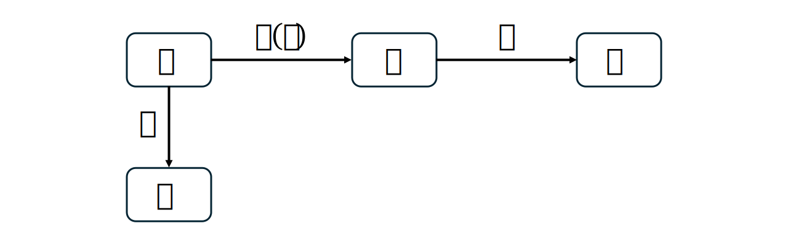
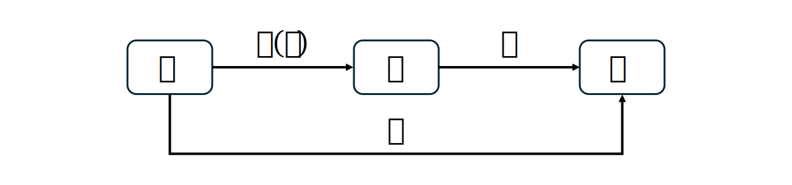
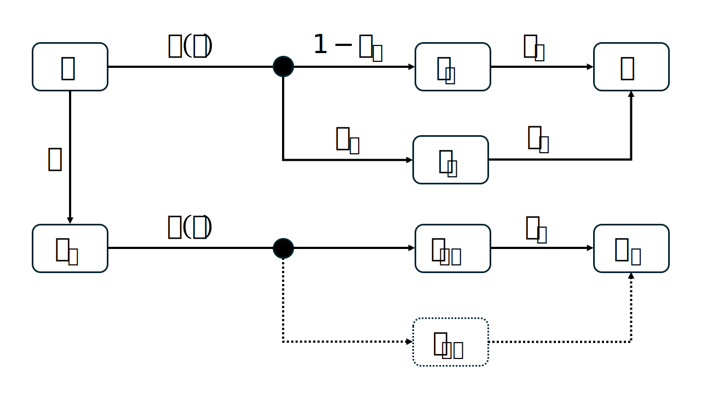
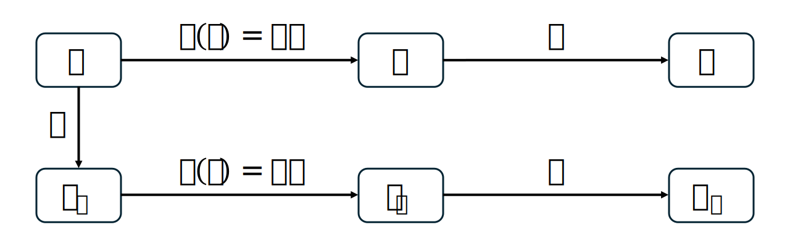
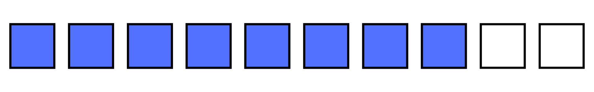
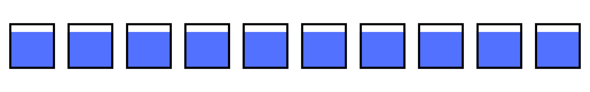
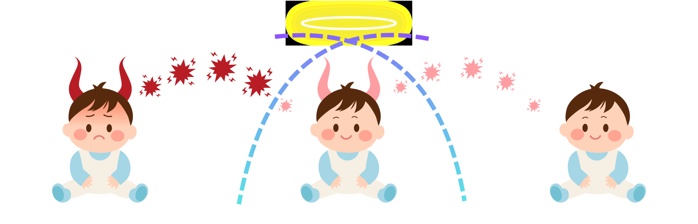
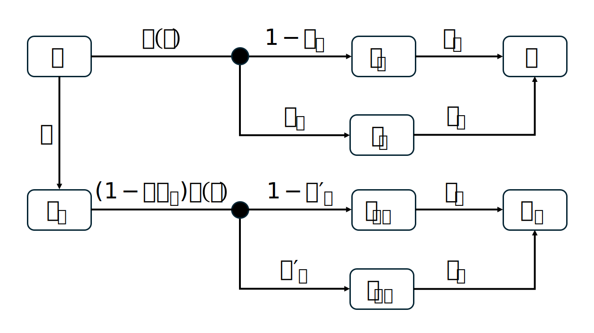
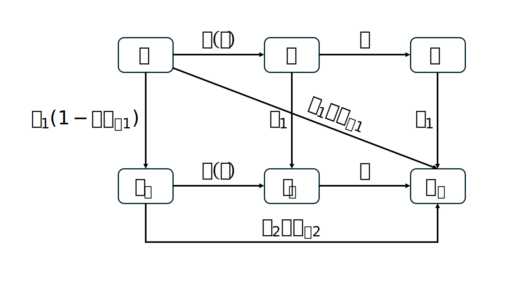

# Model vaccination

::: {.callout-note appearance="simple"}
# Acknowledgement

This chapter is based on the teachings of my PhD supervisor, Dr. Marc Choisy, and a lecture given by Asst Prof. Hannah Clapham at MIDSEA Summer School 2024, for which I am deeply grateful.
:::

```{ojs}
//| echo: false
import { createSlider, createButton, injectStyle, styleMathLabel } from "./_slider.js"
import { injectVaxStyle, makeBaby, makeShieldBubble, launchVirus } from "./_vax-anim.js"
d3 = require("d3@7")
```

To model vaccination, we need to decide 2 things:

1. What is the vaccine effect? Does it protect against infection, severe disease, transmission, or a combination?

2. How do we model imperfect protection?

## Vaccine effects

### Prevent infection

Vaccine prevents the pathogen from establishing an infection in the body. A vaccinated person is less likely to get infected.

```{ojs}
//| echo: false
viewof prv_inf_anim = (() => {
  const wrap = document.createElement("div");
  wrap.className = "vx-wrap";
  wrap.appendChild(injectVaxStyle());

  const W = 500, H = 260;
  const NS = "http://www.w3.org/2000/svg";
  const svg = document.createElementNS(NS, "svg");
  svg.setAttribute("viewBox", `0 0 ${W} ${H}`);
  svg.setAttribute("class", "vx-stage");
  svg.style.maxHeight = "270px";

  // Layer 1: shield bubble (behind right baby)
  svg.appendChild(makeShieldBubble(380, 140, 78));
  // Layer 2: babies — left=angry demon attacker, right=cute, smiling
  const sick   = makeBaby(110, 140, 1, { state: "demon-angry", outfit: "yellow" });
  const target = makeBaby(380, 140, 1, { state: "cute",        outfit: "blue"   });
  svg.appendChild(sick.g);
  svg.appendChild(target.g);

  wrap.appendChild(svg);

  const cap = document.createElement("div");
  cap.className = "vx-caption";
  cap.innerHTML = "The vaccine bubble <b>blocks the virus</b> — the baby stays cute and healthy.";
  wrap.appendChild(cap);

  // Auto-loop: virus thrown from sick baby's mouth, bursts at the bubble.
  let alive = true;
  function sneeze() {
    if (!alive) return;
    launchVirus(svg, 132, 124, 380, 130, { duration: 1300, blockAt: 0.65 });
    setTimeout(sneeze, 1700);
  }
  sneeze();

  if ("IntersectionObserver" in window) {
    const obs = new IntersectionObserver(es => {
      alive = es[0].isIntersecting;
      if (alive) sneeze();
    });
    obs.observe(wrap);
  }
  return wrap;
})();
```

Assuming a perfect vaccine against infection, the model can be designed as follows:



Vaccinated people $V$ remain uninfected in their lifetime and do not participate in disease transmission.

You can simplify this model by moving susceptible people to the $R$ compartment because they also do not participate in disease transmission.



### Prevent severe disease

Vaccine reduces the severity of the disease if the vaccinated person does get infected. A vaccinated individual still get infected but experiences a much milder form of the disease.

```{ojs}
//| echo: false
viewof prv_dis_anim = (() => {
  const wrap = document.createElement("div");
  wrap.className = "vx-wrap";
  wrap.appendChild(injectVaxStyle());

  const W = 500, H = 260;
  const NS = "http://www.w3.org/2000/svg";
  const svg = document.createElementNS(NS, "svg");
  svg.setAttribute("viewBox", `0 0 ${W} ${H}`);
  svg.setAttribute("class", "vx-stage");
  svg.style.maxHeight = "270px";

  // Bubble (back layer) around the protected baby
  svg.appendChild(makeShieldBubble(380, 140, 78));
  // Babies: left=angry demon attacker, right=happy demon (infected but smiling)
  const sick   = makeBaby(110, 140, 1, { state: "demon-angry", outfit: "yellow" });
  const target = makeBaby(380, 140, 1, { state: "demon-happy", outfit: "blue"   });
  svg.appendChild(sick.g);
  svg.appendChild(target.g);

  wrap.appendChild(svg);

  const cap = document.createElement("div");
  cap.className = "vx-caption";
  cap.innerHTML = "The baby still gets infected (a little demon now) — but the vaccine bubble keeps the disease <b>mild</b>, so the baby is still smiling.";
  wrap.appendChild(cap);

  // Auto-loop: virus passes through the bubble and is absorbed by the baby.
  let alive = true;
  function sneeze() {
    if (!alive) return;
    launchVirus(svg, 132, 124, 380, 130, { duration: 1300 });
    setTimeout(sneeze, 1700);
  }
  sneeze();

  if ("IntersectionObserver" in window) {
    const obs = new IntersectionObserver(es => {
      alive = es[0].isIntersecting;
      if (alive) sneeze();
    });
    obs.observe(wrap);
  }
  return wrap;
})();
```

Assuming a perfect vaccine against severe disease, the model can be designed as follows:



The infected population is split into a proportion of $p_s$ for severe cases and $1 - p_s$ for mild cases. Vaccinated people $S_v$ still get infected, but will only experience mild disease.

### Prevent transmission

Vaccine reduces the ability of a vaccinated individual, who becomes infected, to transmit the pathogen to others. A vaccinated person still get infected, still get sick, but they are less likely to spread the disease to others.

```{ojs}
//| echo: false
viewof prv_trans_anim = (() => {
  const wrap = document.createElement("div");
  wrap.className = "vx-wrap";
  wrap.appendChild(injectVaxStyle());

  const W = 680, H = 260;
  const NS = "http://www.w3.org/2000/svg";
  const svg = document.createElementNS(NS, "svg");
  svg.setAttribute("viewBox", `0 0 ${W} ${H}`);
  svg.setAttribute("class", "vx-stage");
  svg.style.maxHeight = "270px";

  // Bubble (back layer) around the middle baby
  svg.appendChild(makeShieldBubble(340, 150, 82));
  // Babies: left=angry attacker, middle=angry demon (infected), right=cute (safe)
  const sick     = makeBaby(110, 150, 0.95, { state: "demon-angry", outfit: "yellow" });
  const middle   = makeBaby(340, 150, 0.95, { state: "demon-angry", outfit: "blue"   });
  const receiver = makeBaby(570, 150, 0.95, { state: "cute",        outfit: "mint"   });
  svg.appendChild(sick.g);
  svg.appendChild(middle.g);
  svg.appendChild(receiver.g);

  wrap.appendChild(svg);

  const cap = document.createElement("div");
  cap.className = "vx-caption";
  cap.innerHTML = "The middle baby is infected and angry — but the vaccine bubble <b>stops the virus</b> from spreading to the next baby.";
  wrap.appendChild(cap);

  // Two-stage loop:
  //   1. attacker (left) → middle — virus absorbs into middle baby
  //   2. middle → receiver (right) — virus bursts INSIDE the bubble (contained)
  // For stage 2 we use a flat arc and a low blockAt so the burst happens
  // well inside the bubble's right edge — the virus literally cannot escape.
  let alive = true;
  function spread() {
    if (!alive) return;
    // Incoming infection (lands on middle baby — passes through bubble freely)
    launchVirus(svg, 132, 134, 340, 140, { duration: 1100 });
    // Outgoing virus is contained inside the bubble
    setTimeout(() => {
      launchVirus(svg, 358, 138, 555, 142, {
        duration: 1100,
        blockAt: 0.22,
        arc: 18
      });
    }, 700);
    setTimeout(spread, 2400);
  }
  spread();

  if ("IntersectionObserver" in window) {
    const obs = new IntersectionObserver(es => {
      alive = es[0].isIntersecting;
      if (alive) spread();
    });
    obs.observe(wrap);
  }
  return wrap;
})();
```

Assuming a perfect vaccine against transmission, the model can be designed as follows:



$I$ being the only source of infection that contributes to the force of infection. Vaccinated people $S_v$ still get infected and become $I_v$, but they do not transmit the disease.

## Imperfect protections

What is meant by a vaccine with effectiveness of 80% protection against a specific clinical endpoint? The mechanism of vaccine action is typically modelled in two ways:

### All-or-nothing model

::: {.callout-tip appearance="simple"}
**All-or-nothing** (AoN, also called the **polarized** [@park2023], or **take**) model assumes that **among vaccinated** individuals, a **proportion** $VE_P$ are **completely protected**, while **the remaining fraction** $1 - VE_P$ remains **completely unprotected** [@zachreson2023; @park2023].
:::

An effectiveness of 80% here implies that among vaccinated people, 80% are completely protected, and 20% receive no protection [@worldhealthorganization2013].



Assumming a standard SIR model, vaccine protects against **infection** with vaccine effectiveness $VE_P$, $\rho$ represents the vaccination rate:

-   Among the susceptible $S$, $\rho S$ are vaccinated.
-   Among those $\rho S$ who are vaccinated, $\rho VE_P S$ are completely protected and go directly to $R_v$, the remaining is $\rho (1 - VE_P) S$.
-   The remaining $\rho (1 - VE_P) S$ are completely unprotected, and will be infected with force of infection $\lambda(t)$ just like those who are unvaccinated.

![All-or-nothing vaccination model [@park2023]](img/vax/aon-mod.svg){#fig-aon-mod}

Below is a per-time-step simulation of @fig-aon-mod. Each dot is one person. Press **Step** to advance the model by one $dt$, **Play** to run it continuously. At every step, transitions are sampled from the same rates that drive the ODE: $\lambda(t) = \beta(I + I_v)/N$ moves susceptibles right, $\gamma$ moves infecteds right, and $\rho$ pulls $S$ down — splitting $\rho VE_P$ along the diagonal straight to $R_v$ from the rest into $S_v$. The floating "+N" badges show how many people took each pathway in that step, and the chart traces every compartment over time.

```{ojs}
//| echo: false
viewof aon_sim_anim = (() => {
  // ── Container & local style ────────────────────────────────
  const wrap = document.createElement("div");
  wrap.className = "aon-wrap";
  wrap.appendChild(injectStyle());

  const css = document.createElement("style");
  css.textContent = `
    .aon-wrap { width:100%; max-width:920px; margin:18px auto 26px;
                font-family:system-ui,-apple-system,sans-serif; }
    .aon-stage { width:100%; display:block;
                 background:linear-gradient(180deg,#fafbfc 0%,#eef2f7 100%);
                 border-radius:14px 14px 0 0; touch-action:manipulation;
                 user-select:none; -webkit-tap-highlight-color:transparent;
                 box-shadow:inset 0 0 0 1px #dde3eb;
                 cursor:crosshair; }
    .aon-chart { width:100%; display:block; background:#ffffff;
                 border-radius:0 0 14px 14px; border-top:1px solid #e2e8f0;
                 box-shadow:inset 0 0 0 1px #dde3eb; }
    .aon-controls { margin-top:14px; padding:14px; background:#fcfcfd;
                    border-radius:10px; border:1px solid #e5e7eb; }
    .aon-sliders { display:flex; flex-wrap:wrap; gap:14px; }
    .aon-sliders > div { min-width:120px; flex:1 1 120px; }
    .aon-buttons { display:flex; gap:8px; margin-top:14px; }
    .aon-buttons > button { flex:1; padding:10px 12px; font-size:13px; }
    .aon-cap { text-align:center; font-size:13px; color:#64748b;
               margin-top:10px; line-height:1.55; }
    .aon-cap b { color:#0f766e; font-weight:700; }
    .aon-cap kbd { background:#f1f5f9; border:1px solid #cbd5e1;
                   border-radius:4px; padding:1px 5px; font-size:11px;
                   color:#334155; font-family:inherit; }
  `;
  wrap.appendChild(css);

  // ── Tiny SVG helper ────────────────────────────────────────
  const NS = "http://www.w3.org/2000/svg";
  const sv = (tag, attrs) => {
    const e = document.createElementNS(NS, tag);
    if (attrs) for (const [k,v] of Object.entries(attrs)) e.setAttribute(k, v);
    return e;
  };

  // ── Stage SVG ──────────────────────────────────────────────
  const W = 1000, H = 470;
  const svg = sv("svg", { viewBox: `0 0 ${W} ${H}`, class: "aon-stage" });
  svg.style.maxHeight = "540px";
  wrap.appendChild(svg);

  // Compartments (positions mirror img/vax/aon-mod.svg)
  const boxW = 170, boxH = 110;
  const boxes = {
    S:  { x:  90, y:  60 },
    I:  { x: 415, y:  60 },
    R:  { x: 740, y:  60 },
    Sv: { x:  90, y: 295 },
    Iv: { x: 415, y: 295 },
    Rv: { x: 740, y: 295 }
  };
  const COL = {
    S:  { fill:"#eaf3fb", stroke:"#0284c7", dot:"#0ea5e9", text:"#075985" },
    I:  { fill:"#fde7e7", stroke:"#dc2626", dot:"#ef4444", text:"#991b1b" },
    R:  { fill:"#dcf6e3", stroke:"#16a34a", dot:"#22c55e", text:"#166534" },
    Sv: { fill:"#dceafd", stroke:"#1d4ed8", dot:"#3b82f6", text:"#1e40af" },
    Iv: { fill:"#fbd2d2", stroke:"#991b1b", dot:"#dc2626", text:"#7f1d1d" },
    Rv: { fill:"#bdedc8", stroke:"#15803d", dot:"#10b981", text:"#14532d" }
  };
  const cy = b => b.y + boxH/2;

  const defs = sv("defs");
  defs.innerHTML = `
    <marker id="aon-arr" viewBox="0 0 10 10" refX="9" refY="5"
            markerWidth="6" markerHeight="6" orient="auto-start-reverse">
      <path d="M 0 0 L 10 5 L 0 10 z" fill="#64748b"/>
    </marker>
    <marker id="aon-arr-hot" viewBox="0 0 10 10" refX="9" refY="5"
            markerWidth="7" markerHeight="7" orient="auto-start-reverse">
      <path d="M 0 0 L 10 5 L 0 10 z" fill="#f59e0b"/>
    </marker>
  `;
  svg.appendChild(defs);

  // Layers
  const arrowLayer = sv("g"); svg.appendChild(arrowLayer);
  const boxLayer   = sv("g"); svg.appendChild(boxLayer);
  const dotLayer   = sv("g"); svg.appendChild(dotLayer);
  const tallyLayer = sv("g"); svg.appendChild(tallyLayer);
  const fluxLayer  = sv("g"); svg.appendChild(fluxLayer);
  const hudLayer   = sv("g"); svg.appendChild(hudLayer);

  // HUD: day clock + λ(t) (separate <text> elements — cleaner than nested tspans)
  hudLayer.appendChild(sv("rect", {
    x: W - 232, y: 12, width: 220, height: 38, rx: 9,
    fill: "#ffffff", "fill-opacity": 0.85,
    stroke: "#cbd5e1", "stroke-width": 1
  }));
  const dayLbl = sv("text", { x: W - 222, y: 36,
    "font-family": "system-ui,sans-serif", "font-size": 13, fill: "#475569" });
  dayLbl.textContent = "Day";
  hudLayer.appendChild(dayLbl);

  const dayVal = sv("text", { x: W - 195, y: 36,
    "font-family": "Menlo,Consolas,monospace", "font-size": 16,
    "font-weight": 700, fill: "#0f172a" });
  dayVal.textContent = "0.0";
  hudLayer.appendChild(dayVal);

  const lamLbl = sv("text", { x: W - 145, y: 36,
    "font-family": '"Cambria Math",serif', "font-style": "italic",
    "font-size": 14, fill: "#7c2d12" });
  lamLbl.textContent = "λ(t) =";
  hudLayer.appendChild(lamLbl);

  const lamVal = sv("text", { x: W - 92, y: 36,
    "font-family": "Menlo,Consolas,monospace", "font-size": 14,
    "font-weight": 700, fill: "#7c2d12" });
  lamVal.textContent = "0.000";
  hudLayer.appendChild(lamVal);

  function setHud(day, lam) {
    dayVal.textContent = day.toFixed(1);
    lamVal.textContent = lam.toFixed(3);
  }

  // Boxes + tally counters
  const tallyEls = {};
  for (const [k, b] of Object.entries(boxes)) {
    const c = COL[k];
    boxLayer.appendChild(sv("rect", {
      x: b.x, y: b.y, width: boxW, height: boxH, rx: 14,
      fill: c.fill, stroke: c.stroke, "stroke-width": 2.5
    }));
    const lbl = sv("text", {
      x: b.x + 14, y: b.y + 32,
      "font-family": '"Cambria Math",serif',
      "font-style": "italic", "font-weight": 700,
      "font-size": 26, fill: c.text
    });
    if (k.length === 1) lbl.textContent = k;
    else lbl.innerHTML = `${k[0]}<tspan dy="6" font-size="18">${k.slice(1)}</tspan>`;
    boxLayer.appendChild(lbl);

    const t = sv("text", {
      x: b.x + boxW - 12, y: b.y + 26,
      "text-anchor": "end",
      "font-family": '"SF Mono",Menlo,Consolas,monospace',
      "font-size": 14, "font-weight": 700, fill: c.text
    });
    t.textContent = "0";
    tallyLayer.appendChild(t);
    tallyEls[k] = t;
  }

  // Arrows + their static rate labels
  const arrowEls = {};
  function addArrow(name, x1, y1, x2, y2, lblX, lblY, lblHtml, anchor="middle") {
    const line = sv("line", {
      x1, y1, x2, y2, stroke:"#94a3b8", "stroke-width":2,
      "marker-end":"url(#aon-arr)"
    });
    arrowLayer.appendChild(line);
    const lbl = sv("text", {
      x: lblX, y: lblY, "text-anchor": anchor,
      "font-family": '"Cambria Math",serif',
      "font-style": "italic", "font-size": 18, fill: "#475569"
    });
    lbl.innerHTML = lblHtml;
    arrowLayer.appendChild(lbl);
    arrowEls[name] = { line, label: lbl, midX: (x1 + x2)/2, midY: (y1 + y2)/2 };
  }
  addArrow("S→I", boxes.S.x + boxW + 2, cy(boxes.S), boxes.I.x - 2, cy(boxes.I),
           (boxes.S.x + boxW + boxes.I.x) / 2, cy(boxes.S) - 14, "λ(t)");
  addArrow("I→R", boxes.I.x + boxW + 2, cy(boxes.I), boxes.R.x - 2, cy(boxes.R),
           (boxes.I.x + boxW + boxes.R.x) / 2, cy(boxes.I) - 14, "γ");
  addArrow("Sv→Iv", boxes.Sv.x + boxW + 2, cy(boxes.Sv), boxes.Iv.x - 2, cy(boxes.Iv),
           (boxes.Sv.x + boxW + boxes.Iv.x) / 2, cy(boxes.Sv) - 14, "λ(t)");
  addArrow("Iv→Rv", boxes.Iv.x + boxW + 2, cy(boxes.Iv), boxes.Rv.x - 2, cy(boxes.Rv),
           (boxes.Iv.x + boxW + boxes.Rv.x) / 2, cy(boxes.Iv) - 14, "γ");
  const xv = boxes.S.x + 28;
  addArrow("S→Sv", xv, boxes.S.y + boxH + 2, xv, boxes.Sv.y - 2,
           xv - 10, (boxes.S.y + boxH + boxes.Sv.y) / 2 + 6,
           'ρ(1−VE<tspan dy="4" font-size="13">P</tspan>)', "end");
  addArrow("S→Rv",
           boxes.S.x + boxW + 2, boxes.S.y + boxH - 6,
           boxes.Rv.x - 2, boxes.Rv.y - 2,
           (boxes.S.x + boxW + boxes.Rv.x) / 2 + 60,
           (boxes.S.y + boxH + boxes.Rv.y) / 2 - 14,
           'ρVE<tspan dy="4" font-size="13">P</tspan>');

  function highlightArrow(name, on) {
    const a = arrowEls[name];
    if (!a) return;
    a.line.setAttribute("stroke", on ? "#f59e0b" : "#94a3b8");
    a.line.setAttribute("stroke-width", on ? 3.2 : 2);
    a.line.setAttribute("marker-end", on ? "url(#aon-arr-hot)" : "url(#aon-arr)");
    a.label.setAttribute("fill", on ? "#b45309" : "#475569");
    a.label.setAttribute("font-weight", on ? 700 : 400);
  }

  // ── Population ─────────────────────────────────────────────
  const N = 220, I0 = 5;
  const margin = 20;
  const innerW = boxW - 2*margin, innerH = boxH - 2*margin;
  const rndJ = () => ({
    jx: margin + Math.random() * innerW,
    jy: margin + Math.random() * innerH
  });

  const dots = [];
  for (let i = 0; i < N; i++) {
    const j = rndJ();
    dots.push({ state:'S', jx:j.jx, jy:j.jy, transit:null,
                phase: Math.random()*6.283 });
  }
  for (let i = 0; i < I0; i++) dots[i].state = 'I';

  const circles = dots.map((d) => {
    const c = sv("circle", { r: 4, fill: COL[d.state].dot,
                             stroke: "#0f172a", "stroke-width": 0.4,
                             "fill-opacity": 0.95 });
    dotLayer.appendChild(c);
    return c;
  });

  function startTransit(d, toState, duration) {
    const from = boxes[d.state], to = boxes[toState];
    const start = { x: from.x + d.jx, y: from.y + d.jy };
    const j = rndJ();
    const end = { x: to.x + j.jx, y: to.y + j.jy };
    const key = d.state + "→" + toState;
    let cp;
    if (key === "S→Sv") {
      cp = { x: from.x - 6, y: (start.y + end.y) / 2 };
    } else if (key === "S→Rv") {
      cp = { x: (start.x + end.x) / 2,
             y: start.y + (end.y - start.y) * 0.28 - 30 };
    } else {
      cp = { x: (start.x + end.x) / 2, y: (start.y + end.y) / 2 - 30 };
    }
    d.transit = { from: d.state, to: toState, start, cp, end,
                  age: 0, duration, newJ: j };
  }

  // Floating "+N" flux labels (animated in tick loop)
  const fluxLabels = []; // { el, y0, age, ttl }
  function flashFlux(arrowName, n, color) {
    if (n <= 0) return;
    const positions = {
      "S→I":   [(boxes.S.x + boxW + boxes.I.x) / 2, cy(boxes.S) - 32],
      "I→R":   [(boxes.I.x + boxW + boxes.R.x) / 2, cy(boxes.I) - 32],
      "Sv→Iv": [(boxes.Sv.x + boxW + boxes.Iv.x) / 2, cy(boxes.Sv) - 32],
      "Iv→Rv": [(boxes.Iv.x + boxW + boxes.Rv.x) / 2, cy(boxes.Iv) - 32],
      "S→Sv":  [xv - 34, (boxes.S.y + boxH + boxes.Sv.y) / 2 + 30],
      "S→Rv":  [(boxes.S.x + boxW + boxes.Rv.x) / 2 + 60, (boxes.S.y + boxH + boxes.Rv.y) / 2 - 32]
    };
    const [x, y] = positions[arrowName];
    const t = sv("text", {
      x, y, "text-anchor": "middle",
      "font-family": "system-ui,sans-serif",
      "font-weight": 800, "font-size": 17, fill: color,
      stroke: "#fff", "stroke-width": 3.5, "paint-order": "stroke",
      opacity: 0
    });
    t.textContent = "+" + n;
    fluxLayer.appendChild(t);
    fluxLabels.push({ el: t, y0: y, age: 0, ttl: 1600 });
  }

  // ── Time-series chart ──────────────────────────────────────
  const chartW = 1000, chartH = 200;
  const chartSvg = sv("svg", { viewBox: `0 0 ${chartW} ${chartH}`, class: "aon-chart" });
  chartSvg.style.maxHeight = "240px";
  wrap.appendChild(chartSvg);

  const cM = { l: 50, r: 90, t: 12, b: 26 };
  const cIW = chartW - cM.l - cM.r, cIH = chartH - cM.t - cM.b;
  const chartG = sv("g", { transform: `translate(${cM.l} ${cM.t})` });
  chartSvg.appendChild(chartG);

  // Axes
  chartG.appendChild(sv("line", { x1: 0, y1: cIH, x2: cIW, y2: cIH, stroke: "#cbd5e1" }));
  chartG.appendChild(sv("line", { x1: 0, y1: 0, x2: 0, y2: cIH, stroke: "#cbd5e1" }));
  // Y ticks (0, .25, .5, .75, 1) × N
  for (const v of [0, 0.25, 0.5, 0.75, 1]) {
    const yy = cIH * (1 - v);
    chartG.appendChild(sv("line", { x1: -3, y1: yy, x2: 0, y2: yy, stroke: "#cbd5e1" }));
    if (v === 0 || v === 0.5 || v === 1) {
      chartG.appendChild(sv("line", { x1: 0, y1: yy, x2: cIW, y2: yy,
        stroke: "#f1f5f9", "stroke-dasharray": "2 3" }));
    }
    const t = sv("text", { x: -8, y: yy + 4, "text-anchor": "end",
      "font-size": 10, fill: "#64748b" });
    t.textContent = Math.round(v * N);
    chartG.appendChild(t);
  }
  const yTitle = sv("text", { x: -38, y: cIH/2,
    "text-anchor": "middle", "font-size": 11, fill: "#475569",
    transform: `rotate(-90 -38 ${cIH/2})` });
  yTitle.textContent = "Population";
  chartG.appendChild(yTitle);
  const xTitle = sv("text", { x: cIW/2, y: cIH + 22,
    "text-anchor": "middle", "font-size": 11, fill: "#475569" });
  xTitle.textContent = "Time (days)";
  chartG.appendChild(xTitle);

  const xTickLayer = sv("g");
  chartG.appendChild(xTickLayer);
  function refreshXTicks(xmax) {
    while (xTickLayer.firstChild) xTickLayer.removeChild(xTickLayer.firstChild);
    for (let i = 0; i <= 4; i++) {
      const tt = (xmax / 4) * i;
      const xx = (tt / xmax) * cIW;
      xTickLayer.appendChild(sv("line", { x1: xx, y1: cIH, x2: xx, y2: cIH + 3, stroke: "#cbd5e1" }));
      const lab = sv("text", { x: xx, y: cIH + 14, "text-anchor": "middle",
        "font-size": 10, fill: "#64748b" });
      lab.textContent = Math.round(tt);
      xTickLayer.appendChild(lab);
    }
  }

  const compOrder = ['S', 'Sv', 'I', 'Iv', 'R', 'Rv'];
  const chartLines = {}, chartEndDots = {};
  for (const k of compOrder) {
    const path = sv("path", { fill: "none", stroke: COL[k].dot, "stroke-width": 2 });
    chartG.appendChild(path);
    chartLines[k] = path;
    const dot = sv("circle", { r: 3, fill: COL[k].dot,
                               stroke: "#fff", "stroke-width": 1 });
    chartG.appendChild(dot);
    chartEndDots[k] = dot;
  }
  // Legend
  const legendX = cIW + 16;
  compOrder.forEach((k, i) => {
    const y = i * 18 + 14;
    chartG.appendChild(sv("rect", { x: legendX, y: y - 8, width: 10, height: 10, rx: 2, fill: COL[k].dot }));
    const t = sv("text", { x: legendX + 14, y: y + 1, "font-size": 11,
      fill: "#334155", "font-family": '"Cambria Math",serif', "font-style": "italic" });
    if (k.length === 1) t.textContent = k;
    else t.innerHTML = `${k[0]}<tspan dy="2" font-size="9">${k.slice(1)}</tspan>`;
    chartG.appendChild(t);
  });

  let history = [{ t: 0, S: N - I0, I: I0, R: 0, Sv: 0, Iv: 0, Rv: 0 }];
  function chartXMax() {
    const last = history[history.length - 1];
    return Math.max(60, Math.ceil((last ? last.t : 0) / 30) * 30);
  }
  function updateChart() {
    const xmax = chartXMax();
    refreshXTicks(xmax);
    for (const k of compOrder) {
      let pd = "";
      for (let i = 0; i < history.length; i++) {
        const x = (history[i].t / xmax) * cIW;
        const y = (1 - history[i][k] / N) * cIH;
        pd += (i === 0 ? "M " : " L ") + x.toFixed(1) + "," + y.toFixed(1);
      }
      chartLines[k].setAttribute("d", pd);
      const last = history[history.length - 1];
      chartEndDots[k].setAttribute("cx", ((last.t / xmax) * cIW).toFixed(1));
      chartEndDots[k].setAttribute("cy", ((1 - last[k] / N) * cIH).toFixed(1));
    }
  }
  updateChart();

  // ── Per-step engine ────────────────────────────────────────
  const params = { beta: 1.5, gamma: 0.22, rho: 0.012, VEP: 0.8, dtModel: 1.0 };
  const STEP_MS = 1100;       // dot-animation window per step
  const AUTO_PAUSE_MS = 280;  // brief pause between auto steps
  let day = 0, phase = 'idle', autoMode = false, stepStart = 0;

  function counts() {
    const c = { S:0, I:0, R:0, Sv:0, Iv:0, Rv:0 };
    for (const d of dots) c[d.transit ? d.transit.from : d.state]++;
    return c;
  }

  function beginStep() {
    if (phase !== 'idle') return;
    const c = counts();
    const lam = params.beta * (c.I + c.Iv) / N;
    const dtm = params.dtModel;
    const pInf = 1 - Math.exp(-lam * dtm);
    const pVax = 1 - Math.exp(-params.rho * dtm);
    const pRec = 1 - Math.exp(-params.gamma * dtm);

    const flux = { "S→I":0, "I→R":0, "Sv→Iv":0, "Iv→Rv":0, "S→Sv":0, "S→Rv":0 };
    for (const d of dots) {
      if (d.transit) continue;
      if (d.state === 'S') {
        const r = Math.random();
        if (r < pInf) { startTransit(d, 'I', STEP_MS); flux["S→I"]++; }
        else if (r < pInf + pVax) {
          const goRv = Math.random() < params.VEP;
          startTransit(d, goRv ? 'Rv' : 'Sv', STEP_MS);
          flux[goRv ? "S→Rv" : "S→Sv"]++;
        }
      } else if (d.state === 'Sv') {
        if (Math.random() < pInf) { startTransit(d, 'Iv', STEP_MS); flux["Sv→Iv"]++; }
      } else if (d.state === 'I') {
        if (Math.random() < pRec) { startTransit(d, 'R', STEP_MS); flux["I→R"]++; }
      } else if (d.state === 'Iv') {
        if (Math.random() < pRec) { startTransit(d, 'Rv', STEP_MS); flux["Iv→Rv"]++; }
      }
    }

    for (const [name, n] of Object.entries(flux)) if (n > 0) highlightArrow(name, true);
    flashFlux("S→I",   flux["S→I"],   "#dc2626");
    flashFlux("I→R",   flux["I→R"],   "#16a34a");
    flashFlux("Sv→Iv", flux["Sv→Iv"], "#dc2626");
    flashFlux("Iv→Rv", flux["Iv→Rv"], "#16a34a");
    flashFlux("S→Sv",  flux["S→Sv"],  "#1d4ed8");
    flashFlux("S→Rv",  flux["S→Rv"],  "#15803d");

    setHud(day, lam);
    phase = 'stepping';
    stepStart = performance.now();
  }

  function endStep() {
    for (const name of Object.keys(arrowEls)) highlightArrow(name, false);
    day += params.dtModel;
    const c = counts();
    history.push({ t: day, ...c });
    if (history.length > 1000) history.shift();
    updateChart();
    const lam = params.beta * (c.I + c.Iv) / N;
    setHud(day, lam);
    phase = 'idle';
    if (autoMode) setTimeout(() => { if (autoMode && phase === 'idle') beginStep(); }, AUTO_PAUSE_MS);
  }

  // ── Animation loop ────────────────────────────────────────
  let rafId = null, lastT = 0;

  function tick(now) {
    if (!lastT) lastT = now;
    const ddt = now - lastT; lastT = now;

    // Drive transits
    for (const d of dots) {
      if (d.transit) {
        d.transit.age += ddt;
        if (d.transit.age >= d.transit.duration) {
          d.state = d.transit.to;
          d.jx = d.transit.newJ.jx;
          d.jy = d.transit.newJ.jy;
          d.transit = null;
        }
      }
    }

    // Tally + clock
    const c = counts();
    for (const k of Object.keys(tallyEls)) tallyEls[k].textContent = c[k];

    // Render dots
    for (let i = 0; i < N; i++) {
      const d = dots[i], ce = circles[i];
      let x, y, fill;
      if (d.transit) {
        const tt = Math.min(1, d.transit.age / d.transit.duration);
        const e = tt < 0.5 ? 2*tt*tt : 1 - Math.pow(-2*tt + 2, 2)/2; // ease in-out
        const u = 1 - e;
        x = u*u*d.transit.start.x + 2*u*e*d.transit.cp.x + e*e*d.transit.end.x;
        y = u*u*d.transit.start.y + 2*u*e*d.transit.cp.y + e*e*d.transit.end.y;
        fill = COL[d.transit.to].dot;
      } else {
        const b = boxes[d.state];
        x = b.x + d.jx; y = b.y + d.jy;
        fill = COL[d.state].dot;
      }
      const stateNow = d.transit ? d.transit.from : d.state;
      const r = (stateNow === 'I' || stateNow === 'Iv')
        ? 4.6 + Math.sin(now * 0.005 + d.phase) * 0.9 : 4;
      ce.setAttribute("cx", x.toFixed(1));
      ce.setAttribute("cy", y.toFixed(1));
      ce.setAttribute("r", r.toFixed(2));
      ce.setAttribute("fill", fill);
    }

    // Drive flux labels (rise + fade)
    for (let i = fluxLabels.length - 1; i >= 0; i--) {
      const f = fluxLabels[i];
      f.age += ddt;
      const tt = f.age / f.ttl;
      if (tt >= 1) { f.el.remove(); fluxLabels.splice(i, 1); continue; }
      const op = tt < 0.15 ? tt / 0.15 : Math.max(0, 1 - (tt - 0.15) / 0.85);
      f.el.setAttribute("y", (f.y0 - 28 * tt).toFixed(1));
      f.el.setAttribute("opacity", op.toFixed(2));
    }

    // Step state machine: end step when no transits remain
    if (phase === 'stepping') {
      const anyActive = dots.some(d => d.transit);
      const elapsed = now - stepStart;
      if (!anyActive && elapsed > STEP_MS * 0.55) endStep();
      else if (elapsed > STEP_MS * 1.8) {
        for (const d of dots) {
          if (d.transit) {
            d.state = d.transit.to;
            d.jx = d.transit.newJ.jx; d.jy = d.transit.newJ.jy;
            d.transit = null;
          }
        }
        endStep();
      }
    }

    rafId = requestAnimationFrame(tick);
  }
  rafId = requestAnimationFrame(tick);

  if ("IntersectionObserver" in window) {
    const io = new IntersectionObserver(es => {
      const visible = es[0].isIntersecting;
      if (!visible && rafId) { cancelAnimationFrame(rafId); rafId = null; lastT = 0; }
      else if (visible && !rafId) { lastT = 0; rafId = requestAnimationFrame(tick); }
    });
    io.observe(wrap);
  }

  // Tap / click to infect a person
  function infectAt(clientX, clientY) {
    const pt = svg.createSVGPoint();
    pt.x = clientX; pt.y = clientY;
    const ctm = svg.getScreenCTM();
    if (!ctm) return;
    const loc = pt.matrixTransform(ctm.inverse());
    let best = null, bestD = Infinity;
    for (const d of dots) {
      if (d.transit) continue;
      if (d.state !== 'S' && d.state !== 'Sv') continue;
      const b = boxes[d.state];
      const dx = b.x + d.jx - loc.x, dy = b.y + d.jy - loc.y;
      const dd = dx*dx + dy*dy;
      if (dd < bestD) { bestD = dd; best = d; }
    }
    if (best && bestD < 60*60)
      startTransit(best, best.state === 'S' ? 'I' : 'Iv', 800);
  }
  svg.addEventListener("click", e => infectAt(e.clientX, e.clientY));
  svg.addEventListener("touchend", e => {
    if (e.changedTouches && e.changedTouches[0]) {
      const t = e.changedTouches[0];
      infectAt(t.clientX, t.clientY);
      e.preventDefault();
    }
  }, { passive: false });

  // ── Controls ──────────────────────────────────────────────
  const ctrl = document.createElement("div");
  ctrl.className = "aon-controls";

  const sliders = document.createElement("div");
  sliders.className = "aon-sliders";

  const SL = {};
  SL.beta = createSlider("β  (transmission)", 0,    5,    0.05,  params.beta,    "#dc2626", "red");
  SL.gam  = createSlider("γ  (recovery)",     0.05, 0.5,  0.01,  params.gamma,   "#16a34a", "green");
  SL.rho  = createSlider("ρ  (vax rate)",     0,    0.05, 0.001, params.rho,     "#3b82f6", "blue");
  SL.vep  = createSlider("VEₚ  (efficacy)",   0,    1,    0.01,  params.VEP,     "#7c3aed", "purple");
  SL.dt   = createSlider("dt  (days/step)",   0.25, 2,    0.25,  params.dtModel, "#0f172a", "dark");
  for (const sl of Object.values(SL)) sliders.appendChild(sl.el);
  styleMathLabel(...Object.values(SL));
  ctrl.appendChild(sliders);

  const live = (sl, key) => sl.input.addEventListener("input", () => {
    sl.sync(); params[key] = sl.val();
  });
  live(SL.beta, "beta");
  live(SL.gam,  "gamma");
  live(SL.rho,  "rho");
  live(SL.vep,  "VEP");
  live(SL.dt,   "dtModel");

  const btnRow = document.createElement("div");
  btnRow.className = "aon-buttons";
  const btnStep  = createButton("⏭  Step",  "step");
  const btnAuto  = createButton("▶  Play",  "auto");
  const btnReset = createButton("↻  Reset", "reset");
  btnRow.appendChild(btnStep.el);
  btnRow.appendChild(btnAuto.el);
  btnRow.appendChild(btnReset.el);
  ctrl.appendChild(btnRow);

  btnStep.el.addEventListener("click", () => {
    autoMode = false;
    btnAuto.setText("▶  Play");
    if (phase === 'idle') beginStep();
  });
  btnAuto.el.addEventListener("click", () => {
    autoMode = !autoMode;
    btnAuto.setText(autoMode ? "⏸  Pause" : "▶  Play");
    if (autoMode && phase === 'idle') beginStep();
  });
  btnReset.el.addEventListener("click", () => {
    autoMode = false;
    btnAuto.setText("▶  Play");
    for (let i = 0; i < N; i++) {
      const d = dots[i], j = rndJ();
      d.state = 'S'; d.jx = j.jx; d.jy = j.jy; d.transit = null;
    }
    for (let i = 0; i < I0; i++) dots[i].state = 'I';
    day = 0;
    history = [{ t: 0, S: N - I0, I: I0, R: 0, Sv: 0, Iv: 0, Rv: 0 }];
    updateChart();
    setHud(0, 0);
    phase = 'idle';
    for (const name of Object.keys(arrowEls)) highlightArrow(name, false);
    while (fluxLayer.firstChild) fluxLayer.removeChild(fluxLayer.firstChild);
    fluxLabels.length = 0;
  });

  wrap.appendChild(ctrl);

  const cap = document.createElement("div");
  cap.className = "aon-cap";
  cap.innerHTML =
    "Each step, every person rolls the dice against the ODE rates: " +
    "<b>S</b> can flow right (infection, prob 1−exp(−λ·dt)), down (vaccinated-but-unprotected, " +
    "prob ρ·dt·(1−VE<sub>P</sub>)) or jump straight to <b>R<sub>v</sub></b> (vaccinated-and-protected, " +
    "prob ρ·dt·VE<sub>P</sub>). Watch the <b>+N</b> badges — they tell you exactly how many people " +
    "took each arrow during that step. Tap any <b>S</b>/<b>S<sub>v</sub></b> dot to seed an infection.";
  wrap.appendChild(cap);

  return wrap;
})();
```

$$\begin{align}
\frac{dS}{dt} &= -\lambda(t) S - \rho S \\
\frac{dI}{dt} &= \lambda(t) S - \gamma I \\
\frac{dR}{dt} &= \gamma I \\
\frac{dS_v}{dt} &= \rho (1 - VE_P) S - \lambda(t) S_v \\
\frac{dI_v}{dt} &= \lambda(t) S_v - \gamma I_v \\
\frac{dR_v}{dt} &= \rho VE_P S + \gamma I_v
\end{align}$$

### Leaky model

::: {.callout-tip appearance="simple"}
**Leaky** (or **degree**) model assumes that **all vaccinated** individuals **are partially protected** [@zachreson2023].
:::

An effectiveness of 80% here implies that all vaccinated people have the endpoint of interest reduced by 80% compared to non-vaccinees.



The assumption that no vaccinated people is totally or permanently protected implies one or both of the following [@worldhealthorganization2013]:

-   No amount (titre) of the immune marker is totally protective or, if it is, no individual can maintain that titre for a long period (because of waning or transient immunosuppression)
-   The degree of protection is a function of the level of the immune marker - the simplest explanation being that protection is a function of both the level of the immune marker and the challenge dose.

Assumming a standard SIR model, vaccine protects against **infection** with vaccine effectiveness $VE_L$, $\rho$ represents the vaccination rate.

-   Among susceptible $S$, $\rho S$ are vaccinated.
-   Among those $\rho S$ who are vaccinated, force of infection $\lambda(t)$ is reduced by a factor of $1 - VE_L$.

![Leaky vaccination model [@park2023]](img/vax/leaky-mod.svg){#fig-leaky-mod}

$$\begin{align}
\frac{dS}{dt} &= -\lambda(t) S - \rho S \\
\frac{dI}{dt} &= \lambda(t) S - \gamma I \\
\frac{dR}{dt} &= \gamma I \\
\frac{dS_v}{dt} &= \rho S - (1 - VE_L) \lambda(t) S_v \\
\frac{dI_v}{dt} &= (1 - VE_L) \lambda(t) S_v - \gamma I_v \\
\frac{dR_v}{dt} &= \gamma I_v
\end{align}$$

## Mixed effects

Imperfect vaccines often have a combination of effects: they can protect against infection, severe disease, and transmission at the same time.



Assuming a vaccine with leaky effectiveness $VE_L$ against infection and severe disease, the model can be designed as follows:



-   Among susceptible $S$, $\rho S$ are vaccinated.
-   Among those $\rho S$ who are vaccinated, force of infection $\lambda(t)$ is reduced by a factor of $1 - VE_L$.
-   Vaccine reduces the proportion of severe disease from $p_s$ to $p_s'$.

## Multiple doses

Some vaccines require multiple doses, like measles (2 doses) or rotavirus (2 doses), with varying effectiveness per dose. Below is the DynaMICE model [@verguet2015] for the 2-dose measles vaccine, assuming AoN effectiveness as in @fig-aon-mod for both doses.



## Code

### A perfect vaccine against infection

```{r, warning=FALSE, message=FALSE}
library(odin)
library(tidyr)
library(ggplot2)
```


```{r, results=FALSE, message=FALSE}
pfvac_ode <- odin({
  # Derivatives
  deriv(S) <- -beta * S * I - rho * S
  deriv(I) <- beta * S * I - gamma * I
  deriv(R) <- gamma * I
  deriv(V) <- rho * S
  
  # Initial conditions
  initial(S) <- N_init - I_init
  initial(I) <- I_init
  initial(R) <- R_init
  initial(V) <- V_init
  
  # Parameters and initial values
  beta <- user(8.77e-8)
  gamma <- user(0.2)
  rho <- user(0.005)
  N_init <- user(5700000)
  I_init <- user(1)
  R_init <- user(0)
  V_init <- user(0)
})
```

```{r}
# Initialize model
pfvac_mod <- pfvac_ode$new()
# How long to run
times <- seq(0,300)
# Run the model
pred <- data.frame(pfvac_mod$run(times))
```

```{r}
#| code-fold: true
#| fig-width: 4
#| fig-height: 3
#| out-width: "100%"
df_plot <- pivot_longer(pred, cols = S:V, names_to = "comp", values_to = "n")

ggplot(df_plot, aes(x = t, y = n, color = comp)) +
  geom_line(linewidth = 1.2) +
  scale_color_brewer(palette = "PuOr", breaks = c("S", "I", "R", "V")) +
  labs(color = NULL, y = NULL, x = "Time") +
  theme_minimal() +
  theme(legend.position = "bottom")
```


### AoN model against infection


### Leaky model against infection

